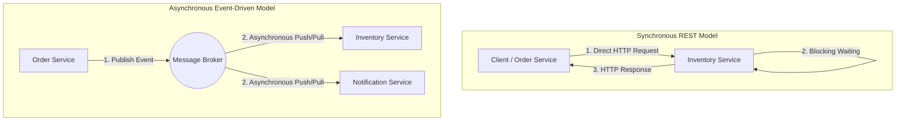
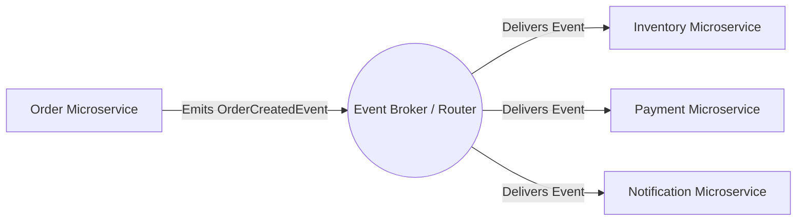
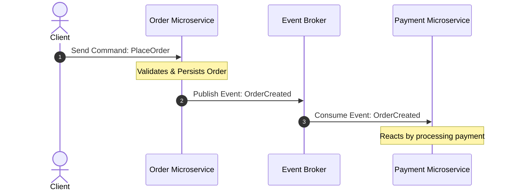
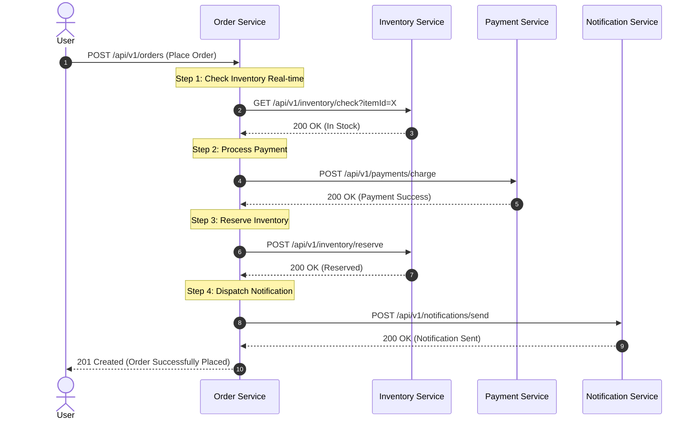
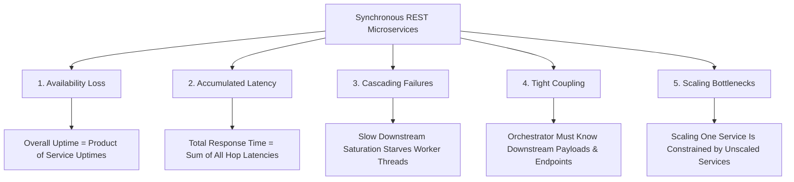
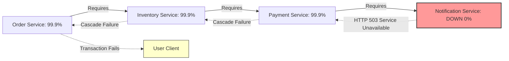
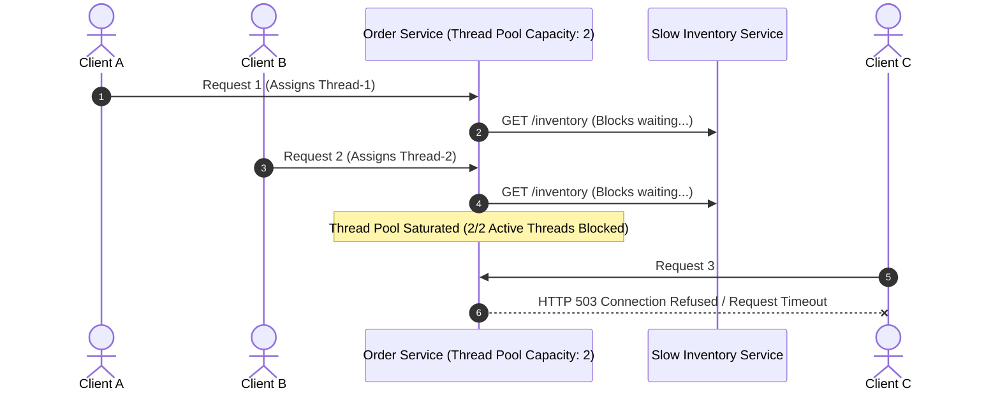

# 01-03_Synchronous REST Microservices: Critical Challenges and Event-Driven Architecture Fundamentals

## 1. Introduction to Microservice Communication Paradigms

### 1.1 Overview of Synchronous vs. Asynchronous Communication
In distributed microservice architectures, services must interact to execute business workflows spanning multiple domains. Traditionally, microservices communicate using synchronous Remote Procedure Call (RPC) or RESTful HTTP interfaces. In a synchronous request-response pattern, the calling service blocks execution while waiting for the downstream service to process the request and return an HTTP response.

While synchronous REST is straightforward to implement and debug for simple CRUD operations, relying on synchronous communication across long-running or multi-service business workflows introduces severe architectural bottlenecks. As system scale and operational complexity increase, organizations transition to Event-Driven Architecture (EDA), an asynchronous communication style where microservices publish events representing state changes and react to events emitted by other services without direct coupling.



### 1.2 Scope and Architectural Roadmap
This guide covers the foundational mechanics of microservice communication across Chapters 01 through 03:
* **Fundamentals of Event-Driven Architecture**: Definitions, core properties of events, and distinguishing events from commands and queries.
* **Synchronous REST Microservices Workflow**: Detailed operational trace of a multi-service e-commerce order fulfillment flow.
* **Critical Bottlenecks of Synchronous Microservices**: Deep-dive analysis of availability loss, latency accumulation, cascading failures, tight coupling, and independent scaling bottlenecks.

---

## 2. Core Concepts of Event-Driven Architecture (EDA)

### 2.1 Defining Event-Driven Architecture
Event-Driven Architecture is a software design pattern where decoupled services communicate asynchronously by producing, detecting, and consuming events. Instead of Service A directly invoking an API endpoint on Service B (`Service A -> Service B`), Service A emits an event describing a completed state change into a centralized event router or broker. Services interested in that state change subscribe to the broker and react independently.



### 2.2 Semantic Taxonomy: Commands, Queries, and Events
A core prerequisite for event-driven design is cleanly separating system interactions into three distinct message archetypes: Commands, Queries, and Events.

| Semantic Metric | Command | Query | Event |
| :--- | :--- | :--- | :--- |
| **Intent** | Request to mutate system state | Request to retrieve system state | Notification of a completed state change |
| **Grammatical Tense** | Imperative (e.g., `PlaceOrder`) | Present / Indicative (e.g., `GetOrderDetails`) | Past Tense (e.g., `OrderCreated`) |
| **Targeting** | Point-to-point (Directed to one handler) | Point-to-point (Directed to one provider) | Publish-Subscribe (Broadcast to N consumers) |
| **State Mutation** | Intended (Can be accepted or rejected) | None (Side-effect free) | Unalterable fact (Already occurred) |
| **Coupling** | High (Sender knows target capability) | High (Caller expects specific response payload) | Low (Publisher is unaware of consumers) |

#### Spring Boot Semantic Representations
```java
// Command: Intent to execute an action
public record PlaceOrderCommand(String customerId, List<OrderItem> items, BigDecimal totalAmount) {}

// Query: Intent to retrieve data
public record GetOrderQuery(String orderId) {}

// Event: Historical fact of an action that already happened
public record OrderCreatedEvent(String orderId, String customerId, BigDecimal amount, Instant timestamp) {}
```



### 2.3 Key Characteristics of Events
1. **Immutability**: An event represents a historical statement of fact (`OrderCreated`). Because past events cannot be rewritten, event messages are strictly immutable once published. Consumers cannot modify or reverse an event; compensatory events (e.g., `OrderCancelled`) must be issued to handle business reversals.
2. **Past-Tense Semantics**: Event identifiers strictly describe completed business occurrences (`PaymentAuthorized`, `InventoryReserved`, `ShipmentDispatched`).
3. **Self-Contained Payloads (Event-Carried State Transfer)**: Every event payload carries all context needed by downstream consumers to fulfill their business logic without issuing synchronous HTTP callbacks to the publishing service.

```java
// Self-contained event carrying state (Event-Carried State Transfer pattern)
public record PaymentProcessedEvent(
    String paymentId, String orderId, String customerId, 
    BigDecimal statusAmount, PaymentStatus status, Instant processedAt
) {}
```

---

## 3. Synchronous REST Example in Distributed Microservices

### 3.1 Long-Running Business Flow Architecture
Consider a distributed e-commerce system composed of five microservices:
1. **User Service**: Manages user profiles and authentication.
2. **Order Service**: Orchestrates order placement and lifecycle state.
3. **Inventory Service**: Tracks stock availability and warehouse reservations.
4. **Payment Service**: Integrates with payment gateways to charge credit cards/wallets.
5. **Notification Service**: Dispatches transactional emails, push notifications, and SMS.

In a synchronous REST architecture, processing a single "Place Order" user request requires the Order Service to orchestrate a long-running HTTP chain across multiple downstream services before returning a final response to the user.



### 3.2 Synchronous Spring Boot RestTemplate / WebClient Pattern
Below is a typical synchronous implementation using Spring Boot's `RestTemplate` where the `OrderService` synchronously invokes downstream HTTP endpoints sequentially:

```java
@Service
public class SynchronousOrderOrchestrator {
    @Autowired
    private RestTemplate restTemplate;

    public OrderResponse createOrder(OrderRequest request) {
        // Step 1: Synchronous Inventory Check
        Boolean inStock = restTemplate.postForObject("http://inventory-service/api/check", request, Boolean.class);
        
        // Step 2: Synchronous Payment Processing
        PaymentResult payment = restTemplate.postForObject("http://payment-service/api/charge", request, PaymentResult.class);
        
        // Step 3: Synchronous Inventory Reservation
        restTemplate.postForObject("http://inventory-service/api/reserve", request, Void.class);
        
        // Step 4: Synchronous Notification Dispatch
        restTemplate.postForObject("http://notification-service/api/send", request, Void.class);
        
        return new OrderResponse("SUCCESS", payment.getTransactionId());
    }
}
```

---

## 4. Critical Challenges & Disadvantages of Synchronous REST Microservices

While the REST approach appears straightforward, executing multi-service workflows synchronously leads to five major architectural failure modes in distributed environments.



### 4.1 Challenge 1: Reduced System Availability (Multiplicative Availability)
In a synchronous call chain, the composite availability of the end-to-end transaction is calculated as the product of the individual operational availabilities of every involved microservice:

`Availability_system = Availability_Service1 * Availability_Service2 * ... * Availability_ServiceN`

If a synchronous order workflow requires 4 microservices and each service operates at 99.9% uptime (3 nines):

`Availability_total = 0.999 * 0.999 * 0.999 * 0.999 = 0.9960 (99.6%)`

If any single downstream microservice suffers a brief outage, hardware glitch, or network partition, the entire long-running request immediately fails, leading to poor system resiliency.



### 4.2 Challenge 2: Accumulated Latency (Additive Latency)
The total response latency experienced by the caller is the arithmetic sum of the network transit times, serialization overheads, and internal processing latencies across every downstream service call:

`Latency_total = Latency_Order + Latency_InventoryCheck + Latency_Payment + Latency_InventoryReserve + Latency_Notification`

```mermaid
gantt
    title Synchronous REST Latency Accumulation
    dateFormat  X
    axisFormat %s ms
    section Latency Hops
    Order Processing Overhead  :a1, 0, 20
    Inventory Check (HTTP Hop 1) :a2, 20, 120
    Payment Charge (HTTP Hop 2)  :a3, 120, 420
    Inventory Reserve (HTTP Hop 3):a4, 420, 520
    Notification Send (HTTP Hop 4):a5, 520, 720
```



Because each HTTP call introduces socket negotiation, TLS overhead, payload JSON marshalling/unmarshalling, and network round-trips, total latency escalates rapidly, leading to high user-perceived load times.

### 4.3 Challenge 3: Cascading Failures and Thread Exhaustion
Synchronous web containers (such as Spring Boot's embedded Tomcat) allocate dedicated worker threads from a fixed thread pool to handle incoming HTTP requests. When a service makes a synchronous REST call to a downstream dependency, that worker thread blocks until the socket read returns or times out.

If a downstream dependency (e.g., Inventory Service) becomes sluggish due to database lock contention, upstream worker threads in the Order Service quickly become saturated waiting for HTTP responses. Once the thread pool is exhausted, the Order Service can no longer accept new incoming requests for any endpoint, resulting in system-wide collapse.



### 4.4 Challenge 4: Tight Spatial and Temporal Coupling
Synchronous REST forces tight coupling across two dimensions:
* **Spatial Coupling**: The orchestrating service (`OrderService`) must store explicit network addresses, API routing schemas, request payloads, and error handling mechanisms for every target service (`PaymentService`, `InventoryService`, `NotificationService`).
* **Temporal Coupling**: All participating services must be online, healthy, and reachable at the exact millisecond the request is executed. If `NotificationService` is offline for maintenance, the entire order placement fails—even though sending an order receipt email is an auxiliary task that could be deferred.

### 4.5 Challenge 5: Independent Scaling Bottlenecks
Microservices promise independent scalability, allowing high-demand services to scale horizontally without altering low-demand services. However, in a synchronous request chain, scaling one microservice independently provides minimal benefit if downstream dependencies are not scaled proportionally.

For example, if `PaymentService` is scaled up to handle 1,000 requests per minute, but `InventoryService` remains constrained to 100 requests per minute, 900 requests will fail at the inventory check step. The resulting failures cascade back to `PaymentService` and `OrderService`, rendering the scaling efforts ineffective.


---

## 5. Architectural Comparison Matrix

| Architectural Metric | Synchronous REST Microservices | Asynchronous Event-Driven Architecture |
| :--- | :--- | :--- |
| **Communication Style** | Request-Response (Direct RPC/HTTP) | Publish-Subscribe (Event Emission) |
| **Execution Paradigm** | Blocking synchronous execution | Non-blocking asynchronous reactive execution |
| **Temporal Coupling** | High (All target services must be online simultaneously) | Low (Producers publish regardless of consumer state) |
| **Spatial Coupling** | High (Caller knows exact endpoints & payload schemas) | Low (Publisher emits event to broker without targeting consumers) |
| **System Availability** | Low (Product of all downstream service uptimes) | High (Isolates consumer failures; broker queues events) |
| **Latency Profile** | High / Additive ($T_{total} = \sum T_i$) | Low / Parallelized ($T_{total} = T_{publisher} + T_{broker}$) |
| **Resiliency & Fault Isolation** | Poor (Cascading failures through thread exhaustion) | Excellent (Backpressure and message queue buffering) |
| **Scalability** | Dependent (Constrained by slowest downstream bottleneck) | Independent (Consumers process queued events at their own pace) |

---

## 6. Key Takeaways and Architectural Summary

1. **Synchronous REST Limits Scale**: Direct HTTP inter-service calls work well for edge API gateways and simple CRUD operations, but create severe reliability bottlenecks when used for multi-service business workflows.
2. **Events Represent Historical Facts**: Unlike commands (which instruct a service what to do) or queries (which ask for data), events state immutable historical facts (`OrderCreated`).
3. **Decoupling Solves Cascading Failures**: By introducing an event broker, services emit state changes without waiting for downstream execution, eliminating thread pool starvation, latency accumulation, and temporal coupling.
