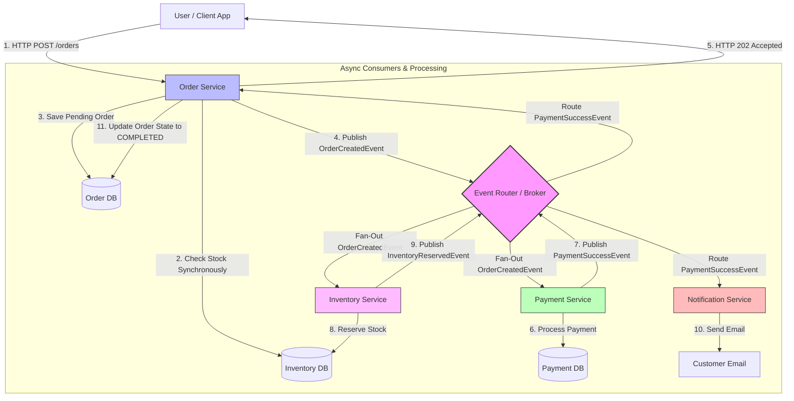
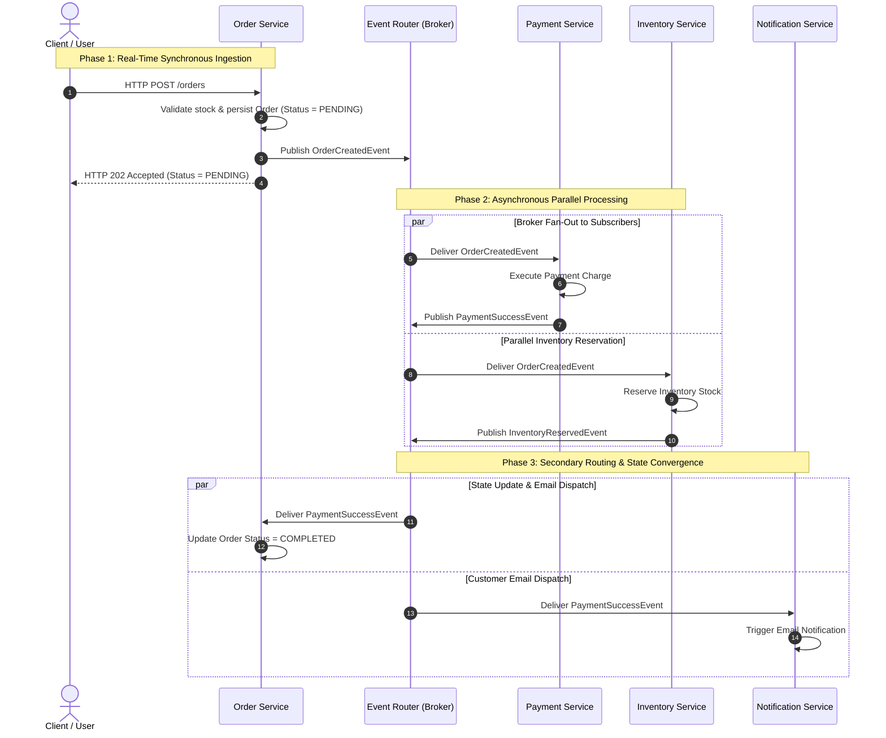
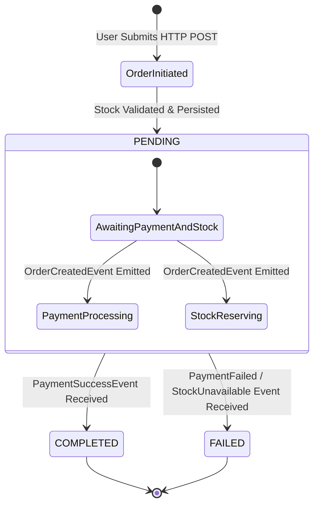
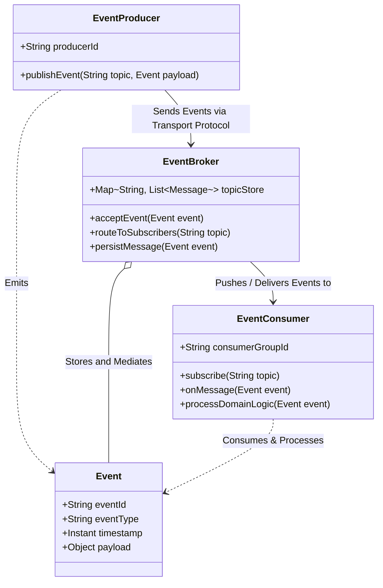

# 04-05_Event-Driven Microservices: Asynchronous Workflows and Core Infrastructure

## Topic 1: Architectural Evolution – Transitioning from Synchronous REST to Asynchronous EDA

Distributed microservices architectures traditionally rely on synchronous HTTP/REST interactions, where an upstream service directly invokes downstream endpoints in a blocking request-response chain. While REST is straightforward for simple request-reply scenarios, it introduces severe architectural bottlenecks in complex enterprise domain workflows—such as e-commerce order fulfillment. Synchronous chains suffer from additive latency, multiplicative availability degradation, and tight spatial and temporal coupling.

Event-Driven Architecture (EDA) resolves these structural limitations by introducing an asynchronous, event-mediated communication paradigm. Instead of microservices invoking each other directly via explicit API calls, services communicate by publishing and consuming **events** through a centralized, high-throughput **Event Router** (also known as an **Event Broker** or **Message Broker**, such as Apache Kafka, RabbitMQ, or AWS EventBridge).

In an asynchronous EDA model for order fulfillment, the core microservices include:
* **User / Client App**: The API consumer initiating order creation requests.
* **Order Service**: The domain boundary responsible for order lifecycle management, order state persistence, and event emission.
* **Event Router / Broker**: The intermediary infrastructure routing events to interested subscribers based on event types or topics.
* **Payment Service**: The domain service dedicated to payment authorization, transaction settlement, and payment event emission.
* **Inventory Service**: The domain service managing real-time stock allocation and inventory reservation.
* **Notification Service**: The peripheral service handling customer communications (e.g., email notifications).

By decoupling these services via an Event Router, microservices no longer need to know the physical IP addresses, REST contracts, or availability states of downstream dependencies.



---

## Topic 2: End-to-End Event-Driven Order Processing Workflow

The event-driven order processing workflow transitions the system from a single blocking thread execution model into a multi-phased, event-driven saga composed of real-time synchronous ingestion and asynchronous parallel execution phases.

### Phase 1: Real-Time Ingestion and Synchronous Validation

1. **Client Order Submission**: The user submits an HTTP POST request to the Order Service containing order item details and customer credentials.
2. **Real-Time Stock Pre-Validation**: The Order Service performs an immediate, non-blocking pre-check against inventory or local cache to ensure stock availability before accepting the transaction.
3. **Pending State Persistence**: Upon successful validation, the Order Service persists the new order record into its local database with an initial status of `PENDING`.
4. **Order Created Event Emission**: The Order Service publishes an `OrderCreatedEvent` message containing the order ID, customer ID, total amount, and line items to the Event Router.
5. **Immediate Client Acknowledgment**: The Order Service returns an HTTP 202 Accepted response containing the order ID and `PENDING` status to the user. This completes the synchronous phase in approximately 1 second (compared to 5+ seconds in a fully synchronous REST chain).

```java
@Autowired
private KafkaTemplate<String, OrderCreatedEvent> kafkaTemplate;

public void createOrder(OrderRequest request) {
    Order order = orderRepository.save(new Order(request, OrderStatus.PENDING));
    kafkaTemplate.send("order-created-topic", order.getId(), new OrderCreatedEvent(order));
}
```

### Phase 2: Asynchronous Event Routing and Parallel Consumer Execution

1. **Message Fan-Out**: The Event Router accepts the `OrderCreatedEvent` and fans it out simultaneously to all consumer services subscribed to the `order-created-topic`.
2. **Passive Notification Principle**: The Event Router does not command consumers on what actions to perform. It asserts the historical fact that an order was created. Each consumer independently decides how to react based on its domain logic.
3. **Parallel Execution**:
   * **Payment Service**: Consumes `OrderCreatedEvent`, contacts the payment gateway, processes the credit card charge, and records the transaction. Upon success, it publishes a `PaymentSuccessEvent` to the Event Router.
   * **Inventory Service**: Consumes `OrderCreatedEvent`, allocates physical stock items, and persists the stock deduction. Upon success, it publishes an `InventoryReservedEvent` to the Event Router.

```java
@KafkaListener(topics = "order-created-topic", groupId = "payment-service-group")
public void handleOrderCreated(OrderCreatedEvent event) {
    paymentProcessor.charge(event.orderId(), event.totalAmount());
    kafkaTemplate.send("payment-success-topic", event.orderId(), new PaymentSuccessEvent(event.orderId()));
}
```

### Phase 3: Secondary Event Distribution and State Convergence

1. **Targeted Event Routing**: The Event Router receives the `PaymentSuccessEvent` and delivers it to downstream microservices registered for payment completion events.
2. **Notification Dispatch**: The Notification Service consumes `PaymentSuccessEvent`, constructs a receipt payload, and triggers an asynchronous SMTP or SMS gateway to inform the customer.
3. **Order State Finalization**: The Order Service consumes `PaymentSuccessEvent`, retrieves the corresponding order record from its database, and updates its lifecycle status from `PENDING` to `COMPLETED`.

```java
@KafkaListener(topics = "payment-success-topic", groupId = "order-service-group")
public void handlePaymentSuccess(PaymentSuccessEvent event) {
    orderRepository.updateStatus(event.orderId(), OrderStatus.COMPLETED);
}
```

```yaml
spring.cloud.stream.bindings.orderCreated-out-0.destination=order-created-events
spring.cloud.stream.bindings.paymentSuccess-in-0.destination=payment-success-events
spring.cloud.stream.kafka.binder.brokers=localhost:9092
```





---

## Topic 3: Core Components of Event-Driven Architecture

At an architectural level, Event-Driven Architecture is grounded upon three fundamental infrastructure components that collaborate to achieve asynchronous message passing.



### 1. Event Producer
The **Event Producer** is any microservice or component that detects a state change or business milestone within its domain boundary and constructs an immutable event payload representing that fact.
* **Role**: Detects domain state transitions and emits corresponding events.
* **Characteristics**: Unaware of downsteam consumers, their physical locations, or their processing logic.
* **Responsibility**: Constructs clean event schemas containing event metadata (event ID, timestamp, producer ID) and domain attributes (e.g., `orderId`, `totalAmount`).

### 2. Event Broker / Router
The **Event Broker** (or Event Router) acts as the centralized mediation backbone for the entire distributed system.
* **Role**: Ingests events from producers, persists them to message logs or queues, and routes/delivers them to subscribed consumers.
* **Characteristics**: Acts as a neutral intermediary separating message submission from message consumption.
* **Responsibility**: Provides durability, topic filtering, message routing, partition management, and consumer offset tracking (e.g., Apache Kafka log offsets or RabbitMQ queue bindings).

### 3. Event Consumer
The **Event Consumer** is any microservice or component that registers interest in specific event types, receives them from the broker, and executes business logic in response.
* **Role**: Reacts to domain events emitted elsewhere in the system.
* **Characteristics**: Operates asynchronously and independently of the producer.
* **Responsibility**: Maintains local state, handles idempotent event processing, and emits secondary downstream events if required by its domain.

### Comparative Matrix of Core EDA Components

| Feature / Attribute | Event Producer | Event Broker / Router | Event Consumer |
| :--- | :--- | :--- | :--- |
| **Primary Function** | Detects domain state changes and emits events | Ingests, persists, filters, and routes events | Receives events and executes domain logic |
| **Awareness Scope** | Knows only the Event Broker interface and topic name | Knows event metadata, topics, and subscriber subscriptions | Knows event schemas and source topics |
| **State Management** | Manages local domain state and database records | Manages topic logs, queues, partitions, and offsets | Manages local database records and consumer offsets |
| **Coupling Level** | Zero knowledge of downstream consumers | Decoupled intermediary between all services | Zero knowledge of upstream producer internals |
| **Examples in System** | Order Service, Payment Service, Inventory Service | Apache Kafka, RabbitMQ, AWS EventBridge, ActiveMQ | Payment Service, Inventory Service, Notification Service |

---

## Topic 4: Architectural Advantages of Asynchronous EDA over Synchronous REST

Re-architecting microservices from synchronous REST to asynchronous Event-Driven Architecture directly resolves the core systemic flaws of REST request-response chains.

### 1. Loose Coupling and Spatial Decoupling
In a REST architecture, the Order Service must maintain physical HTTP endpoints, hostnames, and client libraries for Payment, Inventory, and Notification services. In EDA, microservices interact solely with topic channels on the Event Broker. Upstream services do not know which or how many downstream services consume their events.

### 2. Independent Microservice Scalability
Under synchronous REST, scaling the Order Service requires scaling all downstream dependencies equally to prevent bottlenecks. In an EDA model, every service scales independently based on its own workload metrics (e.g., CPU, memory, or broker queue depth). If payment authorization experiences a spike, additional instances of the Payment Service can be deployed to consume from the broker without affecting the Order Service's ingestion rate.

### 3. Fault Tolerance and System Resilience
In a synchronous REST chain, if the Inventory Service drops offline, any HTTP request sent to it fails instantly, causing the entire order creation call to fail. In an EDA architecture, if the Inventory Service suffers a temporary outage, the Event Broker buffers the emitted `OrderCreatedEvent` messages in topic storage. The Order Service continues accepting user orders normally. Once the Inventory Service recovers, it resumes reading buffered events from its last committed offset without losing data or failing user requests.

```mermaid
flowchart LR
    subgraph Active Producer Phase
        OS[Order Service] -->|1. Publish OrderCreatedEvent| Broker{Event Broker Log}
        OS -->|2. HTTP 202 Accepted| User[User App]
    end

    subgraph Outage & Buffering Phase
        Broker -.->|3. Messages Buffered in Topic| KafkaLog[(Broker Topic Log)]
        Broker -x|4. Connection Refused| InvSvcOffline[Inventory Service - OFFLINE]
    end

    subgraph Recovery & Catch-up Phase
        InvSvcOnline[Inventory Service - RECOVERED] -->|5. Re-establish Subscription| KafkaLog
        KafkaLog -->|6. Process Buffered Events from Offset| InvSvcOnline
    end

    style InvSvcOffline fill:#f88,stroke:#333,stroke-width:2px
    style InvSvcOnline fill:#8f8,stroke:#333,stroke-width:2px
    style KafkaLog fill:#ff8,stroke:#333,stroke-width:2px
```

### 4. Event Replayability and Audit Log Capabilities
Modern event brokers (such as Apache Kafka) store events in immutable, append-only commit logs. This architecture provides built-in event replay capabilities. If a bug is introduced into the Payment Service or a new Analytics Service is deployed weeks later, historical events can be replayed from offset 0 to reconstruct past states or populate new domain databases without modifying existing production code.

### 5. Latency Reduction and Superior User Experience
In a synchronous REST architecture, total response latency is additive:

$$	ext{Latency}_{	ext{REST}} = 	ext{Latency}_{	ext{Order}} + 	ext{Latency}_{	ext{Inventory}} + 	ext{Latency}_{	ext{Payment}} + 	ext{Latency}_{	ext{Notification}} pprox 5.0	ext{s}$$

In an asynchronous EDA model, user-facing latency is limited strictly to the initial ingestion and event publishing time:

$$	ext{Latency}_{	ext{EDA}} = 	ext{Latency}_{	ext{OrderInbound}} + 	ext{Latency}_{	ext{BrokerPublish}} pprox 1.0	ext{s}$$

By offloading heavy processing to asynchronous parallel threads, the user receives immediate confirmation, resulting in lower drop-off rates and improved user satisfaction.

---

### Comparative Analysis: Synchronous REST vs. Asynchronous EDA

| Architectural Metric | Synchronous REST Microservices | Asynchronous Event-Driven Microservices |
| :--- | :--- | :--- |
| **Communication Paradigm** | Direct blocking HTTP/REST request-response | Asynchronous message passing via Event Broker |
| **System Coupling** | Tight spatial and temporal coupling | Loose spatial, temporal, and contract coupling |
| **Client Response Latency** | Additive (Sum of all downstream REST latencies) | Minimal (Inbound validation + Broker emission latency) |
| **Availability Degradation** | Multiplicative (A_total = A_1 * A_2 * ... * A_n) | Decoupled (Broker buffer isolates downstream outages) |
| **Failure Impact** | Single service outage crashes the entire call chain | Outages buffer events; ingestion remains online |
| **Scalability Model** | Monolithic lock-step scaling across all services | Independent horizontal scaling per consumer microservice |
| **State Reconstruction** | Difficult; relies on point-in-time DB snapshots | Natural; append-only event logs support full event replay |
| **Implementation Complexity** | Low initially; high operational complexity at scale | Moderate infrastructure overhead (requires Broker cluster) |
