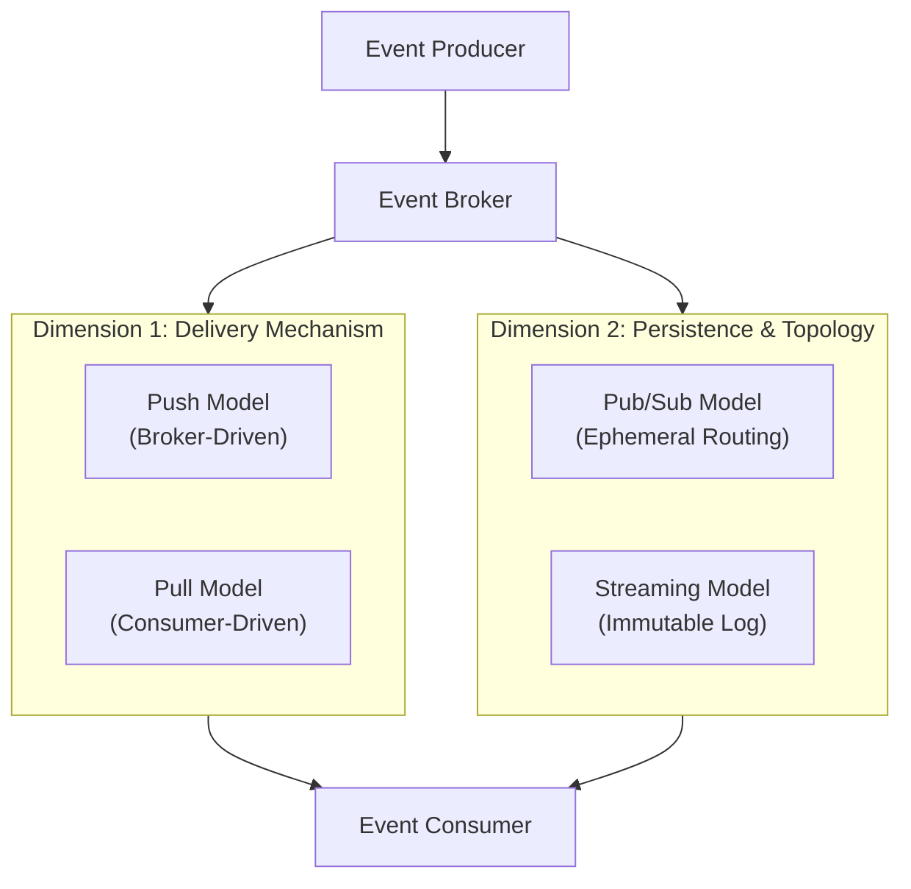
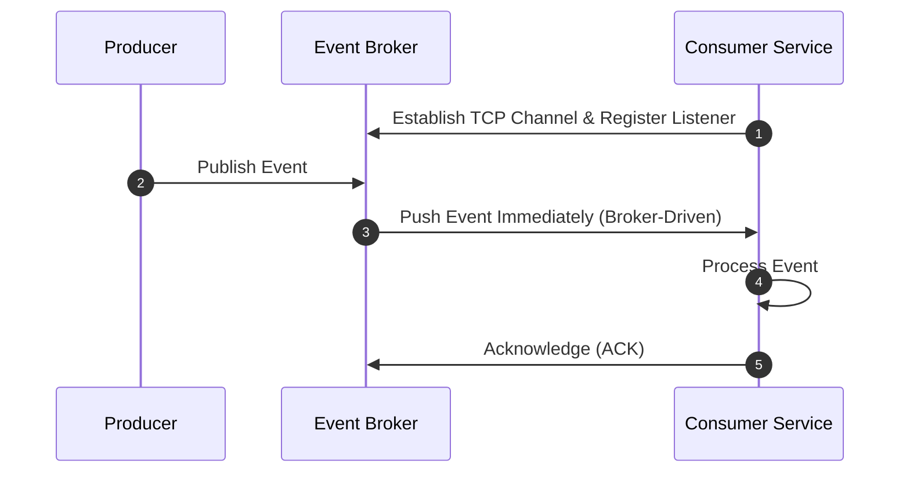
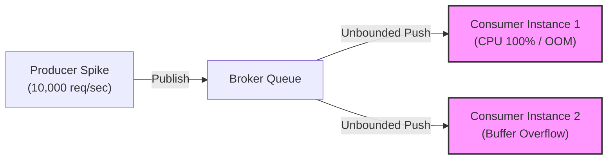
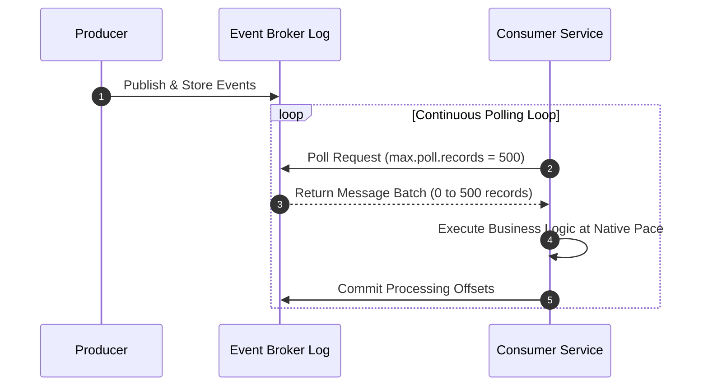
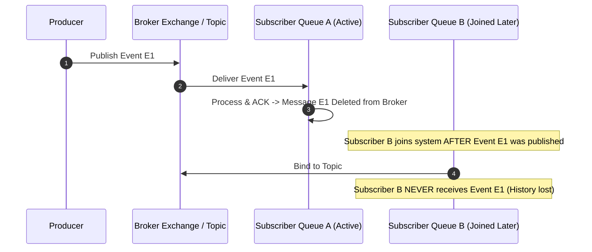
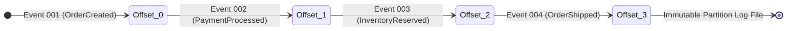
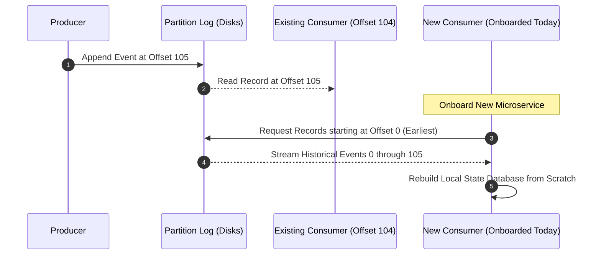

# 06-07_Event-Driven Message Delivery and Consumption Models: Push/Pull and Pub/Sub vs. Streaming

## Overview: The Mechanics of Event Movement in Distributed Architectures

In an Event-Driven Architecture (EDA), understanding how messages travel from producers through event brokers to consumers is fundamental to designing resilient, scalable distributed systems. Event movement is governed by two distinct structural dimensions:

1. **Delivery Mechanism (Consumer Control vs. Broker Control)**: Dictates how events are transferred from the broker to consumer applications (**Push Model** vs. **Pull Model**).
2. **Persistence and Topology Model (State Retention vs. Ephemeral Routing)**: Dictates how events are routed, stored, and retained within the messaging infrastructure (**Publish-Subscribe Model** vs. **Event Streaming Log Model**).



---

## Chapter 06: Message Consumption Patterns — Push Model vs. Pull Model

The delivery mechanism determines which component initiates the message transfer across the network boundary and controls the throughput rate.

---

### 1. The Push Model (Broker-Driven Event Dispatch)

In the Push Model, the event broker takes an active role in message delivery. Once a producer publishes an event to the broker, the broker immediately dispatches (pushes) the message over an established TCP connection to all active consumers that have registered interest in that queue or topic.

#### Mechanics of Push Delivery
* **Active Broker Dispatch**: The broker maintains open socket connections with connected consumer instances. As soon as an event is validated and enqueued, the broker pushes it down the wire without waiting for an explicit request from the consumer.
* **Socket Streaming**: Messages are delivered over persistent channels (such as AMQP channels or WebSocket streams), enabling near-instantaneous notification and ultra-low delivery latency.



#### Backpressure Vulnerability and Consumer Saturation
The primary architectural risk of the Push Model is the lack of intrinsic **backpressure control**. Because the broker dictates the delivery rate, a sudden spike in upstream producer activity causes the broker to flood connected consumers with events.

If the incoming message rate exceeds the consumer's maximum processing capacity, the consumer service risks severe degradation:
* **Thread Exhaustion**: Thread pools become saturated waiting on slow downstream I/O or database operations.
* **Heap Memory Saturation**: Internal unacknowledged message buffers grow uncontrollably, triggering frequent Garbage Collection (GC) pauses or `OutOfMemoryError` crashes.
* **Cascading Unavailability**: Saturated consumers crash, forcing the broker to re-route incoming traffic to remaining healthy consumer instances, which subsequently crash under the redirected load.



#### Mitigating Push Saturation in Spring Boot
To prevent consumer saturation in Push-based frameworks (such as RabbitMQ with AMQP), developers configure **Prefetch Limits**. Prefetch controls specify the maximum number of unacknowledged messages the broker may send to a consumer channel before waiting for explicit acknowledgments.

```java
// Spring AMQP / RabbitMQ Prefetch Configuration
@Bean
public SimpleRabbitListenerContainerFactory rabbitListenerContainerFactory(ConnectionFactory connectionFactory) {
    SimpleRabbitListenerContainerFactory factory = new SimpleRabbitListenerContainerFactory();
    factory.setConnectionFactory(connectionFactory);
    factory.setPrefetchCount(250); // Limits pushed unacked messages to 250
    factory.setConcurrentConsumers(3);
    return factory;
}
```

---

### 2. The Pull Model (Consumer-Driven Event Polling)

In the Pull Model, the event broker acts as a passive, durable storage repository. The consumer application takes full control of the message transfer process by issuing periodic fetch or poll requests to the broker.

#### Mechanics of Pull Delivery
* **Consumer-Initiated Ingestion**: The consumer sends an explicit request (e.g., `poll()`) specifying the maximum number of records it is prepared to accept (such as `max.poll.records`).
* **Batch Processing**: Messages are retrieved from the broker in structured batches, allowing efficient bulk processing, vectorization, and database batch inserts.
* **Controlled Cadence**: The consumer processes the retrieved batch at its own pace. Only after completing processing and committing the current position does it issue a request for the next batch.



#### Intrinsic Backpressure Management
The foundational advantage of the Pull Model is built-in **backpressure regulation**. Because the consumer actively requests messages only when it has idle capacity:
* **Zero Saturation Risk**: A consumer can never be overwhelmed by producer load spikes. If producers emit 1,000,000 events per second, the broker buffers the incoming events on disk while consumers continue fetching batches at their maximum sustainable rate (e.g., 500 events per second).
* **Workload Isolation**: Heavy computation, database latency, or downstream service slowdowns naturally extend the polling interval without causing memory leaks or thread exhaustion.

#### Polling Efficiency & Long Polling Strategies
A potential drawback of basic polling is network resource waste when queues are empty (frequent empty poll requests). Modern pull-based platforms solve this using **Long Polling**, where the broker holds the poll connection open for a specified timeout (e.g., `poll(Duration.ofMillis(100))`) until new data arrives or the timeout expires.

```java
// Spring Kafka Listener configuring consumer pull batch size
@KafkaListener(
    topics = "order-events", 
    groupId = "inventory-group",
    properties = {"max.poll.records=500", "fetch.min.bytes=1024"}
)
public void consumeBatch(List<ConsumerRecord<String, OrderEvent>> records) {
    inventoryService.processBatch(records);
}
```

---

### 3. Comparative Matrix: Push Model vs. Pull Model

| Feature / Dimension | Push Model (Broker-Driven) | Pull Model (Consumer-Driven) |
| :--- | :--- | :--- |
| **Delivery Trigger** | Initiated proactively by Event Broker | Initiated explicitly by Consumer |
| **Delivery Latency** | Ultra-low (real-time stream delivery) | Slight latency bounded by poll interval |
| **Backpressure Control** | External / Requires prefetch configuration | Native / Inherent to consumer poll loop |
| **Saturation Risk** | High (risk of OOM crashes during spikes) | Zero (broker buffers excess traffic) |
| **Batch Processing** | Typically record-by-record streaming | High-throughput batch operations |
| **Network Overhead** | Minimal idle network traffic | Polling traffic (mitigated by long polling) |
| **Primary Frameworks** | RabbitMQ (AMQP), ActiveMQ, WebSockets | Apache Kafka, AWS SQS, Apache Pulsar |

---

## Chapter 07: Message Topology & Persistence — Pub/Sub Model vs. Streaming Model

The topology and persistence model defines how events are stored, routed across multiple subscribers, and retained over time.

---

### 1. The Publish-Subscribe (Pub/Sub) Model (Ephemeral Event Distribution)

The traditional Publish-Subscribe (Pub/Sub) model operates as an ephemeral message distribution network. Producers publish events to a central topic or exchange, which fan-out and deliver copies of the event to all active consumer queues bound to that topic.

#### Ephemeral Storage and Lifecycle
* **Transient Delivery**: The broker delivers published messages to currently connected, active subscribers.
* **Immediate Deletion**: Once a consumer receives and acknowledges a message, the broker deletes the message from its transient memory/storage.
* **No Retrospective History**: The broker maintains no long-term historical log. Messages exist strictly to transition data from producers to active consumers.



#### The "Late-Joiner" Limitation
A critical characteristic of traditional Pub/Sub systems is the inability to serve new consumer services deployed after an event occurred:
* If Service C is created and deployed today, it cannot read or receive events published yesterday or last week.
* **No Event Replay**: System state cannot be reconstructed by re-processing historical events directly from the messaging tier.

```java
// Spring AMQP Ephemeral Fanout Exchange Configuration
@Bean
public FanoutExchange orderExchange() {
    return new FanoutExchange("orders.fanout", true, false); // Durable exchange, non-autodelete
}
```

---

### 2. The Event Streaming Model (Immutable Distributed Commit Logs)

The Event Streaming Model redefines messaging by treating events as an append-only, durable sequence of historical facts stored in a distributed commit log.

#### Architecture of the Append-Only Commit Log
* **Sequential Append**: Incoming events are appended sequentially to the end of a persistent partition log file on disk.
* **Immutable Records**: Once written, events are immutable and cannot be altered or deleted out of order.
* **Offset Identification**: Every event within a partition is assigned a monotonically increasing 64-bit integer index called an **Offset**.



#### Log Retention Policies
Unlike Pub/Sub systems that delete messages post-consumption, streaming logs retain messages independently of consumer activity based on configured retention policies:
* **Time-Based Retention**: Messages are preserved for a set duration (e.g., `log.retention.hours=168` for 7 days).
* **Size-Based Retention**: Messages are retained until the partition log reaches a specified storage volume limit.
* **Indefinite Retention**: Logs can be retained indefinitely for audit trails and complete event sourcing state store rebuilding.

#### Consumer Offsets and Replayability
In a streaming model, consumers maintain their own position within the log by tracking their current offset pointer. Because message consumption does not mutate or delete the underlying log:
* **Independent Consumption**: Multiple consumer groups read the exact same partition log at different offsets without interfering with each other.
* **Event Replayability**: A consumer can rewind its offset pointer to re-process historical events (useful for recovering from application bugs or recalculated business logic).
* **Late Consumer Onboarding**: A new microservice deployed today can set its offset pointer to `0` (`auto.offset.reset=earliest`) and read the entire historical event stream from Day 1 to reconstruct state.



```java
// Spring Kafka Consumer resetting offset to earliest history
@KafkaListener(
    topics = "order-events",
    groupId = "analytics-service-v1",
    properties = {"auto.offset.reset=earliest"}
)
public void replayHistory(ConsumerRecord<String, OrderEvent> record) {
    analyticsService.indexHistoricalRecord(record.offset(), record.value());
}
```

---

### 3. Comparative Matrix: Pub/Sub Model vs. Streaming Model

| Feature / Dimension | Pub/Sub Model (Ephemeral) | Streaming Model (Log-Based) |
| :--- | :--- | :--- |
| **Storage Mechanism** | Transient memory / In-flight queues | Persistent, append-only disk logs |
| **Message Lifecycle** | Deleted upon delivery and acknowledgment | Retained based on time or size policies |
| **Consumer Offsets** | Managed internally by broker queues | Managed by consumers / consumer group tracking |
| **Event Replayability** | Impossible (no historical storage) | Built-in (offset pointer manipulation) |
| **Late Consumer Onboarding** | Receives future events only | Can read complete log from offset `0` |
| **Subscriber Decoupling** | Temporal coupling (subscribers must exist) | Full temporal decoupling |
| **Primary Frameworks** | RabbitMQ, Google Cloud Pub/Sub, JMS | Apache Kafka, AWS Kinesis, Redpanda |

---

## Architectural Decision Framework & Unified Taxonomy Matrix

By combining the **Delivery Mechanism** (Push vs. Pull) and the **Persistence Model** (Pub/Sub vs. Streaming), messaging architectures fall into four distinct operational quadrants:

```mermaid
flowchart GRID
    subgraph Quad1 ["Push + Pub/Sub"]
        Q1["RabbitMQ / Standard AMQP<br/>• Low Latency<br/>• Transient Messages<br/>• Broker Push"]
    end
    subgraph Quad2 ["Pull + Pub/Sub"]
        Q2["AWS SQS / Traditional JMS<br/>• High Decoupling<br/>• Batch Polling<br/>• Queue Cleanup on ACK"]
    end
    subgraph Quad3 ["Push + Streaming"]
        Q3["Reactive Kafka Streams / WebSockets<br/>• Reactive Backpressure<br/>• Immutable History<br/>• Stream Push"]
    end
    subgraph Quad4 ["Pull + Streaming"]
        Q4["Apache Kafka Core<br/>• High Throughput<br/>• Durable Commit Log<br/>• Consumer Poll Loop"]
    end
```

### Comprehensive Technical Comparison Matrix

| Architectural Combination | Primary Exemplars | Latency Profile | Backpressure Characteristics | Historical Replayability | Ideal Use Cases |
| :--- | :--- | :--- | :--- | :--- | :--- |
| **Push + Pub/Sub** | RabbitMQ, ActiveMQ, Spring AMQP | Ultra-Low (< 5ms) | Requires explicit Prefetch limit configuration | None (Ephemeral queues) | Real-time user notifications, async commands, transient task distribution |
| **Pull + Pub/Sub** | AWS SQS, JMS Queue Polling | Moderate (50-200ms) | Intrinsic (Consumer polls per batch capacity) | None (Messages deleted post-ACK) | Job queue processing, batch background processing, third-party API integration |
| **Pull + Streaming** | Apache Kafka, Redpanda, AWS Kinesis | Low-to-Moderate (10-50ms) | Intrinsic (Consumer controls batch poll speed) | Complete (Offset reset to any historical point) | Audit logs, event sourcing, complex stream processing, core domain events |
| **Push + Streaming** | Reactive Kafka (`Reactor-Kafka`), SSE | Ultra-Low (< 10ms) | Managed via Reactive Streams (`request(n)`) | Complete (Persistent partition log backing) | Real-time dashboard streaming, live financial tick data, telemetry pipelines |
