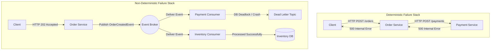
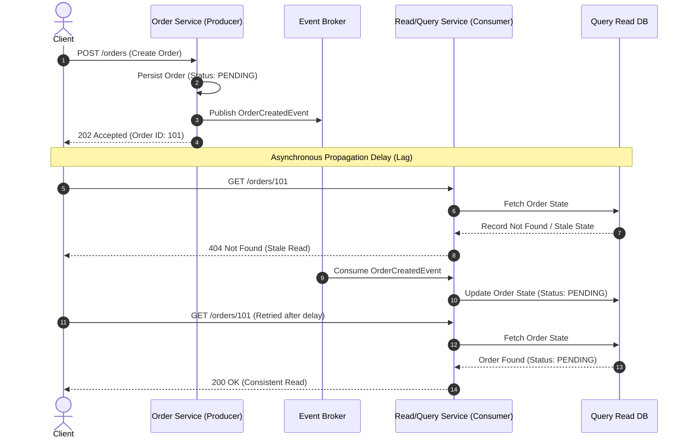
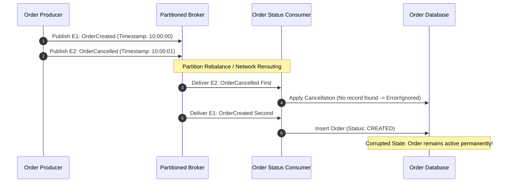
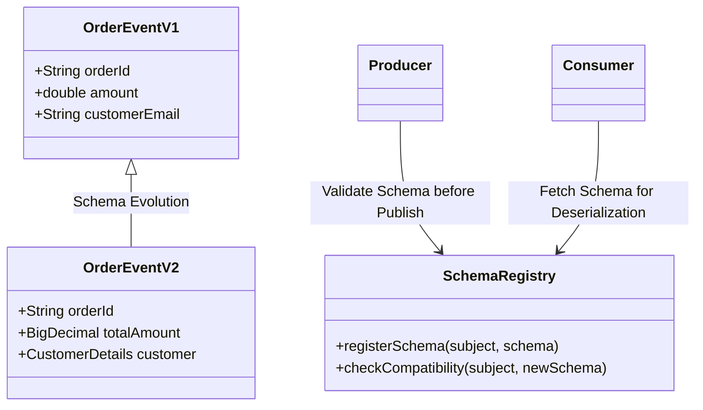
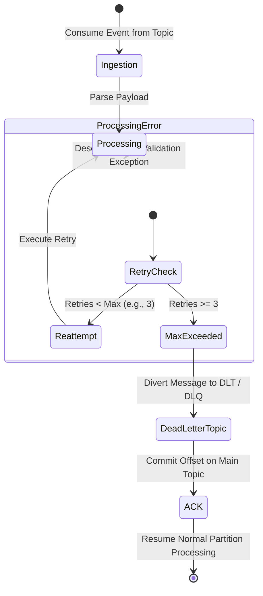
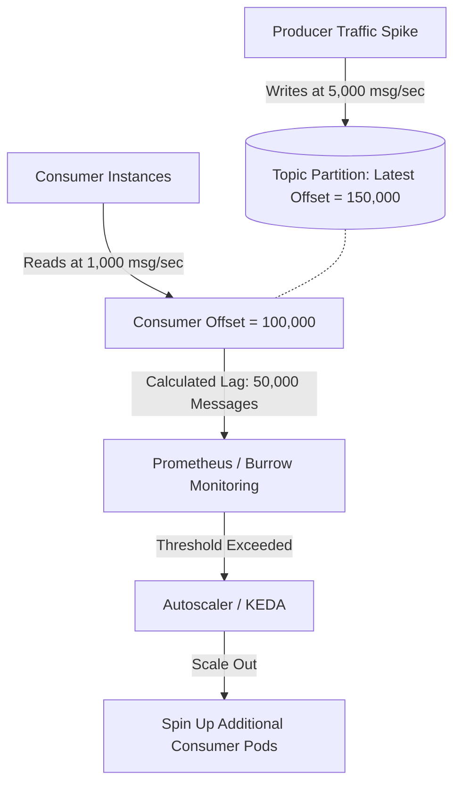
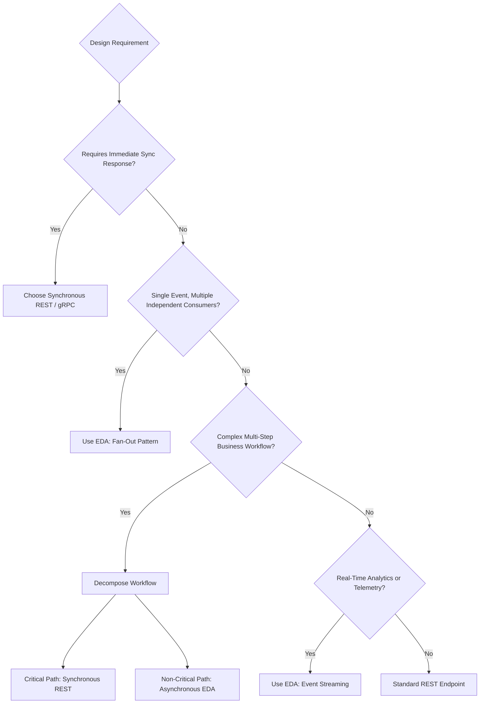
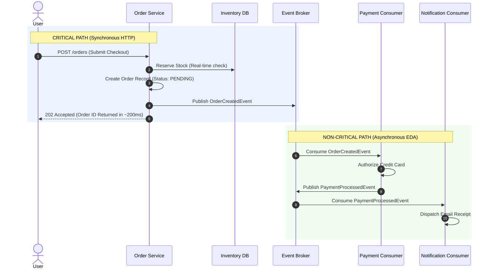
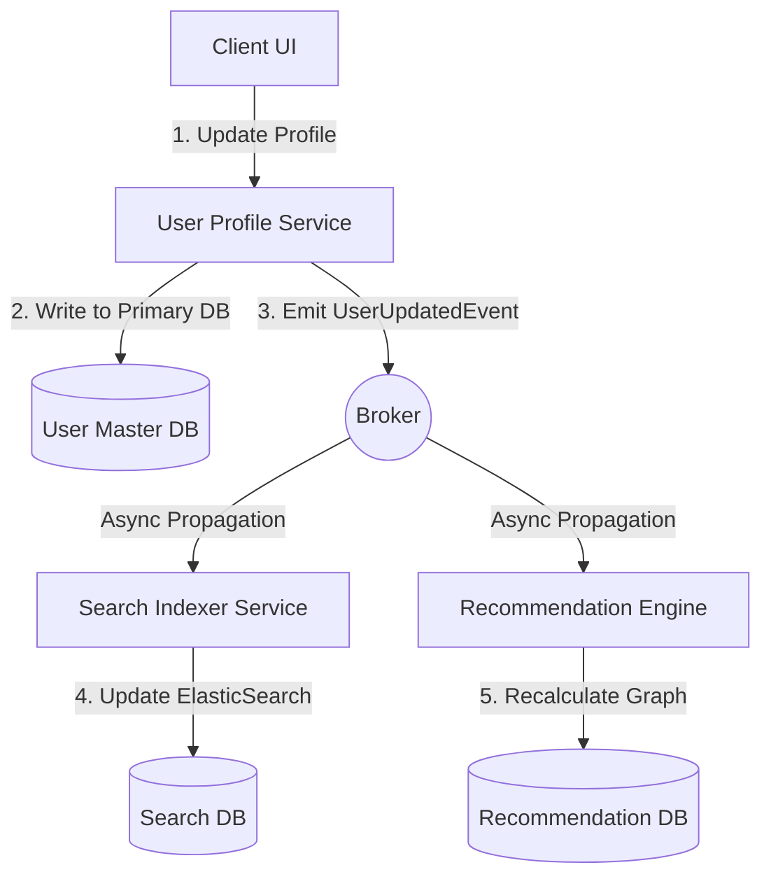
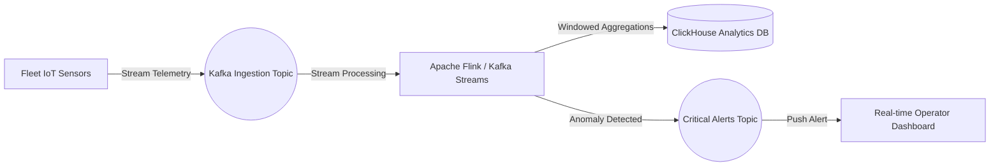

# 08-09_Enterprise Event-Driven Architecture: Critical Challenges, Mitigations, and Core Use Cases

Event-Driven Architecture (EDA) offers significant advantages in scalability, fault isolation, and spatial-temporal decoupling compared to synchronous REST microservices. However, introducing asynchronous event brokers, distributed commit logs, and non-blocking messaging paradigms introduces systemic complexities. Transitioning to EDA trades the simplicity of synchronous call stacks for distributed state management, eventual consistency, out-of-order delivery risks, and complex operational requirements.

---

## 1. Architectural Trade-Offs & Asynchronous System Complexity

While synchronous REST services fail predictably along direct call chains, asynchronous event-driven systems fail non-deterministically across distributed, loosely coupled components. When a synchronous HTTP call fails, the client immediately receives a response code (such as HTTP 500 or 504) and can handle the exception in real time. In an event-driven system, errors occur asynchronously across independent execution threads and decoupled services, often long after the producer has received a successful acknowledgment for publishing the event.



To build resilient enterprise event-driven systems, software architects must address seven primary technical challenges.

---

## 2. Deep Dive: The 7 Core Technical Challenges of EDA & Enterprise Mitigations

### 2.1 Eventual Consistency & Stale Read Dynamics

In a synchronous architecture, database writes occur within a unified transactional boundary or through sequential blocking calls, ensuring immediate read-after-write consistency (strong consistency). In an event-driven system, data modifications propagate asynchronously across service boundaries through an event broker. Consequently, the system state is eventually consistent.

#### The Problem: Stale Reads
When a user updates state (such as submitting an order or changing an address) and immediately executes a read request (`GET /orders/123`), the query may hit a consumer read database that has not yet processed the corresponding event from the message broker. The client receives stale data, creating a perception of system failure or lost updates.



#### Enterprise Mitigation Strategies
1. **Read-Your-Own-Writes Consistency**: The API Gateway or Read Service inspects the client session state or event sequence version. If the local database lag exceeds the client's mutation timestamp, the query is routed to the primary writer DB or held until the read view updates.
2. **Client Optimism & Reactive State Push**: Rather than forcing the client to poll HTTP endpoints, the frontend updates UI state optimistically or opens a WebSocket/Server-Sent Events (SSE) connection to receive real-time push notifications when downstream consumers complete processing.
3. **CQRS (Command Query Responsibility Segregation)**: Explicitly separate the write model (Commands) from the read model (Queries), designing the read model specifically for low-latency queries while explicitly exposing processing state fields (`isProcessing: true`).

```java
// Spring Boot SSE Endpoint for Push-based Consistency Updates
@GetMapping(path = "/orders/{id}/stream", produces = MediaType.TEXT_EVENT_STREAM_VALUE)
public SseEmitter streamOrderStatus(@PathVariable String id) {
    SseEmitter emitter = new SseEmitter(30000L);
    eventListenerRegistry.register(id, emitter);
    return emitter;
}
```

---

### 2.2 At-Least-Once Delivery & Duplicate Event Processing

Event brokers guarantee message delivery using specific semantics: **At-Most-Once**, **At-Least-Once**, or **Exactly-Once**. Production message brokers (such as Apache Kafka, RabbitMQ, and AWS SQS) primarily rely on **At-Least-Once** delivery because network timeouts and broker rebalances make absolute single delivery across distributed networks impossible without severe performance penalties.

#### The Problem: Duplicate Message Processing
A producer publishes an event, or a consumer processes an event successfully, but the network acknowledgment (ACK) fails due to a transient timeout. The broker assumes the message was lost and redelivers it to another consumer instance. Without safeguards, actions like processing payments or deducting inventory will execute multiple times.

```mermaid
flowchart TD
    Producer[Order Producer] -->|1. Publish OrderCreated| Broker((Event Broker))
    Broker -->|2. Deliver Message Offset 42| Consumer[Payment Consumer]
    Consumer -->|3. Execute Payment $100| ExternalGateway[Payment Gateway]
    Consumer -.-x|4. ACK Lost due to Network Timeout| Broker
    Broker -->|5. Redeliver Duplicate Message Offset 42| Consumer2[Payment Consumer Instance 2]
    
    subgraph Idempotent Consumer Guard
        Consumer2 -->|6. Extract Unique Event ID| IdempotencyCheck{ID in Redis/DB?}
        IdempotencyCheck -- Yes -->|7. Skip Processing & ACK| ACK[Send ACK to Broker]
        IdempotencyCheck -- No -->|8. Process & Save ID| Execute[Execute Payment]
    end
```

#### Enterprise Mitigation Strategies: The Idempotent Consumer Pattern
Consumers must be engineered to handle duplicate events gracefully. This is achieved by generating a unique **Idempotency Key** (e.g., `eventId` or business key `orderId` + `eventMetadata`) at the producer level and tracking it at the consumer.

```java
// Spring Kafka Idempotent Consumer Pattern using Redis
@KafkaListener(topics = "order-events", groupId = "payment-group")
public void processOrder(ConsumerRecord<String, OrderEvent> record, Acknowledgment ack) {
    Boolean isNew = redisTemplate.opsForValue()
        .setIfAbsent("exec:" + record.value().getEventId(), "LOCKED", Duration.ofHours(24));
    if (Boolean.TRUE.equals(isNew)) {
        paymentService.executePayment(record.value());
    }
    ack.acknowledge();
}
```

---

### 2.3 Out-of-Order Message Delivery & State Machine Corruption

In a distributed environment, events can take different network paths, undergo partition rebalancing, or be processed by multi-threaded consumers running at different speeds. Consequently, events may arrive in a different order than they were published.

#### The Problem: State Machine Inversion
Consider an e-commerce order workflow emitting two sequential events: `OrderCreated` followed by `OrderCancelled`. If `OrderCancelled` arrives before `OrderCreated`, the consumer processes the cancellation first. When `OrderCreated` subsequently arrives, the database is populated with an active order that should have been closed, resulting in state corruption.



#### Enterprise Mitigation Strategies
1. **Partition Key Routing**: In systems like Apache Kafka or AWS Kinesis, messages with the same business key (e.g., `orderId`) must be published to the same partition. Kafka guarantees strict FIFO (First-In, First-Out) ordering within an individual partition.
2. **Sequence Numbers & Timestamps**: Embed monotonic sequence numbers or logical vector clocks inside the event header. Consumers reject or buffer any event whose sequence number is lower than the last processed sequence number for that entity ID.

```java
// Ensuring Partition Ordering via Message Key in Spring Kafka
public void publishOrderEvent(String orderId, OrderEvent event) {
    // Passing orderId as the message key guarantees same-partition placement
    kafkaTemplate.send(new ProducerRecord<>("order-events", orderId, event));
}
```

---

### 2.4 Schema Evolution & Compatibility Crashing

As business requirements change, event payload structures evolve. Fields are added, modified, or removed. In an event-driven system where producers and consumers are deployed independently, changing a message schema can break downstream consumers that depend on specific field formats or types.



#### Enterprise Mitigation Strategies
1. **Centralized Schema Registry**: Implement a centralized Schema Registry (such as Confluent Schema Registry or AWS Glue Schema Registry) using binary serialization formats like Apache Avro or Protocol Buffers (Protobuf).
2. **Strict Schema Compatibility Policies**:
   - **BACKWARD**: Consumers using schema $N$ can process events produced with schema $N-1$ (e.g., deleting fields or adding optional fields).
   - **FORWARD**: Consumers using schema $N-1$ can process events produced with schema $N$ (e.g., adding new fields).
   - **FULL**: Schema modifications are both backward and forward compatible.

```yaml
# Spring Boot application.yml for Avro & Confluent Schema Registry
spring:
  kafka:
    consumer:
      key-deserializer: org.apache.kafka.common.serialization.StringDeserializer
      value-deserializer: io.confluent.kafka.serializers.KafkaAvroDeserializer
    properties:
      schema.registry.url: http://schema-registry.internal:8081
      specific.avro.reader: true
```

---

### 2.5 Distributed Tracing & Asynchronous Debugging Complexity

In synchronous REST architectures, an HTTP request passes down a single thread execution chain, passing context headers (like `X-Correlation-ID`) across HTTP calls. In contrast, asynchronous event-driven architectures decouple execution using queues or topics, operating across multiple independent threads, process boundaries, and execution loops.

```mermaid
flowchart LR
    Client -->|HTTP POST TraceID: 0x99| API Gateway
    APIGateway -->|TraceID: 0x99| OrderService
    OrderService -->|Publish with Header TraceID: 0x99| Kafka((Kafka Broker))
    
    subgraph Parallel Async Execution
        Kafka -->|Header TraceID: 0x99| PaymentConsumer[Payment Service]
        Kafka -->|Header TraceID: 0x99| InventoryConsumer[Inventory Service]
        Kafka -->|Header TraceID: 0x99| AnalyticsConsumer[Analytics Service]
    end
    
    PaymentConsumer -->|Push Span| Zipkin[(OpenTelemetry Collector / Zipkin)]
    InventoryConsumer -->|Push Span| Zipkin
    AnalyticsConsumer -->|Push Span| Zipkin
```

#### Enterprise Mitigation Strategies
1. **Correlation ID & Context Propagation**: Inject trace context headers (`traceparent`, `tracestate`, or `correlation-id`) into the metadata headers of the broker message record (e.g., Kafka Record Headers or AMQP Message Properties).
2. **OpenTelemetry Integration**: Standardize on OpenTelemetry and Micrometer Tracing (formerly Spring Cloud Sleuth) to automatically inject trace identifiers into message headers during publication and extract them upon consumption.

```java
// Manual Trace ID Propagation in Spring Kafka Record Headers
ProducerRecord<String, OrderEvent> record = new ProducerRecord<>("orders", orderId, event);
record.headers().add(new RecordHeader("correlation-id", Tracer.getCurrentTraceId().getBytes()));
kafkaTemplate.send(record);
```

---

### 2.6 Poison Messages & Dead Letter Queue (DLQ) Architecture

A **Poison Message** is a corrupt, malformed, or invalid event payload that fails during consumer deserialization or business rule processing every time it is attempted.

#### The Problem: Partition Blockage
If a consumer encounters an unhandled exception while processing a message, the consumer may fail to commit the offset and restart processing at the same offset. This creates an infinite retry loop that blocks processing for all subsequent messages on that broker partition.



#### Enterprise Mitigation Strategies
1. **Non-Blocking Retry & Dead Letter Topics (DLT)**: Set a maximum retry threshold (e.g., 3 attempts). Once exceeded, route the invalid message to a dedicated **Dead Letter Topic (DLT)** or **Dead Letter Queue (DLQ)** and immediately acknowledge the offset on the primary topic to unblock processing.
2. **Automated DLQ Alerts & Replay Tooling**: Set up alerting for DLQ messages and build administrative tooling to inspect, fix, and re-inject corrected payloads into the main input topic.

```java
// Spring Kafka Non-Blocking Retry and DLQ Configuration
@RetryableTopic(
    attempts = "3",
    backoff = @Backoff(delay = 1000, multiplier = 2.0),
    dltStrategy = DltStrategy.FAIL_ON_ERROR
)
@KafkaListener(topics = "order-events", groupId = "inventory-group")
public void processInventory(OrderEvent event) {
    inventoryService.reserveStock(event);
}
```

---

### 2.7 Operational Overhead & Consumer Lag Monitoring

Deploying an event-driven system shifts technical complexity from application code to operational infrastructure. Managing distributed event logs, partition balances, storage retention policies, and consumer group offsets requires specialized operational practices.

#### Key Operational Metric: Consumer Lag
**Consumer Lag** represents the delta between the latest offset written to a topic partition by producers and the offset currently processed and committed by a consumer group ($Lag = Offset_{Producer} - Offset_{Consumer}$).



#### Enterprise Operational Metrics Matrix

| Operational Metric | Target Threshold | Impact of Failure | Remediation Strategy |
| :--- | :--- | :--- | :--- |
| **Consumer Lag** | $< 1,000$ messages | Stale data processing, increased latency, eventual consistency delays | Horizontal pod autoscaling (KEDA) based on lag metrics |
| **Broker Disk Usage** | $< 75\%$ total volume | Broker disk exhaustion, write freezes, service outages | Adjust log retention hours/bytes (`log.retention.hours`) |
| **Partition Rebalance Frequency** | Near zero during steady state | Stop-the-world consumer pauses, duplicate message delivery | Increase session timeouts (`max.poll.interval.ms`) |
| **DLQ Growth Rate** | Zero | Unhandled business errors, lost customer transactions | PagerDuty alerting, automated payload analysis |

---

## 3. Technical Decision Matrix: Synchronous REST vs. Asynchronous EDA

| Dimension | Synchronous REST Microservices | Asynchronous Event-Driven Architecture |
| :--- | :--- | :--- |
| **Communication Pattern** | Direct Request-Response (Blocking HTTP/gRPC) | Indirect Event Publication (Non-blocking Broker) |
| **Temporal Coupling** | High (Client & Server must be online simultaneously) | Low (Producers & Consumers run independently) |
| **Spatial Coupling** | High (Client must know Server endpoint URL/IP) | Low (Producers & Consumers know only Topic name) |
| **Consistency Model** | Immediate / Strong Consistency | Eventual Consistency |
| **Latency Profile** | Additive ($T_{total} = \sum T_i$) | Low initial response time ($T_{total} = T_{Producer Write}$) |
| **Availability Profile** | Multiplicative ($A_{total} = \prod A_i$) | Isolated service availability |
| **Failure Blast Radius** | Cascading failures across blocking chains | Contained failures buffered in message queues |
| **Primary System Complexity** | Circuit breakers, timeouts, thread exhaustion | Duplicates, ordering, schema evolution, consumer lag |

---

## 4. Enterprise Use Cases & System Selection Framework

Choosing between REST and EDA requires evaluating specific business requirements, workflow latency needs, and consistency constraints.



---

### 4.1 Fan-Out Distribution (One Event, Multiple Consumers)

#### Scenario
A business event occurs in one domain, and multiple independent downstream domains need to react to it without coupling to the originating service.

#### System Architecture
When a customer places an order, the `Order Service` publishes a single `OrderPlacedEvent`. Downstream microservices consume this event independently based on their specific business capabilities.

```mermaid
flowchart LR
    OrderService[Order Service (Producer)] -->|Publish OrderCreatedEvent| Topic((order-events Topic))
    
    Topic -->|Group: Inventory| InventoryService[Inventory Service]
    Topic -->|Group: Payment| PaymentService[Payment Service]
    Topic -->|Group: Notification| NotificationService[Notification Service]
    Topic -->|Group: Analytics| AnalyticsService[Analytics Service]
```

#### Key Benefits
- **Zero API Modification**: Adding a new downstream consumer (such as a Fraud Detection Service) requires no code changes or redeployment of the `Order Service`.
- **Fault Isolation**: If the `Notification Service` goes down, the `Payment` and `Inventory` services continue processing without interruption.

---

### 4.2 Long-Running Business Workflows: Critical vs. Non-Critical Path Splitting

#### Scenario
E-commerce checkout involves multiple processing stages: validating customer input, checking stock, authorizing credit cards, dispatching delivery requests, sending emails, and updating recommendation engines. Running all of these steps sequentially in a single synchronous REST call creates high latency and lowers system availability.

#### System Architecture: Path Separation
- **Critical Path (Synchronous REST)**: Core operations required to confirm the request. Must execute in real time while the user waits.
- **Non-Critical Path (Asynchronous EDA)**: Secondary operations that can complete asynchronously after the order request is accepted.



---

### 4.3 Workflows with Acceptable Eventual Consistency

#### Scenario
Systems where immediate data consistency across all read models is not required for core business transactions.

#### Examples
1. **User Profile Updates**: When a customer updates their profile picture or address, the change updates the primary user database immediately. Updating historical analytics, search indexes, or cached recommendations can happen asynchronously over the next few seconds.
2. **Audit Logging & Compliance**: Every mutation emits an audit event that is processed asynchronously by compliance storage engines.



---

### 4.4 Real-Time Analytics & High-Throughput Event Streaming

#### Scenario
Applications that need to ingest, analyze, and react to continuous high-volume data streams in real time.

#### Examples
- **Financial Fraud Detection**: Evaluating credit card transactions against anomaly models within milliseconds of occurrence.
- **IoT Fleet Telemetry**: Processing sensor data from thousands of vehicles to predict component failures.



---

## 5. Summary & Implementation Checklist

To build a production-ready Event-Driven Architecture, engineers should verify that their design addresses the following implementation criteria:

- [ ] **Idempotent Consumers**: Every consumer checks a distributed cache (such as Redis) or database constraint using a unique event ID to prevent duplicate processing.
- [ ] **Partition Ordering**: Events that depend on strict ordering are assigned explicit message keys to guarantee single-partition placement.
- [ ] **Schema Registry Integration**: Event structures use serialization formats (like Avro or Protobuf) managed by a central Schema Registry with backward compatibility rules.
- [ ] **Dead Letter Queue (DLQ)**: Non-blocking retries are configured with exponential backoff, automatically routing poisoned messages to a DLQ after a set number of retries.
- [ ] **Distributed Tracing Headers**: OpenTelemetry correlation IDs are injected into record metadata headers to maintain context propagation across asynchronous boundaries.
- [ ] **Consumer Lag Alerting**: Operational dashboards explicitly monitor consumer lag metrics to scale instances before processing delays impact users.
