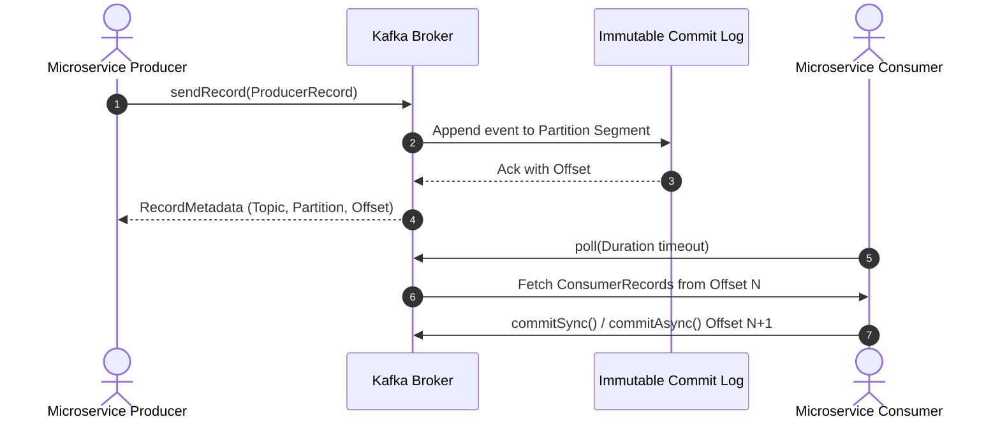

# 01-02_Apache_Kafka_Fundamentals_and_Event_Streaming_Architecture.md

## 1. Introduction and Architecture Context

Event-Driven Architecture (EDA) relies on asynchronous event publication and consumption to decouple microservices, improve scalability, and increase system resilience. Apache Kafka serves as the core backbone for enterprise event streaming architectures.

### Deep-Dive Learning Strategy
Mastering Kafka requires a structural, deep-dive understanding of its underlying architecture before moving to implementation details such as producer and consumer configurations. Because distributed event streaming introduces complex concepts—such as distributed log immutability, partition offsets, consumer group rebalancing, and broker consensus—it is essential to establish foundational clarity at each stage before proceeding to complex configurations. If concepts feel dense during architectural exploration, pausing to solidify understanding before moving forward prevents cascading knowledge gaps.

---

## 2. Fundamentals of Event-Driven Messaging Models

Event-driven paradigms are broadly divided into traditional **Publish/Subscribe (Pub/Sub) Messaging** and **Distributed Event Streaming**.

### Pub/Sub vs. Event Streaming

| Feature / Dimension | Traditional Pub/Sub (e.g., RabbitMQ, JMS) | Distributed Event Streaming (Apache Kafka) |
| :--- | :--- | :--- |
| **Primary Purpose** | Transient message routing and delivery | Continuous event ingestion, durable storage, and processing |
| **Persistence / Storage** | Messages are deleted after consumer acknowledgement | Events are append-only and persisted durably for a configured retention period |
| **Replayability** | Not supported natively (messages consumed are destroyed) | Fully supported (consumers can reset offsets to replay historical events) |
| **Consumer Decoupling** | High runtime decoupling, but queue state depends on consumer consumption rate | Absolute decoupling; producers and consumers operate independently at their own rate |
| **Scalability** | Scaled via competing consumers on a single queue | Scaled via partition distribution across broker clusters |

### Event Streaming Architecture Workflow

```mermaid
flowchart LR
    subgraph Producers
        P1[Order Service]
        P2[Payment Service]
    end

    subgraph Kafka Cluster
        subgraph Distributed Commit Log
            E1[Event 01: OrderCreated] --> E2[Event 02: PaymentProcessed]
            E2 --> E3[Event 03: OrderShipped]
        end
    end

    subgraph Consumers
        C1[Inventory Service - Offset 3]
        C2[Analytics Service - Offset 1 - Replaying]
    end

    P1 -->|Publish Event| Distributed Commit Log
    P2 -->|Publish Event| Distributed Commit Log
    Distributed Commit Log -->|Stream Events| C1
    Distributed Commit Log -->|Stream / Replay Events| C2
```

---

## 3. What is Apache Kafka?

Apache Kafka is an open-source, highly scalable, fault-tolerant distributed event streaming platform designed to handle high-throughput, low-latency data feeds in real-time.

### Three Core Capabilities

1. **Publish (Produce Events)**: Applications write structured event records containing a key, value, timestamp, and optional headers to Kafka topics.
2. **Store (Persist Events)**: Events are written to an append-only commit log on disk, replicated across brokers for high availability, and retained according to defined retention policies (time-based or size-based).
3. **Subscribe / Consume (Read Events)**: Consumer applications continuously poll topics to process event streams sequentially or asynchronously based on assigned log offsets.

### Event Storage and Replayability Mechanism

Unlike conventional message brokers that remove messages immediately after delivery, Kafka treats topics as persistent distributed logs. Because events are never mutated and remain on disk until retention limits expire, consumer applications can rewind their read pointer (offset) to re-process historical data.

Key use cases for event replayability include:
- **Service Recovery**: Rebuilding application state following a system crash or database corruption.
- **Bootstrapping New Services**: Ingesting historical event history when deploying a new microservice.
- **Audit and Analytics**: Running batch analysis across past events without impacting production message pipelines.

### End-to-End Event Lifecycle



---

## 4. Overview of Core Kafka Infrastructure Components

An Apache Kafka ecosystem comprises several interacting architectural components:

- **Producer**: Client applications that publish streams of events to Kafka topics.
- **Broker**: A single Kafka server node responsible for storing partition data and handling read/write requests.
- **Cluster**: A group of interconnected brokers working together to distribute load, handle failover, and maintain partition replication.
- **Topic**: A logical category or stream name to which events are published.
- **Partition**: An ordered, immutable segment of a topic log distributed across cluster nodes for horizontal scaling.
- **Consumer Group**: A group of cooperating consumers sharing the workload of reading messages from topic partitions.

---

## 5. Spring Boot Integration Quick Reference

In Spring Boot applications, event publishing and consumption are configured using `KafkaTemplate` and `@KafkaListener`.

### Event Publishing Pattern

```java
@Autowired
private KafkaTemplate<String, Object> kafkaTemplate;

public void publishEvent(String topic, String key, Object payload) {
    kafkaTemplate.send(topic, key, payload);
}
```

### Event Consumption Pattern

```java
@KafkaListener(topics = "order-events", groupId = "inventory-group")
public void consumeOrderEvent(OrderEvent event) {
    // Process order event
}
```

### Key Spring Boot Properties

```properties
spring.kafka.bootstrap-servers=localhost:9092
spring.kafka.producer.key-serializer=org.apache.kafka.common.serialization.StringSerializer
spring.kafka.producer.value-serializer=org.springframework.kafka.support.serializer.JsonSerializer
spring.kafka.consumer.key-deserializer=org.apache.kafka.common.serialization.StringDeserializer
spring.kafka.consumer.value-deserializer=org.springframework.kafka.support.serializer.JsonDeserializer
```
