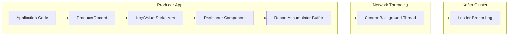
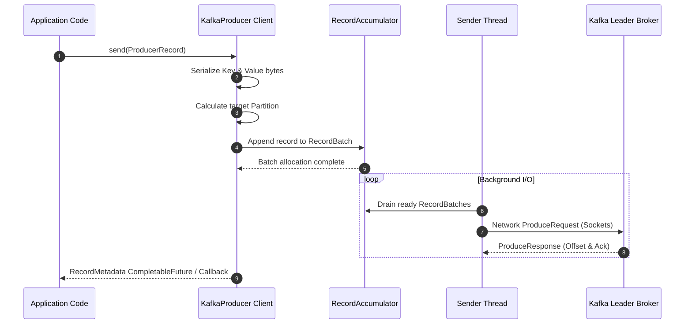
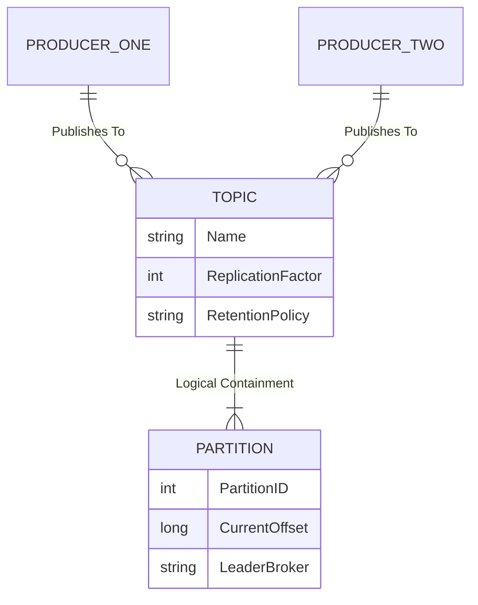
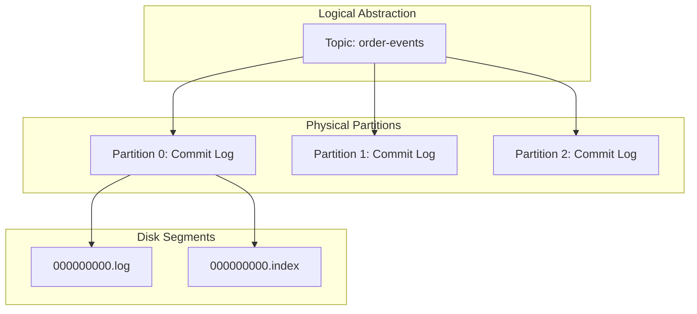

# 03-04 Apache Kafka Producer Architecture and Topic Fundamentals

## 1. Apache Kafka Producer Fundamentals & Architectural Decoupling

### 1.1 Core Definition and Decoupled Architecture
An **Apache Kafka Producer** is a client application responsible for publishing event records to a Kafka cluster. In an event-driven architecture, the producer acts as the origin of data, emitting events that capture state changes, domain occurrences, or telemetry metrics.

A foundational architectural principle of Kafka is the **complete decoupling of producers and consumers**:
* **Consumer Blindness**: The producer functions without any knowledge of downstream consumers. It does not track which applications consume its events, how many consumers exist, or when processing occurs.
* **Asynchronous Push Model**: Producers publish messages via an asynchronous push model. Messages are appended to Kafka topics regardless of whether consumer applications are active, online, or degraded.
* **Storage and Processing Separation**: The producer's sole responsibility is the durable handoff of data to Kafka brokers. Downstream routing, fan-out, and message persistence are managed by the broker infrastructure, eliminating direct point-to-point coupling between services.

| Architectural Dimension | Traditional RPC / Direct Request-Response | Kafka Event Streaming (Producer Model) |
| :--- | :--- | :--- |
| **Service Coupling** | Tight coupling; caller must know target endpoint, protocol, and availability. | Full temporal and spatial decoupling; producer only targets a logical Kafka topic. |
| **Target Awareness** | Direct destination address (IP/URL) and explicit request payloads. | No awareness of downstream consumers or target processing logic. |
| **Backpressure Impact** | Downstream latency or failure directly degrades or blocks the caller. | Isolated by broker buffer; producers append to log independently of consumer throughput. |
| **Failure Domain** | Cascading failures if downstream services become unreachable. | Localized; event is durably committed to the broker log even if consumers are down. |

---

### 1.2 Producer Event Lifecycle & Internal Architecture
When a producer application issues a record, the underlying client client library (`KafkaProducer`) processes the record through an internal pipeline prior to network transmission.

#### Record Structure
A Kafka producer record (`ProducerRecord<K, V>`) consists of:
1. **Topic Name**: The target logical stream.
2. **Key (Optional)**: Used for partitioning strategy and log compaction keying.
3. **Value**: The domain event payload (JSON, Avro, Protobuf, or String).
4. **Headers (Optional)**: Key-value metadata pairs (e.g., correlation IDs, tracing context).
5. **Timestamp (Optional)**: Event time (`CreateTime`) or ingestion time (`LogAppendTime`).

#### Internal Pipeline
1. **Serialization**: Key and Value serializers convert high-level objects into raw byte arrays (`byte[]`).
2. **Partitioning**: A `Partitioner` determines the target partition index based on record key hashes or round-robin strategies.
3. **Accumulator Buffer**: Records are grouped into memory batches (`RecordBatch`) inside the `RecordAccumulator` to optimize network throughput.
4. **Sender Thread**: A dedicated background thread extracts ready batches, constructs socket requests, and transmits data to the leader brokers.





---

### 1.3 Delivery Guarantees & Tuning Configuration
Producer behavior regarding reliability, latency, and throughput is dictated by broker acknowledgment settings (`acks`) and batching configurations.

#### Producer Acknowledgment Modes (`acks`)
* **`acks=0` (Fire-and-Forget)**: The producer returns immediately upon writing records to the network socket. Highest throughput, but carries high risk of data loss.
* **`acks=1` (Leader Acknowledgment)**: The leader broker writes the record to its local partition log before acknowledging. Provides moderate durability.
* **`acks=all` or `acks=-1` (Full In-Sync Replicas)**: The leader waits for all active In-Sync Replicas (ISRs) to commit the record before returning success. Guarantees zero data loss when paired with `min.insync.replicas`.

```java
// Spring Boot Producer Configuration Snippet
configProps.put(ProducerConfig.BOOTSTRAP_SERVERS_CONFIG, bootstrapServers);
configProps.put(ProducerConfig.KEY_SERIALIZER_CLASS_CONFIG, StringSerializer.class);
configProps.put(ProducerConfig.VALUE_SERIALIZER_CLASS_CONFIG, JsonSerializer.class);
configProps.put(ProducerConfig.ACKS_CONFIG, "all");
```

```java
// Spring Boot KafkaTemplate Publish Snippet
@Autowired
private KafkaTemplate<String, OrderEvent> kafkaTemplate;

public CompletableFuture<SendResult<String, OrderEvent>> publishOrder(String orderId, OrderEvent event) {
    return kafkaTemplate.send("order-events", orderId, event);
}
```

---

## 2. Apache Kafka Topic Abstraction & Logical Event Grouping

### 2.1 Topic Concept and Category Abstraction
A **Kafka Topic** is a named, logical stream of records. Metaphorically, a topic can be envisioned as a **category** or a **folder** within a filesystem:
* **Logical Grouping**: Topics structure event data by domain context (e.g., `user-signups`, `payment-transactions`, `inventory-updates`).
* **Storage Abstraction**: While developers target a topic when sending messages, the topic itself is a logical abstraction. Physical storage, indexing, scaling, and distribution are managed via underlying **Partitions**.
* **Append-Only Multi-Producer Support**: Multiple distinct producer applications can concurrently publish events to the exact same topic. Events from various sources are interleaved into the topic stream while preserving write thread-safety.



---

### 2.2 Topic Structure & Physical Realization
Although topics represent logical categories, Kafka converts each topic into physical segment files on broker disk storage.

#### Topic to Partition Relationship
* A topic is subdivided into one or more **Partitions**.
* Each partition functions as an immutable, ordered sequence of records (an append-only commit log).
* Records added to a topic partition are assigned a monotonically increasing sequential number called an **Offset**.



#### Retention Policies and Log Cleanup
Topics maintain event streams according to governance policies defined at topic creation or runtime cluster config:
1. **Time-based Retention (`log.retention.hours`)**: Events are deleted after a specified duration (e.g., 7 days).
2. **Size-based Retention (`log.retention.bytes`)**: Limits total partition log size on disk; oldest segments are pruned when threshold is exceeded.
3. **Log Compaction (`cleanup.policy=compact`)**: Retains at least the last known value for each record key within the partition, enabling state restoration and changelog patterns.

---

### 2.3 Spring Boot Topic Declarations
Spring Boot allows programmatic creation and administrative management of topics via `KafkaAdmin` and `NewTopic` beans.

```java
// Spring Boot Topic Bean Definition
@Bean
public NewTopic createOrderEventsTopic() {
    return TopicBuilder.name("order-events")
            .partitions(3)
            .replicas(1)
            .build();
}
```

---

## 3. Summary and Technical Comparison Matrices

### Producer vs. Topic Architectural Responsibilities

| Dimension | Producer Component | Topic Abstraction |
| :--- | :--- | :--- |
| **Abstraction Level** | Client-side application component. | Cluster-side logical category and storage abstraction. |
| **Primary Function** | Originates, serializes, partitions, and transmits records. | Organizes, categorizes, and structures stream records. |
| **Scalability Mechanism** | Scaled out horizontally by adding client instances. | Scaled out horizontally by adding partitions across brokers. |
| **Lifecycle** | Ephemeral application lifecycle; starts and stops with service. | Durable infrastructure lifecycle; managed administrative entity. |

### Key Producer Tuning Parameters

| Configuration Property | Default Value | Technical Purpose | Performance Impact |
| :--- | :--- | :--- | :--- |
| `bootstrap.servers` | N/A | Initial list of broker addresses for cluster discovery. | Required for initial metadata cluster connection. |
| `key.serializer` | N/A | Serializer class implementing `Serializer<K>`. | Converts object keys into byte payloads. |
| `value.serializer` | N/A | Serializer class implementing `Serializer<V>`. | Converts object values into byte payloads. |
| `acks` | `all` | Broker acknowledgment durability requirement. | Controls data safety versus produce latency. |
| `linger.ms` | `0` | Artificial delay to wait for `batch.size` bytes before send. | Increases batching efficiency and throughput at cost of latency. |
| `batch.size` | `16384` (16KB) | Maximum memory size allocated per partition record batch. | Larger batches improve throughput and compression efficiency. |
| `enable.idempotence` | `true` | Enables sequence-number-based duplicate prevention. | Guarantees exactly-once write semantics per partition without performance penalty. |
