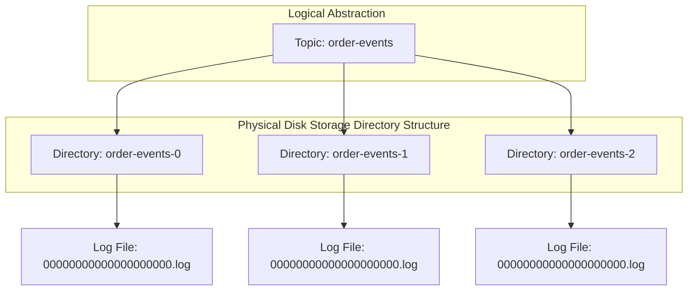
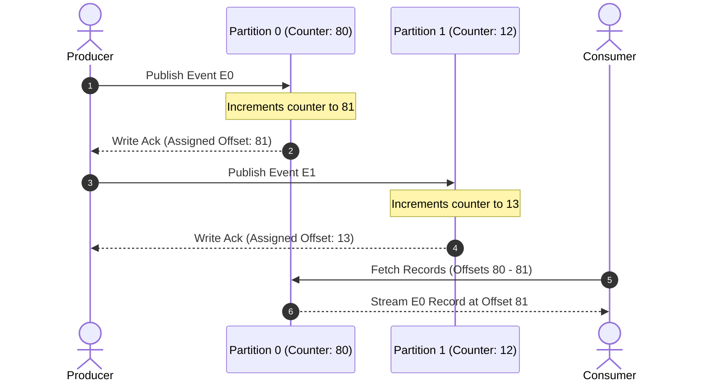
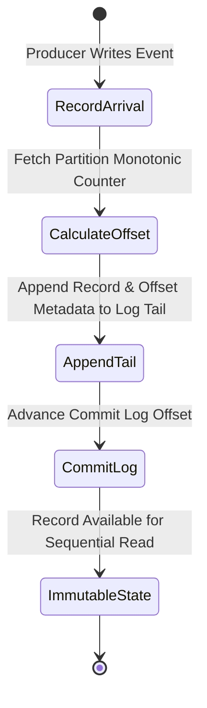
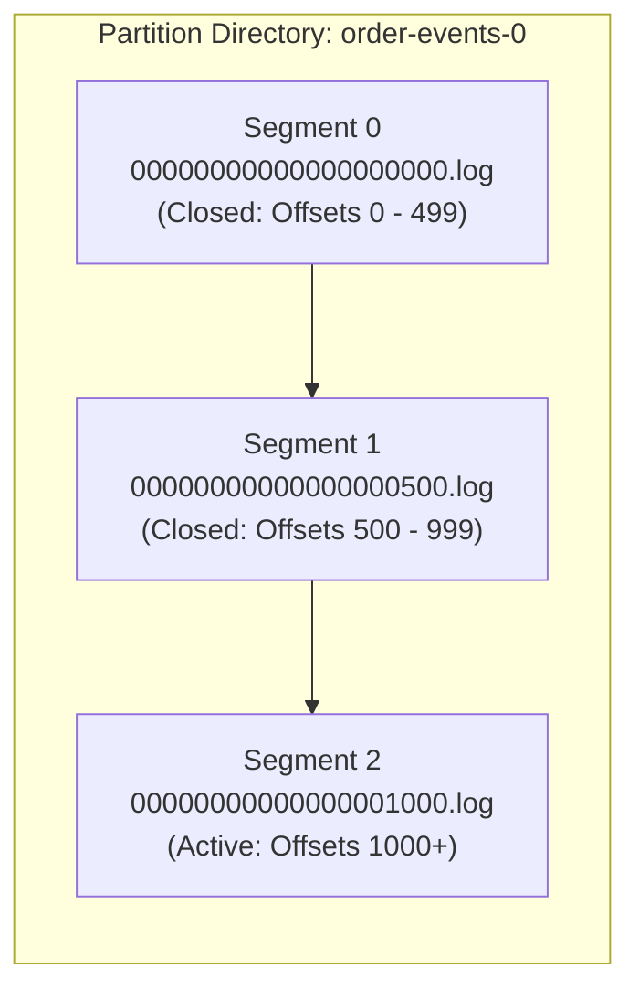
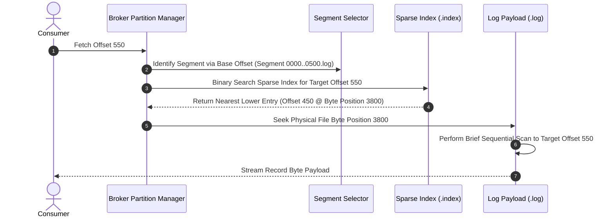
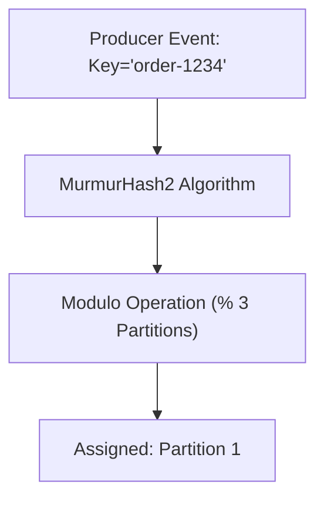
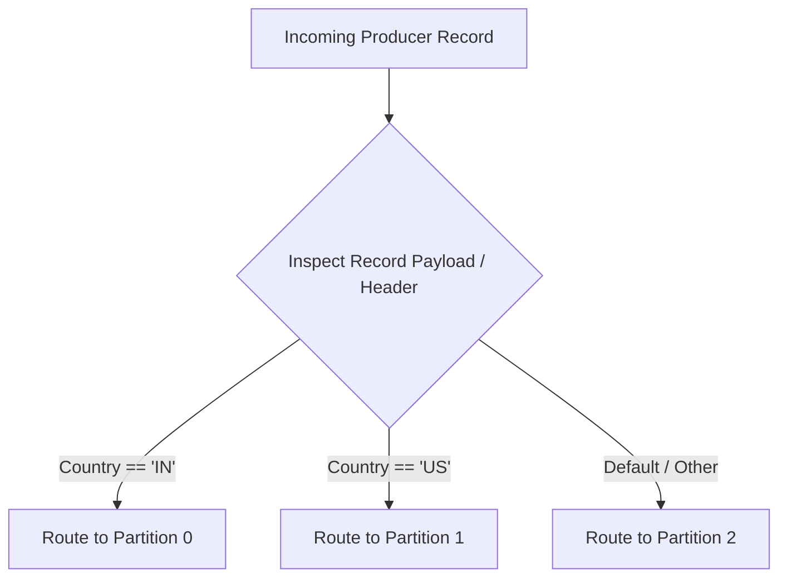
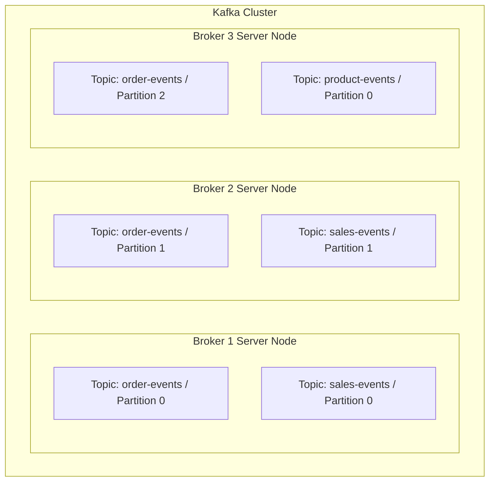
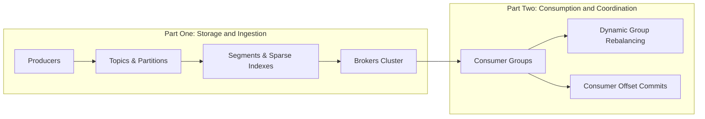

# 05-07_Apache Kafka Partitions Segments and Broker Architecture.md

## 1. Physical Log Architecture and Partition Fundamentals

### 1.1 Topic Abstraction vs. Physical Partitions
In Apache Kafka, a **topic** is a logical entity that represents a category or feed name to which event records are published. However, from an infrastructure and disk storage perspective, a topic does not exist as a single monolithic file. Instead, every topic is divided into one or more **partitions**, which serve as the actual physical storage units for events.

When a topic is created on a Kafka cluster, the broker creates physical directories on its host filesystem corresponding to each assigned partition. The directory naming convention strictly follows the pattern `<topic-name>-<partition-id>` (e.g., `order-events-0`, `order-events-1`, `order-events-2`). Inside these partition directories, Kafka maintains append-only log files where binary-encoded event payloads are permanently written to disk.



### 1.2 Offset Assignment and Monotonic Increment Mechanics
Each partition is an ordered, immutable sequence of record messages that is continually appended to. Every event published to a partition is assigned a sequential, monotonically increasing 64-bit integer called an **offset**. 

Key characteristics of partition offsets include:
* **Independent Counter Scope**: Every partition maintains its own independent offset counter starting at offset `0`. Offset values are unique only within the scope of a specific partition.
* **Sequential Write Assignment**: When a new record arrives at a partition, Kafka inspects its internal counter, generates the next incremented offset (e.g., if the highest offset is 80, the next record is assigned offset 81), and appends the record alongside its assigned offset metadata.
* **Strict Per-Partition Ordering**: Because events are appended sequentially and assigned strictly increasing offset integers, ordering is absolute **within a single partition**. A record with offset 81 is guaranteed to have occurred after offset 80 in that partition.
* **Absence of Global Ordering Across Partitions**: Kafka does not provide a global ordering guarantee across multiple partitions within the same topic. Because individual partitions increment their counters independently, it is impossible to determine whether an event at offset 2 in Partition 1 occurred before or after an event at offset 1 in Partition 0 without relying on external record timestamps.



### 1.3 Immutable Append-Only Storage Model
Kafka partitions enforce a strict **append-only** record model. Once an event is written and committed to a partition log, it cannot be modified, edited, or overwritten in-place. All incoming writes occur strictly at the tail end of the physical log file.

This append-only architecture delivers major performance and operational benefits:
* **Elimination of Random Disk I/O**: Sequential disk writes bypass costly physical disk head seek operations on traditional HDDs and optimize page cache utilization on modern SSDs.
* **Predictable Sequential Reads**: Consumers always read records sequentially in increasing offset order (e.g., offset 100, 101, 102). Consumers cannot request arbitrary non-sequential offsets (e.g., 105, then 20, then 80) without executing explicit seek operations.
* **High Concurrency without Record Locking**: Immutable logs eliminate row-level locking or page-level write locks during message consumption, allowing concurrent reads while the log tail is actively being appended to.



---

## 2. Segment Files and Indexing Mechanics

### 2.1 Segment File Architecture
Although a partition is logically viewed as a continuous commit log, storing gigabytes or terabytes of data in a single monolithic file on disk would severely degrade system performance. Operating systems struggle to perform fast sequential lookups, memory mapping, and file cleanups on massive single files.

To solve this, Kafka breaks each physical partition log into smaller, manageable file chunks known as **segments**. 



Core properties of log segments include:
* **Active Segment vs. Closed Segments**: At any given time, only one segment in a partition directory is the **active segment** (where active writes occur). All preceding segments are **closed segments** (read-only immutable files).
* **Segment Naming Convention**: Segment files are named after the **base offset**—the offset of the first event record stored within that specific segment. The filename is padded with leading zeros to 20 digits followed by the `.log` extension (e.g., `00000000000000000000.log` starts at offset 0, while `00000000000000000500.log` starts at offset 500).
* **Segment Rollover Triggers**: Kafka closes the current active segment and opens a new active segment when specific thresholds are breached, such as maximum size limit (`segment.bytes`, default 1 GB) or maximum time limit (`segment.ms`).

### 2.2 Sparse Indexing Mechanics and Binary Search Lookup
When a consumer requests records starting at a target offset (e.g., offset 550), scanning a 1 GB segment file line-by-line from byte 0 is unacceptably slow. To achieve near-instantaneous offset lookups, Kafka maintains a complementary **index file** (`.index`) for every segment file.

#### Dense Indexing vs. Sparse Indexing
* **Dense Indexing**: Stores a mapping entry for *every single offset*. This creates massive memory overhead and large index files that consume significant OS page cache.
* **Sparse Indexing**: Kafka uses **sparse indexing**, where an index entry is created only after a configurable threshold of bytes (defined by `index.interval.bytes`, default 4096 bytes / 4 KB) has been written to the log file.

#### Step-by-Step Sparse Index Calculation Example
Consider a segment starting at offset 0 with `index.interval.bytes = 4096`:
1. Offset 0 arrives (size 300 bytes) -> Log position starts at Byte 0. Total bytes: 300 B.
2. Offset 1 arrives (size 500 bytes) -> Log position starts at Byte 300. Total bytes: 800 B.
3. Offset 2 arrives (size 1000 bytes) -> Log position starts at Byte 800. Total bytes: 1800 B.
4. Offset 3 arrives (size 2000 bytes) -> Log position starts at Byte 1800. Total bytes: 3800 B.
5. Offset 4 arrives (size 500 bytes) -> Log position starts at Byte 3800. Total bytes: 4300 B.
6. Since cumulative written bytes (4300 B) now exceed the 4096-byte index interval, Kafka writes a new row into the sparse `.index` file: `(Offset 4 -> Physical File Position 3800 Bytes)`.



### 2.3 Segment File Types and Configuration Matrix

| File Extension | Structural Purpose | Binary Contents | Key Tuning Configurations |
| :--- | :--- | :--- | :--- |
| **`.log`** | Stores actual record payloads | Binary batch headers, keys, values, metadata, offsets, and timestamps | `segment.bytes` (default 1GB), `segment.ms` |
| **`.index`** | Maps logical offsets to byte offsets | Sparse key-value array of `(Relative Offset, Physical Byte Position)` | `index.interval.bytes` (default 4KB), `segment.index.bytes` |
| **`.timeindex`** | Maps timestamps to logical offsets | Sparse array of `(Timestamp, Relative Offset)` used for time-based seeks | `index.interval.bytes` |

```properties
# Spring Boot / Kafka Topic Configuration for Segment and Index Boundaries
spring.kafka.properties.segment.bytes=1073741824
spring.kafka.properties.index.interval.bytes=4096
spring.kafka.properties.segment.index.bytes=10485760
```

---

## 3. Producer Partitioning Strategies

### 3.1 Key-Based Partitioning Mechanics
When publishing events, producers can attach a message **key**. Kafka uses key-based partitioning to guarantee that all records with the exact same key are routed to the exact same partition, enforcing strict processing order per entity (e.g., all events for `orderId-1234` land in Partition 1).

The default partitioner computes the partition assignment using the MurmurHash2 algorithm:
```
Partition = abs(MurmurHash2(RecordKey)) % TotalPartitions
```



### 3.2 Round-Robin and Sticky Partitioning
If a producer publishes a record without specifying a message key (`key = null`), Kafka selects a destination partition automatically:
* **Legacy Round-Robin**: Evenly rotates message distribution across all available partitions ($P_0 	o P_1 	o P_2 	o P_0$).
* **Modern Sticky Partitioner**: Fills a complete batch (`batch.size`) destined for a single partition before switching to the next partition. This maximizes network compression ratios and throughput while eliminating small fragmented requests.

### 3.3 Custom Partitioning Logic
Developers can override default hashing algorithms by creating custom classes that implement Kafka's `Partitioner` interface. This allows custom routing logic, such as routing traffic based on geographical regions or tenant priority tiers.



```java
public class RegionalPartitioner implements Partitioner {
    @Override
    public int partition(String topic, Object key, byte[] keyBytes, Object val, byte[] valBytes, Cluster cluster) {
        return "IN".equals(key) ? 0 : 1;
    }
    @Override public void close() {}
    @Override public void configure(Map<String, ?> configs) {}
}
```

```properties
# Configuring Custom Partitioner Class in Spring Boot
spring.kafka.producer.properties.partitioner.class=com.example.kafka.RegionalPartitioner
```

---

## 4. Kafka Broker Architecture and Topology

### 4.1 Broker Instance Responsibilities
A **Kafka Broker** is a single stateful server instance (running on a physical machine, virtual machine, or container) that runs the Kafka daemon process. 

A broker is responsible for:
* Hosting partition log directories and managing segment write/read operations on local storage.
* Servicing incoming produce requests from producers and fetch requests from consumers.
* Participating in cluster replication protocols to maintain high availability and zero data loss.

### 4.2 Distributed Partition Assignment Across Cluster
A critical architectural principle of Apache Kafka is that **a single broker stores only a subset of partitions for a subset of topics**. No single broker contains the entire dataset of an enterprise Kafka deployment.

For example, given a topic `order-events` with 3 partitions:
* **Broker 1** hosts `order-events-0`
* **Broker 2** hosts `order-events-1`
* **Broker 3** hosts `order-events-2`

This distributed distribution enables horizontal scaling: throughput is shared across multiple network interfaces, memory pools, and CPU sockets.



### 4.3 Structural Entity Matrix

| Abstraction Level | Architectural Nature | Core Responsibilities | File System Manifestation |
| :--- | :--- | :--- | :--- |
| **Topic** | Logical Category | Groups related event streams logically | Virtual grouping across brokers |
| **Broker** | Physical Server Node | Serves network I/O and manages physical log files | Statefully running Java process / JVM |
| **Partition** | Physical Commit Log | Preserves sequential ordering and enables scaling | Directory named `<topic>-<partition_id>` |
| **Segment** | Physical Data Chunk | Stores record batches and sparse indexes | Set of `.log`, `.index`, and `.timeindex` files |

---

## 5. Part One Synthesis and Part Two Roadmap

### 5.1 Architecture Summary & Key Takeaways
Part One establishes the fundamental building blocks of Apache Kafka's event streaming storage engine:
1. **Producer Isolation**: Producers publish events to decoupled logical topics using key-based, round-robin, or custom partitioning rules.
2. **Partition Log Mechanics**: Partitions act as physical, ordered, append-only commit logs on disk where events are assigned monotonically increasing offsets.
3. **High-Performance Segment Storage**: Monolithic logs are split into segments (`.log`) paired with sparse index files (`.index`) that map logical offsets to disk byte positions via binary search.
4. **Broker Cluster Topology**: Brokers distribute topic partitions horizontally across cluster nodes to scale I/O and storage capacity.

### 5.2 Transition to Consumer Groups and Part Two
With data safely stored and indexed on broker disk storage, the next critical challenge is **consumption at scale**. Part Two dives into the consumer architecture:
* **Consumer Groups**: Dynamic worker pools that parallelize partition consumption.
* **Offset Commits**: State management mechanisms tracking consumer position (`__consumer_offsets`).
* **Rebalance Protocol**: Dynamic group coordination and partition reassignments during consumer scaling or node failures.

