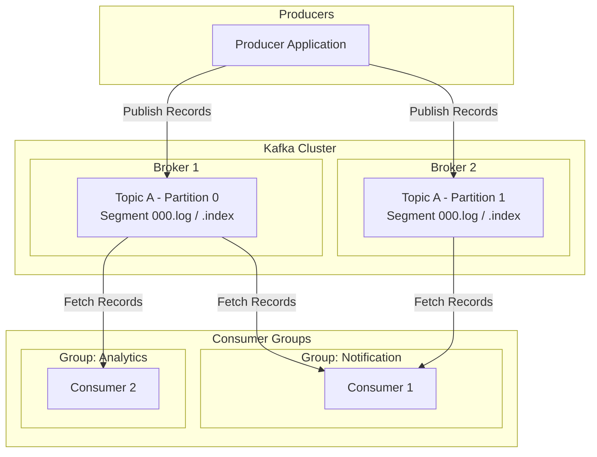
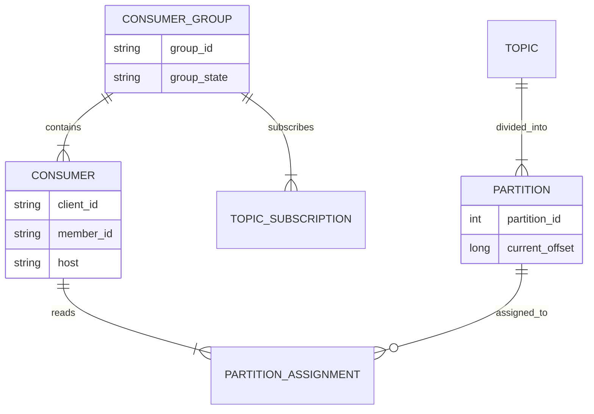
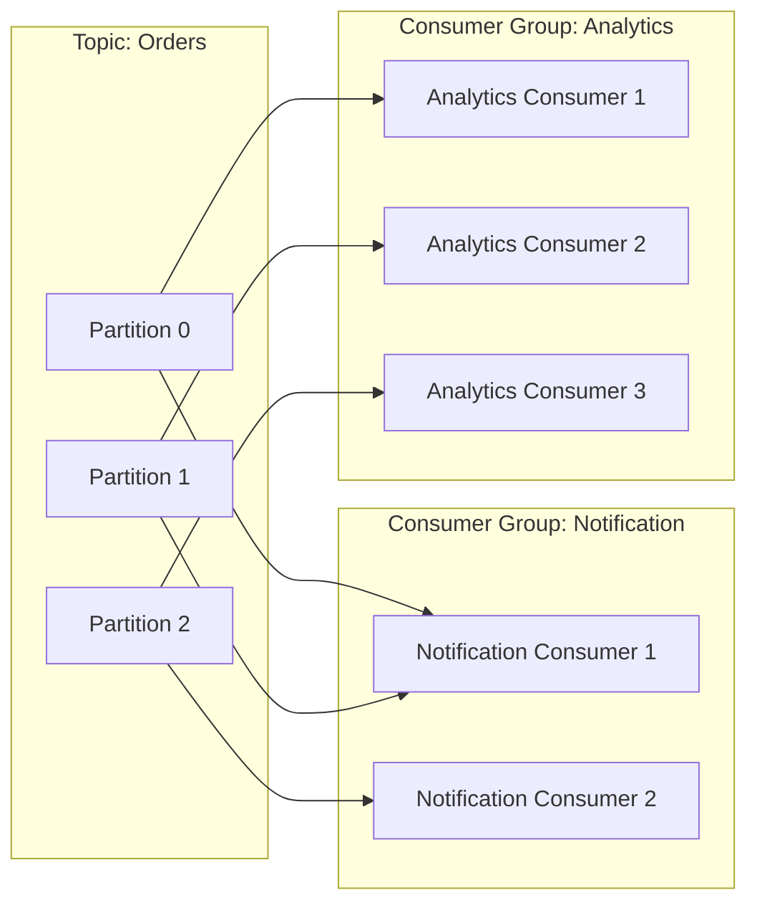
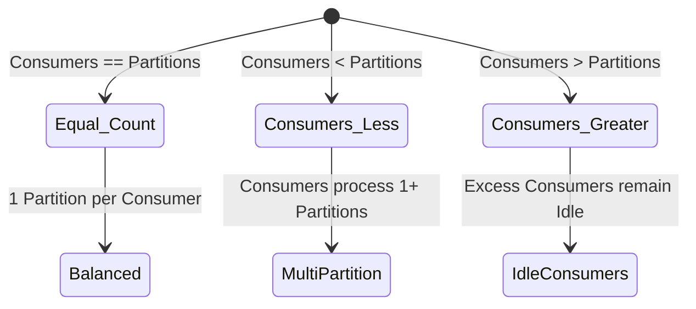
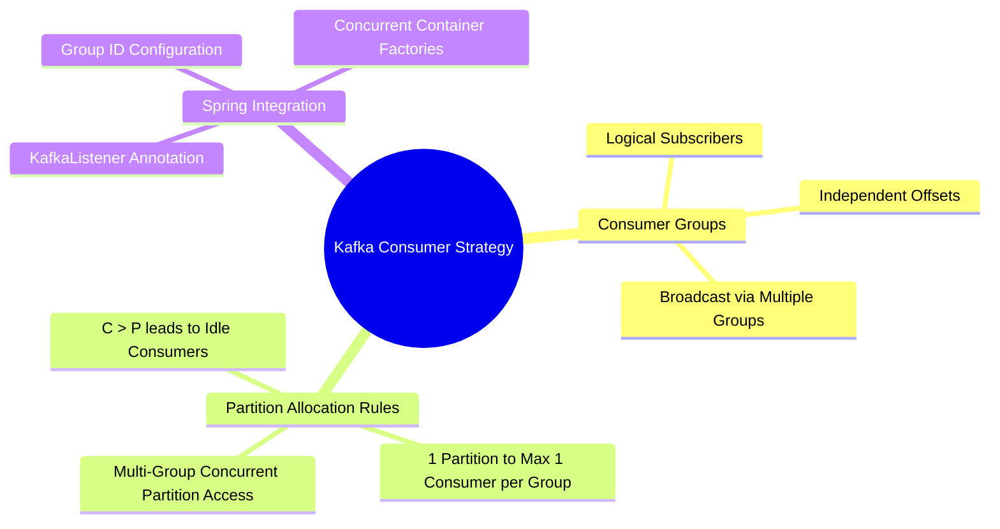

# 01-02_Kafka Consumer and Consumer Group Definition_Fundamentals and Partition Assignment.md

## 1. Apache Kafka Architecture Overview & Core Components Recap

Apache Kafka is an event streaming platform designed for high-throughput, fault-tolerant, and distributed real-time data ingestion. To understand consumer dynamics, it is essential to contextualize where consumers fit within the broader cluster architecture.



### Core Cluster Components

| Component | Function & Architecture |
| :--- | :--- |
| **Kafka Broker** | A server instance running within a Kafka cluster. Brokers handle client requests (produce, fetch, metadata), manage partition storage, and coordinate replication. |
| **Topic** | A logical stream or category to which records are published. Topics in Kafka are partitioned for scalability and parallelism. |
| **Partition** | An ordered, immutable sequence of records appended log-style. Partitions are the fundamental unit of parallelism and throughput scaling in Kafka. |
| **Segment (.log & .index)** | Physical log files on the broker disk. A partition is split into segments. `.log` files store actual message payloads, while `.index` and `.timeindex` files maintain offset-to-physical-position mappings for fast O(1) disk lookups. |
| **Producer** | Client applications that write events to Kafka topics, using partitioning strategies (e.g., key hash, round-robin, custom partitioners) to route records to specific partitions. |
| **Consumer & Consumer Group** | Client applications that subscribe to topics, read records sequentially from assigned partitions, and track progress using offsets. |

---

## 2. Consumer & Consumer Group Fundamentals

In Apache Kafka, reading data is decoupled from writing data through the abstraction of **Consumers** and **Consumer Groups**. Understanding the distinction between individual consumer instances and consumer groups is critical for building scalable microservice architectures.



### Key Concepts

*   **Consumer Instance:** An individual worker thread or application process running a Kafka consumer client. It connects to the cluster, joins a designated consumer group, fetches batches of records, and processes them.
*   **Consumer Group (`group.id`):** A logical collection of consumer instances sharing a common identifier. The consumer group acts as a single logical subscriber to one or more Kafka topics.
*   **Publish-Subscribe vs. Queueing Paradigms:**
    *   **Queueing (Work Distribution):** When multiple consumers join the *same* consumer group, Kafka distributes topic partitions among them so that each record is processed by only one consumer instance in that group.
    *   **Publish-Subscribe (Broadcasting):** When multiple consumers belong to *different* consumer groups, each group receives a complete, independent copy of all messages published to the topic.

---

## 3. Partition Assignment Rules & Group Dynamics

Kafka enforces strict rules governing how partitions are allocated to consumer instances within and across consumer groups.



### Fundamental Assignment Rules

1.  **Rule 1 (Single Group Isolation):** Within a single consumer group, a partition can be assigned to **at most one** consumer instance at any given time. Two consumers in the same group can never read from the same partition simultaneously. This guarantees strict in-partition ordering without contention.
2.  **Rule 2 (Multi-Group Independence):** Consumers in **different** consumer groups can read from the same partition independently and concurrently. Each group maintains its own independent commit offset position in the `__consumer_offsets` system topic.

### Partition-to-Consumer Scaling Scenarios



| Scenario | Consumer Count vs. Partition Count | Partition Allocation Behavior | Operational Nuance & Impact |
| :--- | :--- | :--- | :--- |
| **Balanced (C = P)** | 3 Consumers, 3 Partitions | Each consumer is assigned exactly 1 partition. | Ideal state for balanced throughput and maximum resource utilization. |
| **Under-provisioned (C < P)** | 2 Consumers, 3 Partitions | One or more consumers are assigned multiple partitions (e.g., Consumer 1 gets P0 & P1; Consumer 2 gets P2). | Increases load per active consumer; overall consumption parallelism is limited by C. |
| **Over-provisioned (C > P)** | 4 Consumers, 3 Partitions | 3 consumers are assigned 1 partition each; 1 consumer receives no partitions and remains **idle**. | Idle consumers act as active standby instances. If an active consumer dies, the group coordinator immediately reassigns its partition to an idle consumer. |

---

## 4. Spring Boot & Java Integration Patterns

In Spring Boot applications, Kafka consumers are configured using application properties and declarative listener annotations.

### Configuration Properties

```properties
spring.kafka.bootstrap-servers=localhost:9092
spring.kafka.consumer.group-id=notification-group
spring.kafka.consumer.auto-offset-reset=earliest
spring.kafka.consumer.key-deserializer=StringDeserializer
```

### Declarative Listener Implementation

```java
@KafkaListener(topics = "orders", groupId = "notification-group")
public void handleNotification(ConsumerRecord<String, String> record) {
    log.info("Key: {}, Payload: {}, Partition: {}", record.key(), record.value(), record.partition());
}
```

### Multi-Group Configuration Example

To implement both notification and analytics processing pipelines on the same topic, distinct group IDs are specified:

```java
@KafkaListener(topics = "orders", groupId = "analytics-group")
public void handleAnalytics(ConsumerRecord<String, String> record) {
    analyticsService.process(record.value(), record.partition());
}
```

---

## 5. Summary & Key Takeaways



*   **Consumer Groups** provide scalable parallel processing while maintaining message ordering within individual partitions.
*   **Partition Caps Parallelism:** The maximum active parallelism for a single consumer group is capped by the number of partitions in the subscribed topic.
*   **Idle Consumer Redundancy:** Deploying more consumers than partitions provides immediate hot-standby failover capabilities during instance crashes or rebalances.
*   **Multi-Service Pipelines:** Different microservices (e.g., `notification-group` vs. `analytics-group`) should always use distinct `group.id` settings to receive complete streams of domain events.
