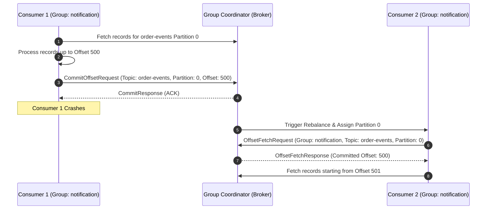
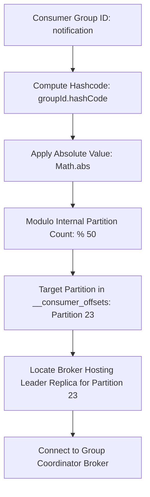
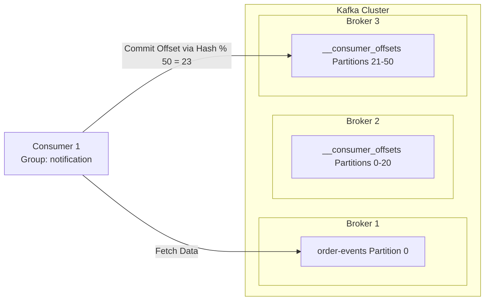
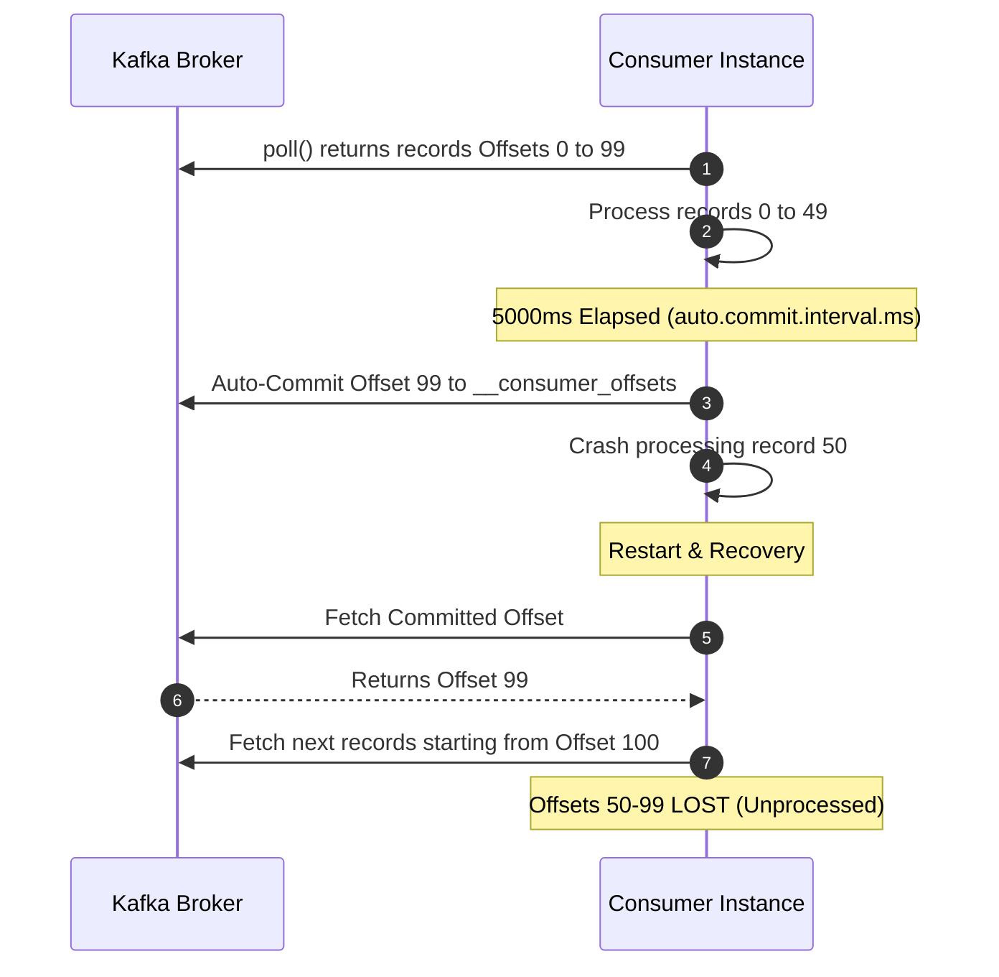
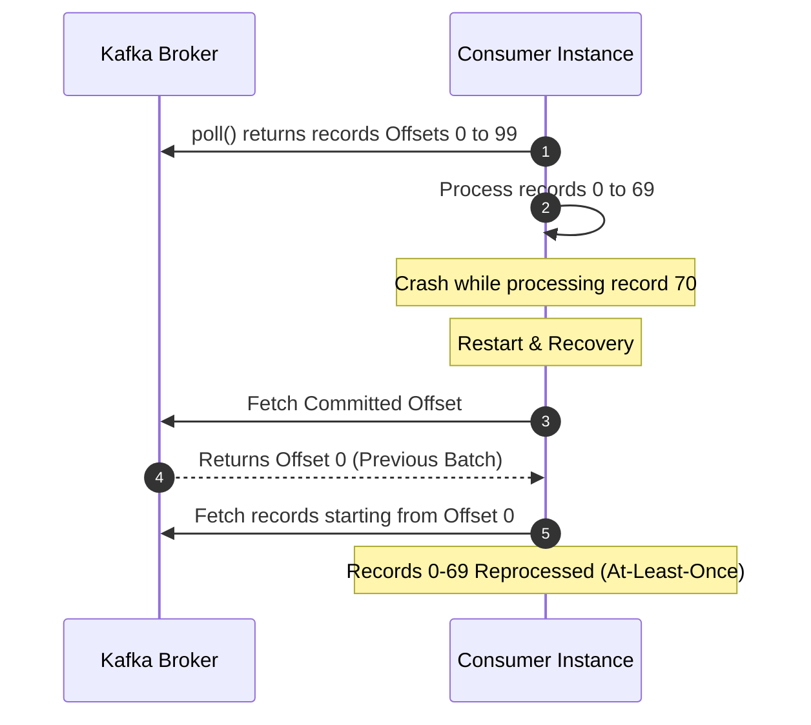
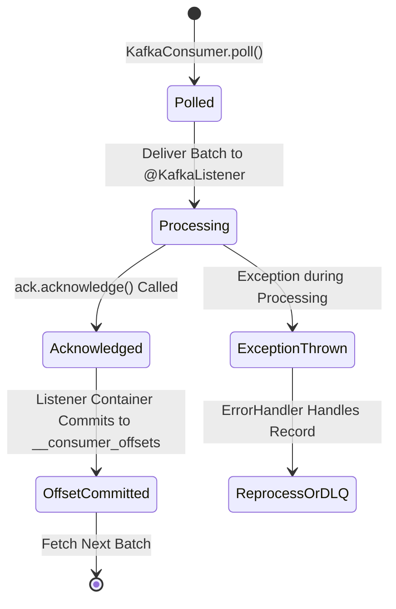

# 03-04_Kafka Offset Commits in Consumer Offsets Topic and Strategies.md

## 1. Group-Level Offset Tracking and State Isolation

### Core Concept: Group-Wise vs. Consumer-Wise Offset Persistence
Apache Kafka tracks consumption progress by persisting offsets on a per-consumer-group basis rather than tying offset state to individual consumer instances. Within a consumer group, each assigned partition maintains an independent offset pointer that marks the highest successfully processed message sequence number.

Storing offset metadata at the consumer group level (`Group ID + Topic + Partition -> Offset`) ensures complete state isolation and decoupling from transient consumer process identities. Individual consumer instances within a group are stateless workers that can crash, restart, or scale dynamically without corrupting partition state.

If consumer instance `C1` in consumer group `notification` crashes while processing partition 0 of topic `order-events`, a rebalance occurs. Consumer instance `C2` takes over partition 0 and queries Kafka for the committed offset associated with group `notification` and partition 0. Upon receiving the latest committed offset (e.g., offset 500), `C2` seamlessly resumes processing from offset 501.

### Dynamic Rebalance & Crash Recovery Dynamics
When a consumer instance joins or leaves a consumer group, the Group Coordinator initiates a group rebalance to redistribute partition assignments. Because consumption state resides centrally in Kafka, new or surviving instances retrieve the exact partition offset snapshot saved by the group prior to the rebalance.



### Group-Level State vs. Individual Instance State Comparison

| Feature / Dimension | Group-Level Offset Persistence | Consumer Instance State |
| :--- | :--- | :--- |
| **State Owner** | Consumer Group (`groupId`) | Individual Process / Thread |
| **Storage Location** | Internal `__consumer_offsets` topic | Ephemeral In-Memory Buffer |
| **Fault Tolerance** | High; survives complete instance failure | None; destroyed on process termination |
| **Rebalance Impact** | Preserves processing progress for takeover nodes | Requires re-initialization upon reassignment |
| **Key Composite** | `[Group ID, Topic Name, Partition ID]` | `[Consumer Client ID, Instance Host IP]` |

---

## 2. The Internal `__consumer_offsets` Topic

### Internal Topic Architecture and Metadata Structure
Kafka manages consumer offset tracking natively by storing all commit records inside an internal system topic named `__consumer_offsets`. This design leverages Kafka's high-throughput partition log engine for system metadata.

The `__consumer_offsets` topic is automatically provisioned by the Kafka broker cluster upon receiving the first offset commit request or consumer group interaction. By default, Kafka configures `__consumer_offsets` with 50 partitions (`offsets.topic.num.partitions=50`) and a replication factor driven by `offsets.topic.replication.factor`.

Every message written to `__consumer_offsets` is a structured key-value log record:
* **Key**: A tuple containing `[groupId, topic, partition]`.
* **Value**: Offset metadata including `[committed_offset, leader_epoch, metadata_string, commit_timestamp]`.

### Partition Determination via Consistent Hashing
Because `__consumer_offsets` consists of 50 partitions, Kafka uses a deterministic hash algorithm to route all offset commit messages for a given consumer group to a single partition.

```java
int targetPartition = Math.abs(groupId.hashCode()) % numPartitions;
```

For example, if `groupId.hashCode()` for group `notification` evaluates to a hash whose modulo 50 equals 23, partition 23 of `__consumer_offsets` will store all offset commit and offset fetch events for every topic and partition consumed by the `notification` group.



### Group Coordinator Discovery & Cluster Topology
In a distributed Kafka cluster, partitions are spread across multiple broker nodes. The broker hosting the leader replica for a group's assigned `__consumer_offsets` partition serves as the designated **Group Coordinator** for that consumer group.

When a consumer instance initializes:
1. It computes the target partition in `__consumer_offsets` using the hash modulo formula.
2. It sends a `FindCoordinatorRequest` to any bootstrap broker to identify which broker holds the leader replica for that internal partition.
3. The bootstrap broker returns the node metadata for the Group Coordinator broker.
4. The consumer opens a dedicated network connection to the Group Coordinator to issue `OffsetCommitRequest` and `OffsetFetchRequest` calls.



### Log Compaction Mechanics (`cleanup.policy=compact`)
To prevent infinite disk usage growth from continuous offset commits, `__consumer_offsets` uses log compaction (`cleanup.policy=compact`). 

Kafka's background cleaner thread periodically scans `__consumer_offsets` log segments and retains only the latest record value for each unique key (`[groupId, topic, partition]`). Older offset commit entries for the same key are marked for garbage collection and discarded, keeping the internal partition log compact and fast to read during rebalances.

### System Topics vs. User Topics Comparison

| Parameter / Feature | System Topic (`__consumer_offsets`) | Standard User Topics |
| :--- | :--- | :--- |
| **Auto-Creation** | Automatic on first commit/group request | Configurable via `auto.create.topics.enable` |
| **Default Partitions** | 50 (`offsets.topic.num.partitions`) | 1 (`num.partitions`) |
| **Cleanup Policy** | `compact` (Log Compaction) | `delete` (Time/Size-based retention) |
| **Record Key** | Schema tuple `[groupId, topic, partition]` | Application key (e.g., `orderId`, `userId`) |
| **Access Control** | Internal protocol managed by Group Coordinator | External Producer / Consumer API access |

---

## 3. Offset Commit Strategies and Reliability Trade-offs

### Automatic Commit Strategy (`enable.auto.commit=true`)
When `enable.auto.commit` is set to `true`, the Kafka consumer client periodically commits the highest offset returned by the last `poll()` invocation in the background. The commit frequency is dictated by `auto.commit.interval.ms` (default: 5000 ms / 5 seconds).

#### Execution Mechanics
During every `KafkaConsumer.poll()` execution, the client checks if the elapsed time since the last commit exceeds `auto.commit.interval.ms`. If the timer has expired, the client triggers an asynchronous offset commit for the offsets fetched in the prior polling cycle before fetching new records.

#### Data Loss Hazard Scenario
Auto-commit introduces a severe risk of message loss if a failure occurs mid-batch.

1. At $T_0$, `poll()` fetches messages with offsets 0 to 99.
2. The consumer application begins processing records sequentially.
3. At $T_1$ (5 seconds elapsed), auto-commit fires in the background, registering offset 99 in `__consumer_offsets`.
4. At $T_2$, the consumer instance crashes while processing message offset 50.
5. On recovery, a new consumer queries `__consumer_offsets`, obtains committed offset 99, and resumes polling at offset 100.
6. Messages 50 through 99 are **never processed**, causing quiet data loss.



### Manual Commit Strategy (`enable.auto.commit=false`)
Disabling auto-commit allows application code to dictate exact commit timing, giving developers explicit control over processing guarantees.

#### Batch Manual Commit
Under batch manual commit, the consumer fetches a batch of records (e.g., 100 records via `max.poll.records`), processes the entire batch completely, and then issues a synchronous (`commitSync()`) or asynchronous (`commitAsync()`) commit call.

* **Failure & Reprocessing Analysis**: If the consumer crashes at message 70 out of 100, no offset commit occurred for the current batch. Upon rebalance, the takeover consumer retrieves the last committed offset (offset 0 from the previous batch) and re-executes processing from offset 0 to 99.
* **Delivery Semantics**: Guarantees **At-Least-Once** delivery. Messages 0 through 69 are reprocessed, requiring down-stream processing logic to be idempotent.



```java
ConsumerRecords<String, String> records = consumer.poll(Duration.ofMillis(100));
processBatch(records);
consumer.commitSync();
```

#### Per-Record Manual Commit
An alternative approach issues a commit synchronously after processing each individual record in a loop.

* **Performance Bottleneck**: Committing after every message generates an immense volume of synchronous network round-trips to the broker Group Coordinator. This severely degrades throughput and saturates Kafka broker network threads.
* **Recommendation**: Synchronous per-record commit is strongly discouraged for high-throughput production workloads.

```java
for (ConsumerRecord<String, String> record : records) {
    processRecord(record);
    consumer.commitSync(Collections.singletonMap(
        new TopicPartition(record.topic(), record.partition()),
        new OffsetAndMetadata(record.offset() + 1)));
}
```

### Commit Strategy Trade-offs Comparison

| Metric / Aspect | Automatic Commit (`auto.commit`) | Batch Manual Commit | Per-Record Manual Commit |
| :--- | :--- | :--- | :--- |
| **Primary Guarantee** | At-Most-Once (Potential Loss) | At-Least-Once (Potential Duplicates) | At-Least-Once (Minimal Duplicates) |
| **Throughput Impact** | Maximum Throughput | High Throughput | Severely Degraded / Low |
| **Network Overhead** | Minimal (Periodic Async) | Low (Single Commit per Batch) | Extremely High (1 RPC per Record) |
| **Data Loss Risk** | High | Zero | Zero |
| **Duplicate Risk** | Moderate | Moderate (Bounded by Batch Size) | Extremely Low (Single Record) |
| **Production Suitability**| Non-critical telemetry / logs | Enterprise / Core Business Logic | Rare edge cases / Low volume |

---

## 4. Spring Boot Integration and AckModes

### Spring Kafka AckMode Capabilities
Spring Kafka encapsulates offset management via `ContainerProperties.AckMode` enumeration settings configured on the listener container factory.



### Spring Boot Configuration Snippet
The following `application.yml` properties configure manual offset management with immediate acknowledgment mode:

```yaml
spring:
  kafka:
    consumer:
      enable-auto-commit: false
    listener:
      ack-mode: MANUAL_IMMEDIATE
```

### Declarative `@KafkaListener` Implementation
When `ack-mode` is set to `MANUAL` or `MANUAL_IMMEDIATE`, Spring injects an `Acknowledgment` handle into the listener method.

```java
@KafkaListener(topics = "order-events", groupId = "notification")
public void listen(ConsumerRecord<String, OrderEvent> record, Acknowledgment ack) {
    processOrder(record.value());
    ack.acknowledge();
}
```

### Spring Kafka AckMode Reference Table

| AckMode Enum | Commit Trigger Mechanism | Processing Guarantee |
| :--- | :--- | :--- |
| **RECORD** | Commits offset after the listener returns for each record | At-Least-Once (Fine-grained) |
| **BATCH** | Commits offset after all records returned by `poll()` are processed | At-Least-Once (Default) |
| **TIME** | Commits offset when `ackTime` interval has elapsed since last commit | Time-bounded At-Least-Once |
| **COUNT** | Commits offset when `ackCount` records have been processed | Count-bounded At-Least-Once |
| **MANUAL** | Queues commit when `ack.acknowledge()` is called; committed on batch end | Controlled Batch At-Least-Once |
| **MANUAL_IMMEDIATE** | Executes commit immediately when `ack.acknowledge()` is called | Explicit Immediate At-Least-Once |
