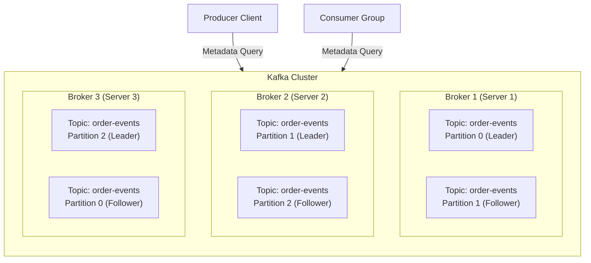
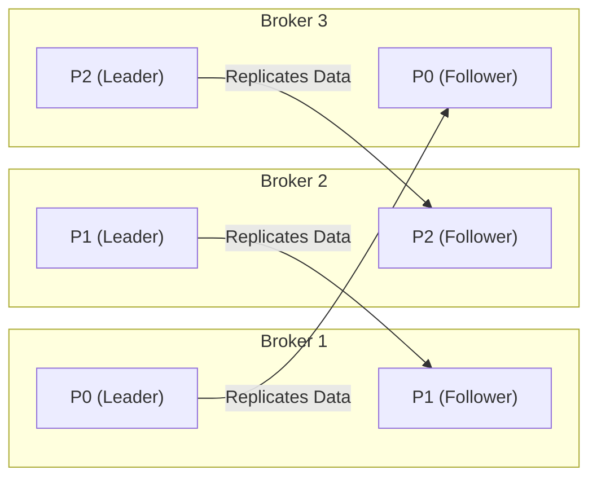
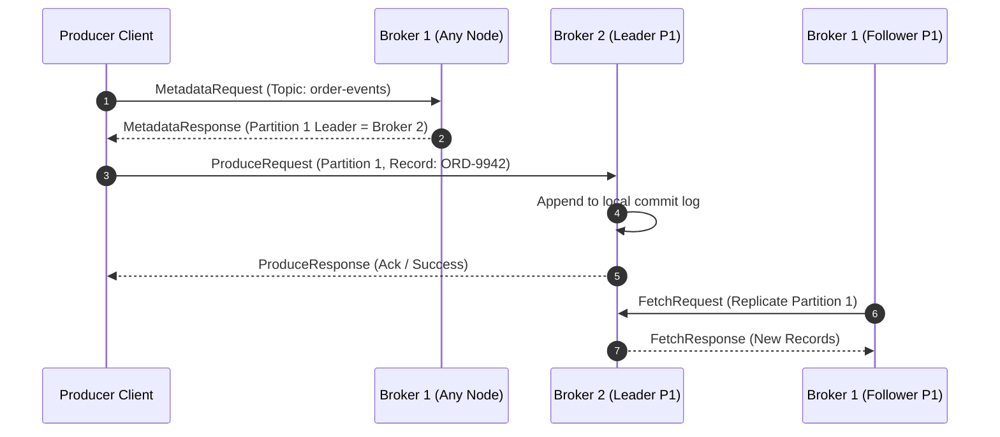
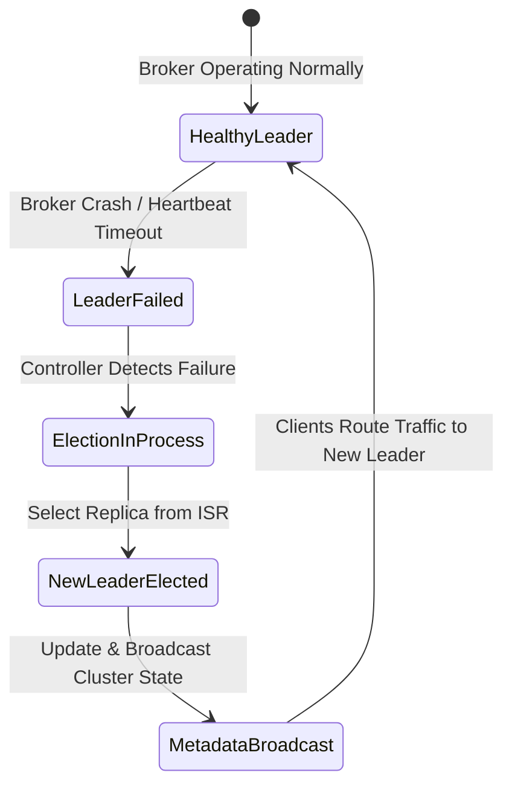
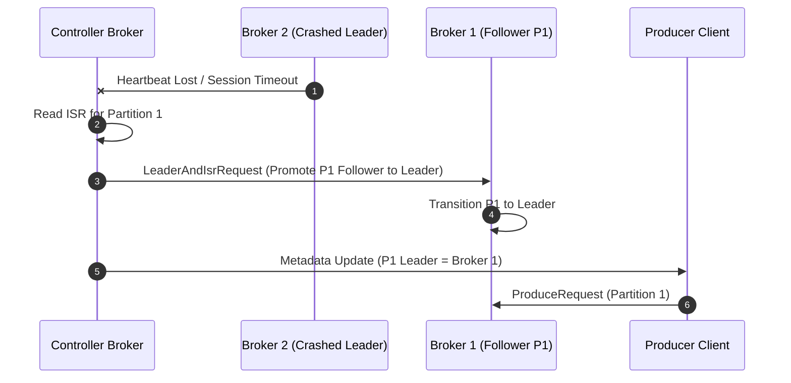

# 05-07_Kafka Cluster Architecture_Leader Follower Partitioning and Cluster Dynamics.md

## Topic 1: Kafka Cluster Fundamentals and High-Availability Architecture

### Core Pillars of Apache Kafka Architecture
An Apache Kafka cluster is a distributed system composed of multiple servers called **brokers** operating in unison. The multi-broker architecture is designed to satisfy three non-negotiable enterprise messaging requirements:

*   **Scalability**: Kafka distributes read and write workloads across a fleet of independent broker servers. Instead of routing all traffic through a centralized queue, data streams are divided into logical partitions distributed across the cluster, enabling linear horizontal scaling.
*   **Fault Tolerance**: Kafka continues to process data seamlessly even when individual brokers, disk drives, or network interfaces fail. Data redundancy guarantees that no single node failure results in data loss.
*   **High Availability**: Kafka operates without a Single Point of Failure (SPOF). Neither broker crashes, network partitions, nor disk degradations bring down the cluster. Every critical component—including message storage, metadata handling, and client request routing—is redundant.



### Physical and Logical Data Layout Across Brokers
A Kafka cluster consists of multiple physical or virtual broker servers. Topics represent logical event streams, which are divided into physical unit structures called **partitions**. 

Each broker hosts a subset of topic partitions. No single broker stores all topic data, preventing storage bottlenecks and allowing individual brokers to handle specific subsets of incoming requests.

| Architectural Pillar | Core Mechanism | Impact on System Operations |
| :--- | :--- | :--- |
| **Scalability** | Partition distribution across physical brokers | Prevents single-node CPU/IOPS bottlenecks; scales throughput linearly |
| **Fault Tolerance** | Cross-broker partition replication | Guarantees message persistence during broker crashes |
| **High Availability** | Automatic leader failover via Controller | Eliminates Single Points of Failure (SPOF) across the cluster |

---

## Topic 2: Leader-Follower Partition Replication Model

### Replication Factor and Partition Placement
To achieve fault tolerance, Kafka uses a **Leader-Follower replication model**. When creating a topic, operators configure two primary parameters:
1.  **Partition Count**: The number of parallel log streams for the topic.
2.  **Replication Factor (RF)**: The total number of copies (replicas) created for each partition across the cluster.

If a topic has a Replication Factor of RF, each partition will have exactly 1 **Leader Replica** and RF - 1 **Follower Replicas**.

#### Concrete Cluster Layout Example
Consider a scenario with the following setup:
*   **Topic Name**: `order-events`
*   **Partition Count**: 3 (`Partition 0`, `Partition 1`, `Partition 2`)
*   **Replication Factor**: 2 (Total replica instances = 3 * 2 = 6)
*   **Cluster Topology**: 3 Brokers (`Broker 1`, `Broker 2`, `Broker 3`)

Kafka distributes the 6 partition replicas across the 3 brokers such that no broker holds duplicate replicas of the same partition, and no broker holds all leader partitions:

*   **Broker 1**: Hosts `Partition 0` (Leader) and `Partition 1` (Follower)
*   **Broker 2**: Hosts `Partition 1` (Leader) and `Partition 2` (Follower)
*   **Broker 3**: Hosts `Partition 2` (Leader) and `Partition 0` (Follower)



### Leader vs. Follower Replica Responsibilities
Every partition replica in Kafka operates under a strict segregation of duties:

*   **Leader Replica**:
    *   Handles **all client write requests** (from Producers).
    *   Handles **all client read requests** (from Consumers).
    *   Appends incoming records directly to its local disk commit log.
    *   Maintains the **In-Sync Replicas (ISR)** list and tracks replica fetch offsets.
*   **Follower Replica**:
    *   Does **not** serve producer writes or consumer reads (under standard configurations).
    *   Operates purely as a passive standby instance.
    *   Issues continuous asynchronous `FetchRequest` calls to its partition Leader to pull raw records and append them to its local disk log.
    *   Stays in sync with the Leader to remain eligible for promotion if the Leader fails.

| Functional Responsibility | Leader Partition Replica | Follower Partition Replica |
| :--- | :--- | :--- |
| **Handles Producer Writes** | Yes (Exclusive) | No |
| **Handles Consumer Reads** | Yes (Exclusive) | No |
| **Log Maintenance** | Appends incoming messages to local commit log | Replicates log records pulled from Leader |
| **Standby Promotion** | Active operational state | Ready to become Leader upon node failure |
| **Client Interaction** | Serves external network traffic | Internal replication traffic only |

---

## Topic 3: Client Request Routing and Leader-Only I/O Dynamics

### Producer Write Routing Dynamics
When a Producer application publishes a message to a topic (e.g., `order-events` with record key `order-id`), it executes the following routing sequence:

1.  **Partition Hashing**: The Producer computes the target partition using consistent hashing on the record key: `abs(hash(key)) % partition_count`. For instance, an `order-id` of `ORD-9942` resolves to `Partition 1`.
2.  **Cluster Metadata Discovery**: The Producer queries any broker in the cluster for topic metadata via a `MetadataRequest`. The broker returns a `ClusterMetadata` response containing the exact mapping of partition leaders to broker network endpoints.
3.  **Direct Leader Connection**: Upon discovering that `Broker 2` hosts the Leader for `Partition 1`, the Producer establishes a direct TCP connection to `Broker 2` and transmits the record.



### Consumer Read and Offset Commit Routing Dynamics
Consumers follow an identical metadata discovery process for message retrieval and offset commits:

1.  **Fetch Requests**: A Consumer assigned to `Partition 1` fetches messages exclusively from `Broker 2` (Partition 1 Leader).
2.  **Offset Commit Routing**: When a Consumer group commits its processed offsets to the internal `__consumer_offsets` topic (which has 50 partitions), it calculates the target partition via `abs(groupId.hashCode()) % 50`. The Consumer resolves which broker hosts the Leader for that specific `__consumer_offsets` partition and sends the commit request directly to that broker (the **Group Coordinator**).

### Spring Boot Code Configuration
The following code snippets demonstrate how to declare topics with explicit partition and replication configurations, as well as producing records with key-based routing in Spring Boot.

#### Topic Configuration Bean
```java
@Bean
public NewTopic orderEventsTopic() {
    return TopicBuilder.name("order-events")
            .partitions(3)
            .replicas(2)
            .build();
}
```

#### Key-Based Producer Record Sending
```java
@Autowired
private KafkaTemplate<String, OrderEvent> kafkaTemplate;

public void sendOrderEvent(String orderId, OrderEvent event) {
    kafkaTemplate.send("order-events", orderId, event);
}
```

#### Spring Kafka Listener
```java
@KafkaListener(topics = "order-events", groupId = "inventory-group")
public void consumeOrderEvent(ConsumerRecord<String, OrderEvent> record) {
    log.info("Key: {}, Value: {}", record.key(), record.value());
}
```

---

## Topic 4: Cluster Orchestration and Controller Broker Roles

### Introduction to the Controller Broker
In a multi-broker Kafka cluster, individual brokers do not make autonomous placement decisions. Instead, one broker in the cluster is designated as the **Controller Broker**.

The Controller is responsible for cluster-wide state management:
*   **Partition Allocation**: Deciding which physical brokers host the leader and follower replicas for newly created topics.
*   **Leader Election**: Selecting a new Leader replica when an existing Leader broker fails.
*   **Metadata Propagation**: Broadcasting updated cluster metadata to all active brokers whenever topic topology or broker states change.



### Leader Failover and Re-election Workflow
When a broker hosting a Leader partition crashes, high availability is maintained through automatic leader re-election:

1.  **Failure Detection**: The Controller detects that a broker (e.g., `Broker 2`, Leader of `Partition 1`) has missed heartbeats or severed its session.
2.  **ISR Lookup**: The Controller inspects the In-Sync Replicas (ISR) list for `Partition 1`.
3.  **Leader Promotion**: The Controller promotes an active, in-sync follower (e.g., `Partition 1` follower on `Broker 1`) to become the new Leader.
4.  **Metadata Update**: The Controller updates the global cluster metadata store and broadcasts an `UpdateMetadataRequest` to all remaining brokers.
5.  **Client Re-routing**: Producers and Consumers receive updated metadata on their next refresh and seamlessly re-route write and read requests to `Broker 1`.


