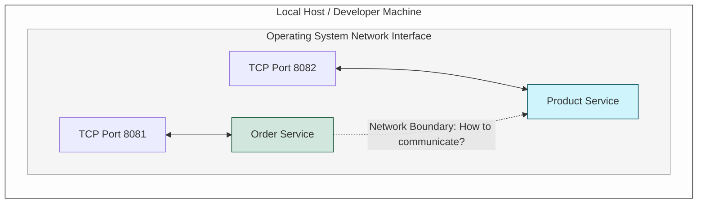
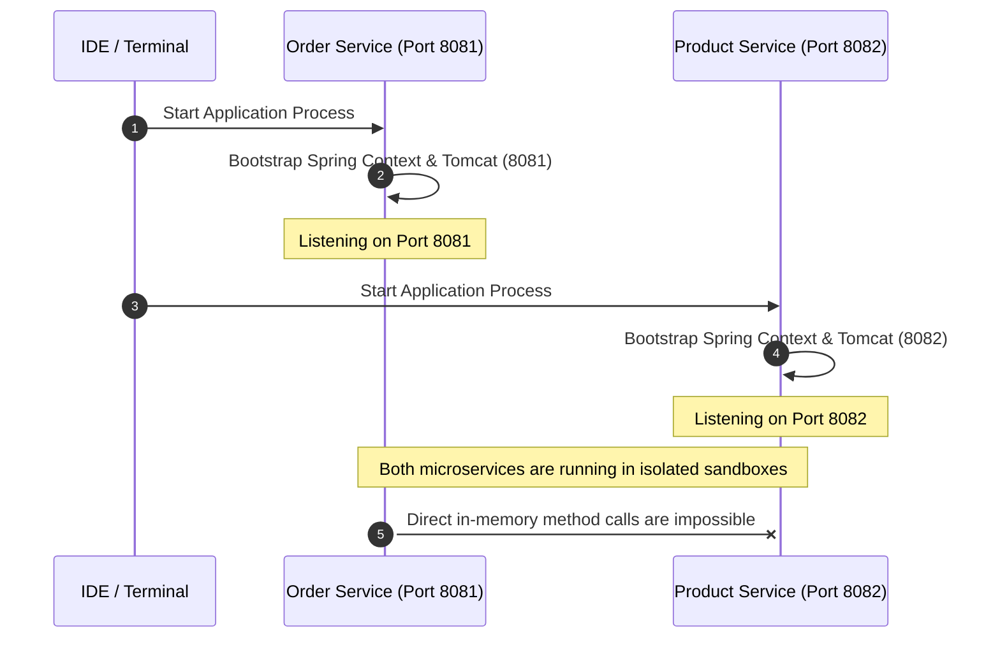

# 01-02_Spring Microservices Communication: Fundamentals and Setup

In modern software engineering, microservices architectures partition complex applications into smaller, autonomous, and loosely coupled services. The foundation of this pattern relies on setting up decoupled runtime environments and establishing robust network communication channels between them. This guide details the initialization, configuration, and structural setup of two foundational Spring Boot microservices: Order Service and Product Service.

---

## 1. Fundamentals of Microservices Isolation

In a microservices topology, each service runs as an independent process, often within separate host environments, containers, or virtual machines. This physical separation provides several key benefits:

*   **Process Isolation**: If one service fails (e.g., due to an out-of-memory error or thread exhaustion), other services remain active and unaffected.
*   **Independent Scalability**: High-demand services can be scaled horizontally without scaling the entire application.
*   **Heterogeneous Technology Stack**: Services can use different programming languages, databases, or frameworks tailored to their specific workloads.

However, this separation introduces network boundaries. Because services do not share a common memory space or runtime process, they cannot communicate via local method calls. Instead, they must rely on inter-process communication (IPC) protocols, typically HTTP/REST, gRPC, or asynchronous message brokers.

---

## 2. Architectural Blueprint: Order and Product Services

To explore inter-service communication from first principles, we establish two basic microservices. These services model a simplified e-commerce workflow where an order processing system must query catalog details from a product inventory system.

| Service Name | Default Port | Primary Dependency | Core Responsibility |
| :--- | :--- | :--- | :--- |
| **Order Service** | `8081` | `Spring Web` | Manages customer checkout, processes transactions, and requests product metadata. |
| **Product Service** | `8082` | `Spring Web` | Maintains the product catalog, tracks item details, and exposes endpoints to query product data. |

### Network Port Allocation and Socket Binding
When running multiple services on a single host machine (such as during local development), each service must bind to a unique TCP port. If two processes attempt to bind to the same network interface and port combination, the operating system throws a socket conflict error:

```text
java.net.BindException: Address already in use: bind
```

To prevent this collision, we allocate separate ports for our services. The Order Service binds to port `8081` and the Product Service binds to port `8082`.



---

## 3. Initializing the Services via Spring Initializr

We bootstrap both services using Spring Initializr (available at start.spring.io). The initialization process configures our project structure and manages build metadata using build tools like Maven or Gradle.

### The Role of `Spring Web` Starter
To facilitate rapid setup, we include only the `Spring Web` starter dependency (`spring-boot-starter-web`) and omit advanced cloud orchestration libraries (such as Spring Cloud) for this phase. The `Spring Web` starter pulls in several vital dependencies under the hood:
*   **Spring MVC**: The underlying web framework used to construct RESTful endpoints.
*   **Embedded Tomcat**: An embedded servlet container that bootstraps a web server within the Java application runtime, eliminating the need to deploy external WAR files.
*   **Jackson**: A data-binding library used to serialize Java objects into JSON format and deserialize JSON payloads back into Java objects.

---

## 4. Bootstrapping and Environment Configuration

After downloading the project packages, we extract and import them into our integrated development environment (IDE). To specify the execution ports, we configure each project's environment variables within their respective application configuration files.

### Order Service Configuration
Open the `src/main/resources/application.properties` (or `application.yml`) file for the **Order Service** and configure the server port:

```properties
# Set the port number for the Order Service application
server.port=8081
```

### Product Service Configuration
Similarly, open the `src/main/resources/application.properties` file for the **Product Service** and assign its unique port:

```properties
# Set the port number for the Product Service application
server.port=8082
```

### Application Main Entry Point
Each service utilizes the standard `@SpringBootApplication` annotation to mark the primary configuration class and bootstrap the application context:

```java
@SpringBootApplication
public class OrderServiceApplication {
    public static void main(String[] args) {
        SpringApplication.run(OrderServiceApplication.class, args);
    }
}
```

---

## 5. Execution and the Communication Problem

Once both services are compiled, we launch them concurrently. The embedded Tomcat servers bind to their respective ports, creating two active processes waiting for incoming network requests.



### The Inter-Service Communication Challenge
With both applications running, the fundamental challenge of microservices emerges: **How do we enable these isolated services to communicate?** 

When a user initiates an action in the Order Service that requires catalog data from the Product Service, the Order Service must initiate an outbound network request, cross the network boundary, and process the response. To solve this, we must examine HTTP request/response lifecycles and evaluate the mechanisms Spring provides to manage these network operations cleanly and resiliently.
