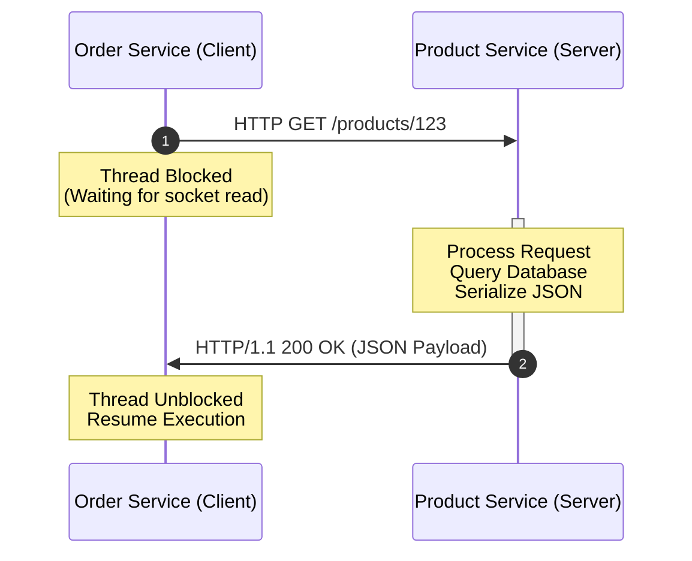
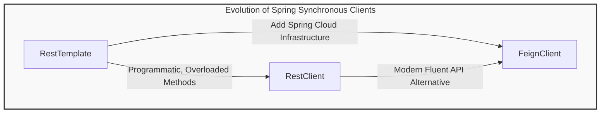

# 03_Types of Communication in Spring Microservices

Inter-service communication is the foundational pillar of microservices architectures. When monolithic systems are decomposed into isolated distributed services, the in-memory method calls of a single JVM are replaced by network boundaries. Bridging this boundary requires a clear understanding of the communication paradigms, client types, and ecosystem frameworks available within Spring Boot.

---

## 1. Foundational Paradigms: Synchronous vs. Asynchronous Communication

Microservices primarily interact using two distinct operational styles, each suited for different business processes and performance characteristics.

| Communication Type | Operational Nature | Thread Management | Primary Implementation Technologies |
| :--- | :--- | :--- | :--- |
| **Synchronous** | Request-Response (Blocking) | Thread suspends execution and waits for target response | RestTemplate, RestClient, Spring Cloud OpenFeign (FeignClient) |
| **Asynchronous** | Event-Driven (Non-Blocking) | Thread is freed immediately; notifications occur via callbacks or events | Message Brokers (Apache Kafka, RabbitMQ) or Reactive Client (WebClient) |

---

## 2. Synchronous Blocking Communication Mechanics

In a synchronous communication flow, the client service initiates an HTTP/TCP transaction and suspends its executing thread until a complete response is returned from the destination service. 

### The Order and Product Service Scenario
Consider an **Order Service** that needs to retrieve item details from a **Product Service**:
1. The Order Service receives an inbound customer checkout request.
2. An execution thread inside the Order Service container constructs and fires an outbound HTTP GET request to the Product Service.
3. While the Product Service queries its database and serializes the product detail payload, the Order Service thread transitions to a blocked state.
4. The thread consumes system resources (CPU registers and stack memory) without executing work, waiting passively for the socket to return data.
5. Once the response bytes arrive and are deserialized, the thread resumes execution to process the order.



---

## 3. The Spring Client Landscape

Spring Boot provides several clients designed to manage synchronous communication, ranging from legacy programmatic APIs to modern declarative frameworks.



### Programmatic Clients (No Spring Cloud Required)
These clients operate without external microservice coordination frameworks (like service registries or custom load balancers). They are sufficient for basic environments where endpoints are hardcoded or managed via DNS.
*   **`RestTemplate`**: The classic Spring HTTP client. It exposes simple templates for making HTTP requests, wrapping low-level network operations into single-method execution calls.
*   **`RestClient`**: Introduced in Spring Framework 6 and Spring Boot 3, this synchronous client provides a fluent, chainable API that modernizes programmatic HTTP requests without requiring a reactive dependency (like Spring WebFlux's `WebClient`).

### Declarative Clients (Spring Cloud Integration)
*   **`FeignClient` (Spring Cloud OpenFeign)**: This declarative HTTP client simplifies inter-service communication by allowing developers to define plain Java interfaces annotated with routing details. At runtime, the Spring Cloud framework generates the concrete implementation proxy automatically.

---

## 4. Spring Cloud Ecosystem Integration

While `RestTemplate` and `RestClient` are powerful on their own, enterprise microservices architectures ultimately rely on **Spring Cloud** to build resilient, self-healing networks. Declarative clients like `FeignClient` integrate natively with these Cloud infrastructure elements:

*   **Service Discovery (Eureka Server)**: Rather than hardcoding IP addresses or domain names, clients dynamically look up target physical locations using application names registered in Eureka.
*   **Load Balancing (Spring Cloud LoadBalancer)**: Distributes outbound HTTP traffic across multiple healthy instances of a target microservice.
*   **Resilience & Observability**: Integrates with circuit breakers (Resilience4j) and tracing systems (Micrometer Observation) to track requests across the network topology and prevent cascading service failures.

To master declarative communication, developers must first understand the fundamental mechanics of `RestTemplate` and `RestClient`. Both clients form the physical baseline layer for connections, headers, message conversion, and socket pooling that `FeignClient` abstracts internally.

---

## 5. Architectural Comparison Matrix

| Technical Capability | RestTemplate | RestClient | FeignClient |
| :--- | :--- | :--- | :--- |
| **API Style** | Programmatic (Overloaded Methods) | Programmatic (Fluent Builder) | Declarative (Interface-based) |
| **Spring Cloud Integration** | Manual wrapping | Manual wrapping | Out-of-the-box (Native) |
| **Spring Boot Version** | Legacy (Spring 1.x - 3.x) | Modern (Spring 3.x+) | Enterprise Cloud (Spring Boot + Cloud) |
| **Code Verbosity** | High | Low (Fluent method chaining) | Minimal (Interface definition only) |

---

## 6. Enterprise Client Configuration Snippets

### Declarative FeignClient (Spring Cloud Pattern)
This pattern demonstrates how to configure an interface that automatically resolves dynamic product instances via Spring Cloud:
```java
@FeignClient(name = "product-service")
public interface ProductClient {
    @GetMapping("/products/{id}")
    ProductDto getProductById(@PathVariable("id") Long id);
}
```

### Modern RestClient (Fluent Synchronous Pattern)
The chainable approach used in modern Spring 3.x projects to execute synchronous REST calls:
```java
RestClient restClient = RestClient.create();
ProductDto product = restClient.get()
    .uri("http://localhost:8082/products/123")
    .retrieve()
    .body(ProductDto.class);
```
