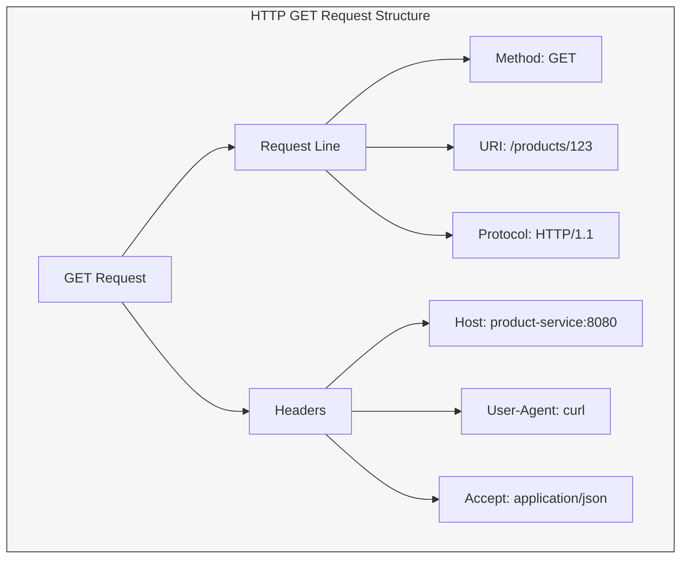
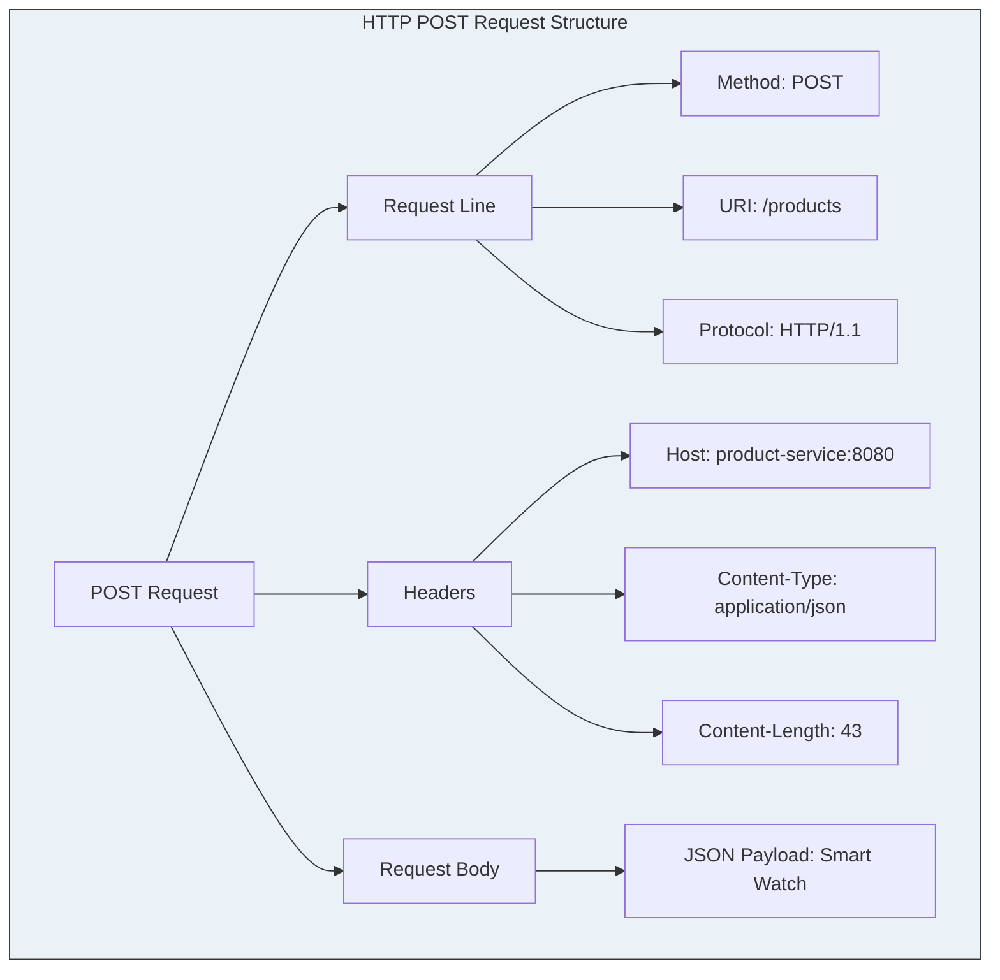
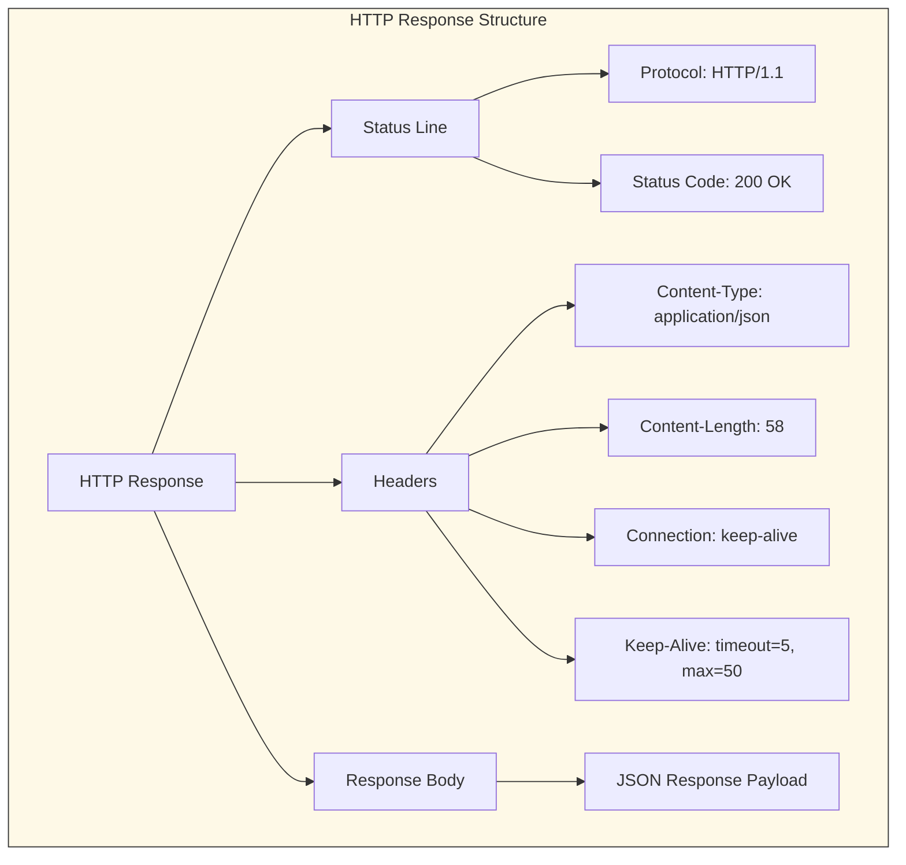
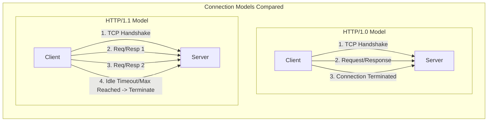
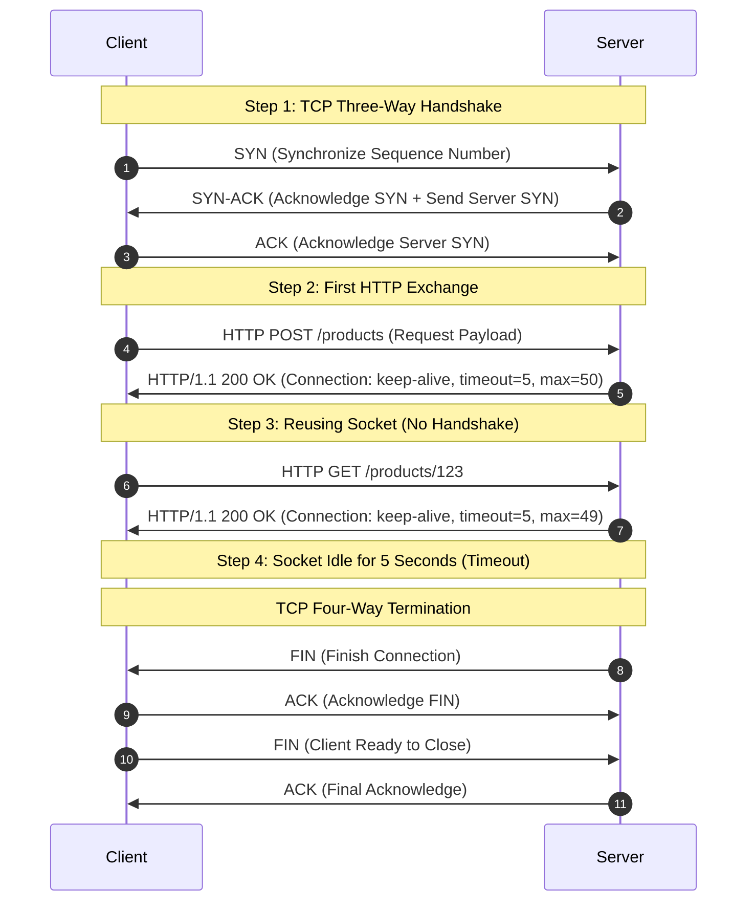

# 04_HTTP Request and Response Call: Mechanics and Connection Lifecycles

In distributed architectures, microservices communicate over the network using standardized application-layer protocols. The most common protocol is HTTP (Hypertext Transfer Protocol), which governs how web clients and services exchange data. To build efficient, high-performance systems, developers must understand the lower-level mechanics of HTTP requests, responses, and connection lifecycles.

---

## 1. Anatomy of an HTTP Request

An HTTP request is a message sent by a client to initiate an action on a server. It consists of a request line, headers, and an optional body.

### The GET Request Structure

A `GET` request is used to retrieve data from a specified resource. It contains no request body. The request message is composed of several key elements:

*   **HTTP Method:** The operation type (e.g., `GET`, `POST`, `PUT`, `DELETE`) indicating the desired action.
*   **URI (Uniform Resource Identifier):** The specific resource path on the target service (e.g., `/products`).
*   **Protocol Version:** The version of the HTTP protocol being used (such as `HTTP/1.0`, `HTTP/1.1`, `HTTP/2`, or `HTTP/3`).
*   **Host Header:** The domain name or IP address of the target server and the port number on which the service is listening.
*   **User-Agent Header:** Identifies the client software or tool initiating the request (e.g., `curl` or Postman).
*   **Accept Header:** Tells the server the media format the client expects in response (e.g., `application/json`).

```http
GET /products/123 HTTP/1.1
Host: product-service:8080
User-Agent: curl/7.81.0
Accept: application/json
```



### The POST Request Structure

A `POST` request is used to send data to the server to create a new resource. In addition to the standard request headers found in a `GET` request, it introduces several specialized headers and a request body:

*   **Content-Type Header:** Informs the server of the exact format of the payload in the request body (e.g., `application/json`).
*   **Content-Length Header:** Specifies the exact size of the request body in bytes.
*   **Request Body:** The actual serialized data payload (e.g., a new product JSON object) sent to the server.

```http
POST /products HTTP/1.1
Host: product-service:8080
Content-Type: application/json
Content-Length: 43
Accept: application/json

{"name":"Smart Watch","price":299.99}
```



---

## 2. Anatomy of an HTTP Response

Once the server processes the request, it returns an HTTP response message. The response contains a status line, headers, and an optional body.

### Response Structure and Keep-Alive Headers

An HTTP response provides status codes indicating success or failure, metadata about the response body, and connection instructions:

*   **Status Line:** Includes the protocol version, a numerical status code, and a text phrase (e.g., `HTTP/1.1 200 OK`).
*   **Content-Type Header:** Instructs the client on how to interpret and parse the response body (e.g., `application/json`).
*   **Content-Length Header:** Denotes the size of the returned response body in bytes.
*   **Connection Header:** Dictates whether the network connection remains open or closes (e.g., `Connection: keep-alive` or `Connection: close`).
*   **Keep-Alive Header:** Provides specific parameters for persistent connections, such as `timeout` (idle time before closing, e.g., 5 seconds) and `max` (maximum requests allowed per connection, e.g., 50).
*   **Response Body:** The serialized payload returned by the server containing the requested data or resource details.

```http
HTTP/1.1 200 OK
Content-Type: application/json
Content-Length: 58
Connection: keep-alive
Keep-Alive: timeout=5, max=50

{"id":123,"name":"Smart Watch","price":299.99}
```



---

## 3. Connection Management Paradigms

Network performance in microservices is heavily influenced by how connections are established, reused, and closed. Sockets are computationally expensive to create, making connection management a critical performance vector.

### Comparing HTTP/1.0, HTTP/1.1, and WebSockets

The table below illustrates the technical differences between connection management styles across versions and protocols:

| Feature | HTTP/1.0 | HTTP/1.1 | WebSockets |
| :--- | :--- | :--- | :--- |
| **Default Connection State** | `Connection: close` | `Connection: keep-alive` | Persistent Upgrade |
| **Connection Lifespan** | Short-lived (Transient) | Persistent (Reusable) | Persistent (Indefinite) |
| **Directionality** | Unidirectional (Client-to-Server) | Unidirectional (Client-to-Server) | Bidirectional (Full Duplex) |
| **Overhead** | High (TCP handshake per request) | Low (Reuses established TCP socket) | Minimal (No HTTP overhead after handshaking) |
| **Concurrency Style** | Sequential or parallel connections | Pipelining or multiple connections | Concurrent frame exchange |



---

## 4. The Keep-Alive Connection Lifecycle

In `HTTP/1.1`, the connection is kept alive by default. This significantly optimizes resource usage by minimizing the number of TCP handshakes.

### Deep-Dive: Persistent TCP Lifecycle

A persistent connection follows a clear state progression, starting with connection establishment, moving through sequential request-response cycles, and concluding with a graceful termination.

1.  **Three-Way Handshake:** Before any HTTP data is sent, the client and server establish a TCP connection. This requires exchanging `SYN`, `SYN-ACK`, and `ACK` packets.
2.  **Request-Response Execution:** The client sends an HTTP request and receives an HTTP response over the active socket.
3.  **Connection Retention:** Because `keep-alive` is set, the socket does not close. Instead, the connection is placed in a pool and is available for immediate reuse.
4.  **Reusing the Connection:** Subsequent requests skip the three-way handshake entirely, cutting down connection overhead.
5.  **Connection Parameters Evaluation:**
    *   **Timeout (e.g., `timeout=5`):** If the connection remains completely idle with no request traffic for 5 seconds, the server triggers termination.
    *   **Max Requests (e.g., `max=50`):** The server tracks the number of HTTP requests processed on this specific connection. Once 50 requests are processed, the connection is scheduled for closure.
6.  **Four-Way Termination:** To close the connection gracefully, the client and server exchange `FIN` and `ACK` packets to release the ports and clean up socket resources.



---

## 5. Production Configuration for Keep-Alive in Java Microservices

When configuring microservices communication in frameworks like Spring Boot, the default client configurations must be tuned. Out-of-the-box Java HTTP client abstractions like the standard JDK `HttpURLConnection` do not manage connection pooling robustly, leading to resource leaks or socket starvation. 

To correctly leverage keep-alive and persistent connections, developers must use a mature engine like Apache HttpClient or OkHttp as the request factory backing modern Spring clients.

### RestTemplate Connection Pool Configuration Snippets

To override default socket-closing behaviors and establish persistent pools, define custom connection properties:

```java
// Configure pool limits and connect timeouts
PoolingHttpClientConnectionManager manager = new PoolingHttpClientConnectionManager();
manager.setMaxTotal(100);
manager.setDefaultMaxPerRoute(20);
```

To configure a custom keep-alive strategy with a fallback default in the request factory:

```java
// Define Keep-Alive response timeout parsing with a fallback
httpClientBuilder.setKeepAliveStrategy((response, context) -> 
    Optional.ofNullable(response.getFirstHeader("Keep-Alive"))
        .map(h -> Duration.ofSeconds(parseTimeout(h.getValue())))
        .orElse(Duration.ofSeconds(5)));
```
