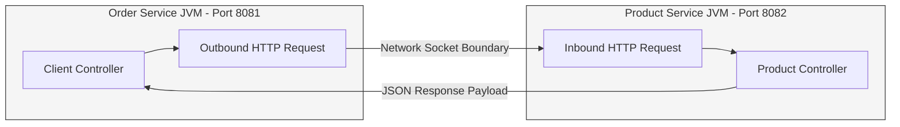
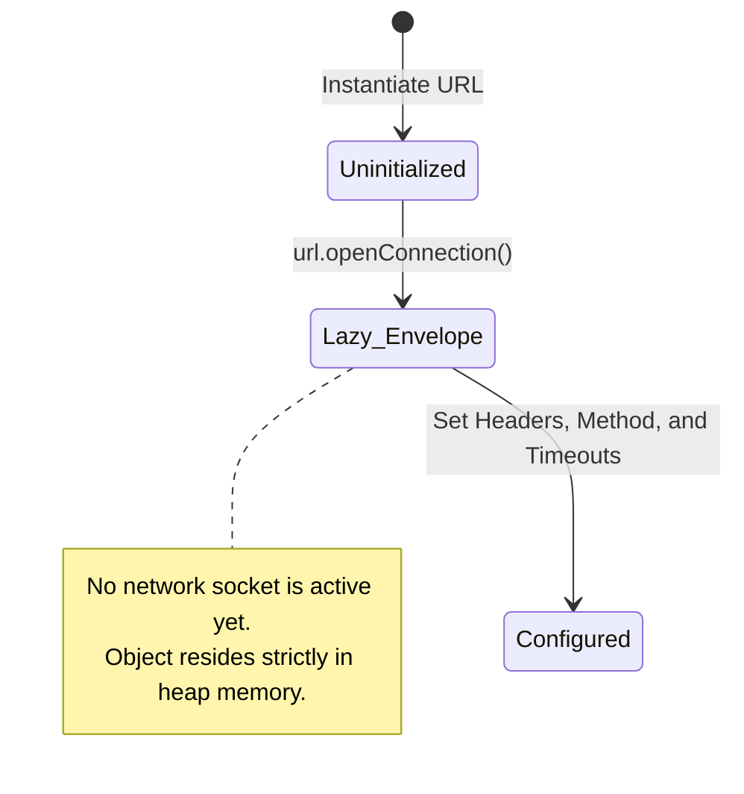
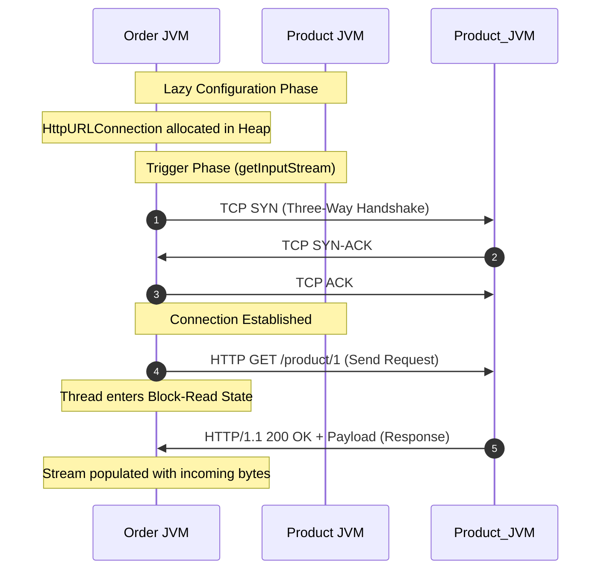
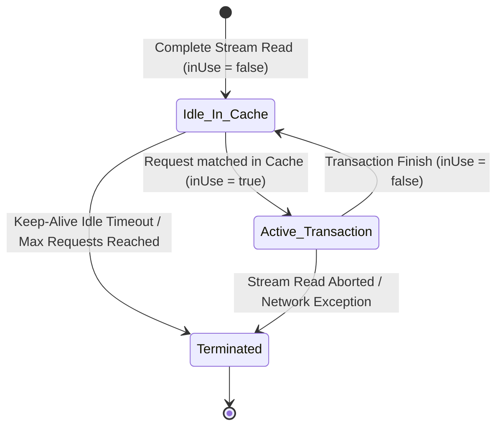

# 05_Inter-Service Communication Using Plain Java

In modern microservices development, high-level Spring abstractions like RestTemplate, RestClient, and FeignClient mask the underlying network and protocol mechanics. To construct truly resilient, high-performance distributed systems, developers must understand how the Java Virtual Machine (JVM) executes network communication at a low level using plain, unabstracted Java APIs. This technical reference dissects the mechanics of executing inter-service HTTP calls using JDK-native classes, exploring lazy initialization, socket handshakes, block-read states, and the JVM's internal Keep-Alive cache.

---

## 1. Low-Level Communication Architecture

In an enterprise application, microservices are run as isolated operating system processes. This isolation ensures independent scalability and fault containment, but it also strips away the ability to make fast, in-memory method calls between services. To bridge this boundary, services must communicate over the network using standardized application protocols such as HTTP.

Consider a standard architecture containing an **Order Service** listening on port `8081` and a **Product Service** listening on port `8082`. When the Order Service requires product details, it must initiate an out-of-process network request to the Product Service.



Without framework support, Java developers must orchestrate these connections manually. This involves low-level socket state management, manual buffering of streams, and explicit network resource cleanup.

---

## 2. Step 1: Request Configuration and the Lazy Envelope

The native JDK representation of an outbound HTTP transaction is the `HttpURLConnection` class. To prepare a request, a developer must first instantiate a `URL` object representing the target server and endpoint, and then call `openConnection()`.

### The Lazy Initialization Paradigm
A critical concept in Java's network stack is that calling `url.openConnection()` does **not** open a network socket or initiate any TCP/IP traffic. Instead, this operation acts as a lazy initialization. It allocates heap memory for an `HttpURLConnection` object, which behaves purely as an in-memory "envelope."

```java
URL url = new URL("http://localhost:8082/product/1");
HttpURLConnection conn = (HttpURLConnection) url.openConnection();
```

Within this envelope, you must manually program the metadata and parameters of the request before any transmission occurs:

*   **HTTP Method Configuration**: Defining the request verb (e.g., `GET`, `POST`, `PUT`, `DELETE`).
*   **Request Headers**: Appending essential communication metadata like `Accept: application/json` or `Content-Type: application/json`.
*   **Connection Timeout**: The maximum duration (in milliseconds) the client is willing to wait to establish the initial physical TCP three-way handshake with the remote host.
*   **Read Timeout**: Once the physical connection is active and the HTTP request is pushed, the read timeout defines how long the client will wait for individual data packets to arrive before severing the connection. This prevents threads from locking up indefinitely when a downstream dependency experiences silent failure.



---

## 3. Step 2: Triggering the Handshake and Executing the Request

Once the request envelope is configured, the physical TCP network transaction must be initiated. The JVM defers this costly operation until it is strictly required to read or write data.

The actual TCP/IP three-way handshake and subsequent data payload transmission are triggered by executing one of three method calls on the `HttpURLConnection` instance:

1.  **`connect()`**: Programmatically instructs the JVM to bind the socket and complete the TCP handshake.
2.  **`getResponseCode()`**: Flushes the request headers across the wire and blocks until the server responds with a status code (e.g., `200 OK`).
3.  **`getInputStream()`**: Requests the input stream of the connection. If the connection is not yet active, it internally calls `connect()` to establish the socket, transmits the HTTP request, reads the server response headers, and returns a reference to the network reading channel.

```java
conn.setRequestMethod("GET");
conn.setConnectTimeout(5000);
InputStream in = conn.getInputStream();
```



Because this communication pattern is synchronous and blocking, the calling thread halts execution the moment a trigger method like `getInputStream()` is invoked. The thread is placed into a blocked I/O state, releasing the CPU core while waiting for the network socket's buffer to fill with response data or for the configured `readTimeout` to expire.

---

## 4. Step 3: Stream Handling and Connection Cleanup

Once `getInputStream()` returns, the client is responsible for reading the raw bytes off the network socket and reconstructing them into a meaningful application-level structure.

### Manual Deserialization Boilerplate
Since raw network sockets stream bytes, the JVM does not automatically understand application formats like JSON. Developers must manually wrap the raw input stream in utility buffers, read the data line-by-line, and append it to a string builder before feeding it to an object mapper.

```java
BufferedReader reader = new BufferedReader(new InputStreamReader(in));
StringBuilder response = new StringBuilder();
String line;
while ((line = reader.readLine()) != null) {
    response.append(line);
}
```

### The Cleanup Lifecycle and Disconnect Mechanics
After processing the payload, proper connection cleanup is vital to prevent severe socket leaks and resource exhaustion. However, calling `disconnect()` on `HttpURLConnection` behaves in a complex, non-obvious manner designed to balance resource cleanup with connection reuse.

When `disconnect()` is called, its behavior is strictly determined by how completely the input stream was processed:

*   **Incomplete Read / Error State**: If an exception occurs or the client program terminates the reading loop before the incoming network stream is fully exhausted, the JVM instantly terminates the underlying TCP socket. The socket is closed, forcing a TCP FIN or RST handshake, and the physical connection is destroyed.
*   **Complete Read State**: If the input stream is read to its absolute end (yielding `-1` or `null` from the reader), calling `disconnect()` does **not** close the underlying TCP socket. Instead, because HTTP/1.1 default behavior is persistent, the socket is kept alive and returned to a centralized pool for future reuse.

---

## 5. Under the Hood: The JVM Keep-Alive Cache

To avoid the performance penalties of repeatedly executing TCP three-way handshakes, the JVM maintains an internal, low-level connection pool known as the **Keep-Alive Cache**.

When an HTTP transaction is successfully completed, the physical socket wrapping the TCP connection is represented by an internal wrapper object known as `HttpClient`. If the response stream was fully drained, this `HttpClient` object is placed into a cache managed by the JVM runtime environment.

### Cache Structure
The Keep-Alive Cache operates as a specialized map structured as follows:

| Component | Description |
| :--- | :--- |
| **Cache Key** | A composite value combining the target URL, domain name/IP address, and port number (e.g., `localhost:8082`). |
| **Cache Value** | The active, open `HttpClient` wrapper containing the physical TCP socket. |
| **Socket State Flag** | An internal boolean flag called `inUse`. |



### The Connection Reuse Flow
The lifecycle of this cache is deeply integrated with the connection triggering mechanism:

1.  **Cache Inspection**: When the developer executes a trigger method (like `connect()` or `getInputStream()`), the JVM does not immediately build a new connection. It searches the Keep-Alive Cache using the target host and port as the key.
2.  **Cache Hit**: If a match is found and its `inUse` flag is `false`, the JVM hijacks the active, cached physical socket, marks the `inUse` flag to `true`, and routes the new HTTP request over the existing socket. This completely avoids the latency of a new three-way handshake.
3.  **Cache Miss**: If no matching connection exists or all cached connections are currently in use, the JVM executes a new TCP handshake, allocates a fresh `HttpClient` wrapper, and registers it within the Keep-Alive Cache.
4.  **Transaction Finish**: When the transaction finishes and the stream is fully drained, the `inUse` flag is set back to `false`. The connection remains valid in the cache until it either exceeds the server's idle `timeout` value or the maximum request threshold (`max`) is reached, at which point a four-way TCP termination is performed.

---

## 6. Technical Synthesis: Plain Java vs. Spring Clients

To see why Spring's client abstractions are valuable, we can compare low-level JVM connection management directly with Spring’s RestTemplate.

| Feature / Metric | Native Plain Java (`HttpURLConnection`) | Spring Boot Abstraction (`RestTemplate`) |
| :--- | :--- | :--- |
| **Boilerplate Overhead** | High (20-30 lines of code per HTTP call for stream reading and error handling). | Low (Typically 1 line of code for standard GET and POST operations). |
| **Socket Management** | Manual (Explicitly calling stream closes and calling disconnect). | Automatic (Spring handles stream draining and connection closure behind the scenes). |
| **Deserialization** | Manual (Explicit loop buffered parsing and JSON mapping). | Automatic (Integrates with Jackson `HttpMessageConverter`s for transparent mapping). |
| **Connection Pooling** | JVM Keep-Alive Cache (Implicitly managed based on stream reading completeness). | ClientHttpRequestFactory (Explicit, configurable pooling with Apache HttpClient or OkHttp). |
| **Resilience Controls** | Manual Socket configuration (Requires configuring raw timeouts per connection instance). | Declarative (Integrated interceptors, backing factories, and spring configuration). |
