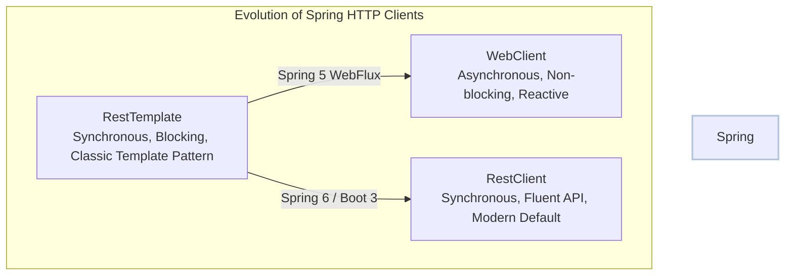
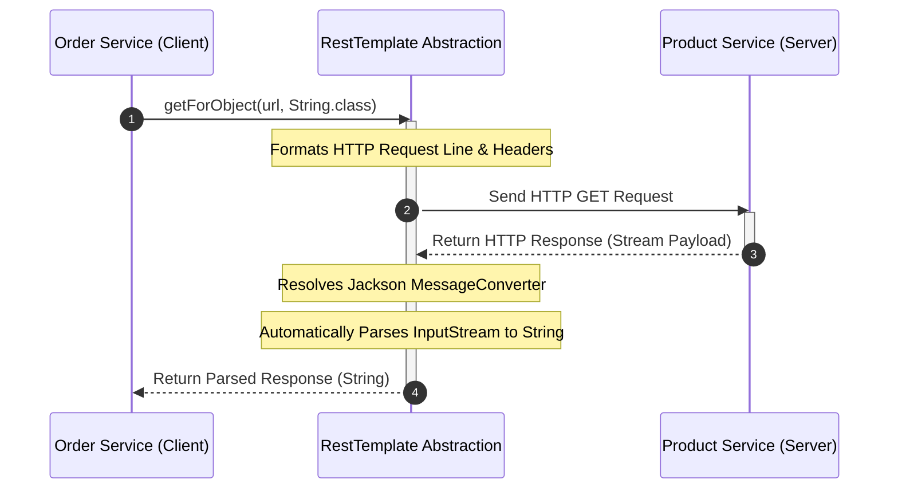
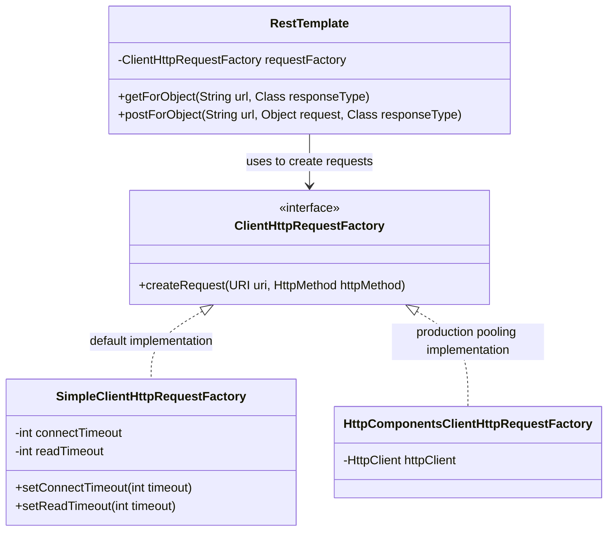

# 07_RestTemplate: Simplified Microservices Communication and Configuration

In microservices architectures, inter-service communication was historically built using low-level Java networking classes. Spring introduced `RestTemplate` to simplify these operations by wrapping raw network complexities into a high-level, developer-friendly API. This technical guide explains the architecture, usage, and configuration of `RestTemplate`, and highlights how it abstracts low-level infrastructure while managing request-response lifecycles.

---

## 1. Introduction to RestTemplate and the Client Abstraction

`RestTemplate` is Spring’s foundational, synchronous HTTP client used to execute HTTP requests and retrieve responses. It abstractly handles the opening of TCP connections, formatting of HTTP request lines and headers, and the serialization and deserialization of payloads.

### The Legacy Status of RestTemplate
In modern Spring ecosystems (Spring Boot 3.x and Spring Framework 6.x), `RestTemplate` is considered a **legacy** component. While still fully supported, Spring has introduced newer communication clients to address its synchronous, blocking nature and API limitations:

*   **`WebClient`**: Introduced in Spring 5 as part of Spring WebFlux, it supports non-blocking, reactive communication, making it highly efficient for high-throughput reactive systems.
*   **`RestClient`**: Introduced in Spring 6 as a modern, synchronous alternative to `RestTemplate`. It offers a fluent, functional API pattern similar to `WebClient` but without the reactive WebFlux dependency, combining the simplicity of a modern API with the synchronous behavior of `RestTemplate`.



---

## 2. Abstraction of Low-Level Boilerplate Code

Before `RestTemplate`, developers communicating between microservices (such as calling a Product Service from an Order Service) relied on plain Java classes like `HttpURLConnection`. This process required massive boilerplate code to manually read byte streams, open input and error streams, handle buffering, and map JSON payloads using external object mappers. 

`RestTemplate` eliminates this boilerplate, reducing multi-step connection and parsing routines into a single line of code.

### Comparative Analysis: Plain Java vs. Spring RestTemplate

| Feature | Plain Java (`HttpURLConnection`) | Spring `RestTemplate` |
| :--- | :--- | :--- |
| **Connection Management** | Explicitly open, configure, and close connections. | Managed automatically by the underlying HTTP client library. |
| **Payload Deserialization**| Manually read input streams, handle buffers, and call JSON parsers. | Automatically mapped to target classes (e.g., `String` or custom DTOs). |
| **Error Handling** | Inspect status codes, open error streams, and throw checked exceptions. | Automatically wraps status codes and translates them to HTTP client exceptions. |
| **Boilerplate Code** | Extremely high (typically 20+ lines per request). | Minimal (typically a single line of code). |



---

## 3. Basic Configuration and Usage Patterns

To use `RestTemplate` in a Spring Boot application, developers must register it as a bean in a configuration class and then autowire it within their service components.

### Step 1: Defining the RestTemplate Bean
By default, registering a basic `RestTemplate` bean is accomplished with a standard configuration class:

```java
@Bean
public RestTemplate restTemplate() {
    return new RestTemplate();
}
```

### Step 2: Autowiring and Executing GET Requests
Once the bean is defined, it can be autowired into a service layer and invoked. The `getForObject` method simplifies GET requests by taking the target URL and the expected response type:

```java
@Autowired private RestTemplate restTemplate;
// Invoking target URI and deserializing raw payload to a String
String response = restTemplate.getForObject(url, String.class);
```

In this sequence, Spring Boot automatically registers message converters (such as `MappingJackson2HttpMessageConverter` or basic string converters) to parse the remote stream response directly into the specified class.

---

## 4. Timeout Management and Client HTTP Request Factories

Using default connection settings in production is risky. If a remote microservice undergoes latency or becomes unreachable, requests can hang indefinitely, resulting in thread exhaustion across the client application. Swapping default behavior with explicit timeouts is essential for reliable distributed communication.

### Understanding Connection and Read Timeouts
To manage timeouts, developers must configure two independent networking parameters:

1.  **Connect Timeout**: The maximum duration allowed to establish the TCP three-way handshake with the remote host. If the target server is down or blocked by a firewall, a connect timeout prevents the client thread from waiting indefinitely.
2.  **Read Timeout**: The maximum duration allowed to wait for data packets once the connection is established. If the target server accepts the connection but blocks during long database queries or processing, the read timeout prevents socket hanging.

### The Role of Request Factories
`RestTemplate` does not directly open HTTP connections. Instead, it delegates connection lifecycle operations to an implementation of the `ClientHttpRequestFactory` interface. 

*   **`SimpleClientHttpRequestFactory`**: This is the default factory used by Spring if no other implementation is provided. It wraps standard JDK `HttpURLConnection` classes.
*   **Production Alternatives**: For production architectures requiring high throughput, the default JDK factory is often replaced with more robust, connection-pooling factories. Examples include `HttpComponentsClientHttpRequestFactory` (powered by Apache HttpClient) or `OkHttp3ClientHttpRequestFactory` (powered by OkHttp). Swapping factories allows developers to manage persistent connection pools, keep-alive durations, and maximum routing limits.



### Configuring Custom Timeouts
To establish custom timeouts, developers can instantiate `SimpleClientHttpRequestFactory`, set the connect and read timeouts (specified in milliseconds), and pass this configured factory into the constructor of `RestTemplate`:

```java
SimpleClientHttpRequestFactory factory = new SimpleClientHttpRequestFactory();
factory.setConnectTimeout(5000); // 5s connection handshake limit
factory.setReadTimeout(3000);    // 3s request data packet wait limit
RestTemplate restTemplate = new RestTemplate(factory);
```

This ensures that the client application fails fast, throwing appropriate exceptions (`ConnectException` or `SocketTimeoutException`) instead of hanging threads when dependencies slow down.
