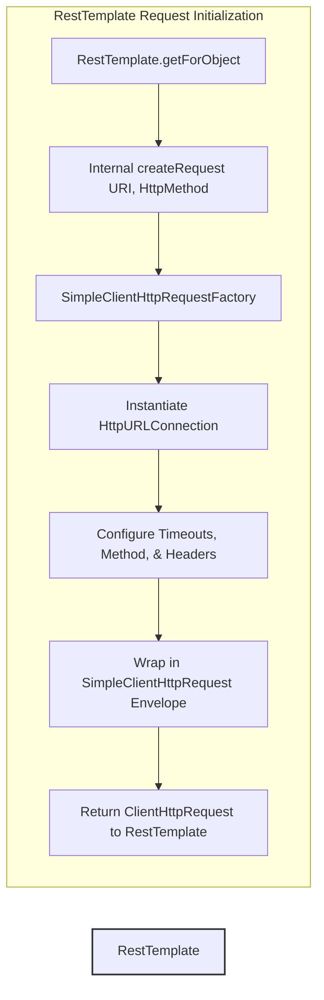
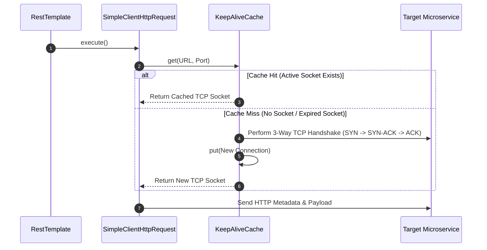
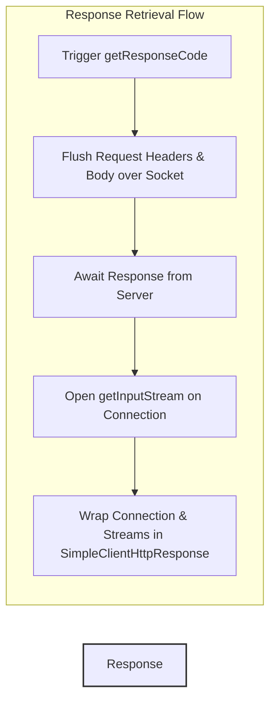
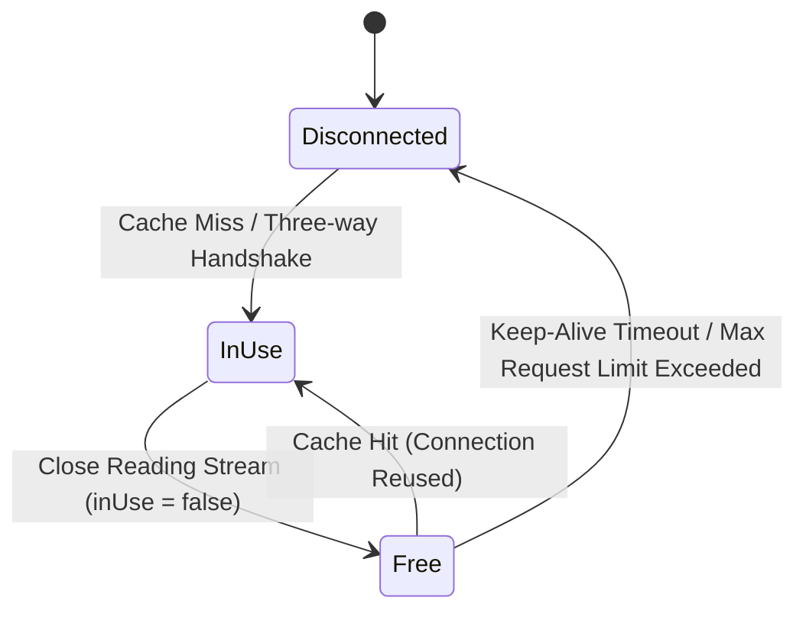

# 08_How RestTemplate Framework Works Internally

RestTemplate acts as a high-level synchronous client orchestrator in Spring. It automates the complex network socket setup, request dispatch, serialization, and stream management that developers previously had to implement manually. Understanding its internal architecture reveals how Spring hides this complexity while leveraging underlying JDK components.

---

## 1. Request Initialization and Factory Abstraction

When a microservice triggers an outbound call using a method like `getForObject()`, RestTemplate does not directly interact with network sockets. Instead, it initiates a multi-stage request-creation pipeline that delegates the underlying connection mechanics to an abstraction layer.

### The Request Creation Pipeline
1. **Method Invocation**: The entry point is a high-level method like `RestTemplate.getForObject(URI, Class<T>)`.
2. **Factory Delegation**: RestTemplate invokes its internal `createRequest(URI, HttpMethod)` method. By default, this call is delegated to the `SimpleClientHttpRequestFactory`.
3. **Socket Preparation**: The factory instantiates a native Java `HttpURLConnection` object. This is the exact same class used in plain Java communication, but it is now encapsulated inside Spring's infrastructure.
4. **Metadata Configuration**: The factory configures the connection with the necessary metadata, such as the request method (e.g., `GET`, `POST`), timeouts (connect timeout and read timeout), and default headers.
5. **Request Encapsulation**: The factory wraps the configured `HttpURLConnection` instance inside a `SimpleClientHttpRequest` object (which implements Spring's `ClientHttpRequest` interface) and returns it to RestTemplate.



### Key Request Wrapper Code
The underlying creation pattern within the request factory abstracts the socket setup cleanly:

```java
// SimpleClientHttpRequestFactory internal initialization pattern
HttpURLConnection connection = this.openConnection(url, this.proxy);
this.prepareConnection(connection, httpMethod.name());
return new SimpleClientHttpRequest(connection);
```

---

## 2. Request Execution and Connection Pooling

Once RestTemplate receives the `ClientHttpRequest` envelope, it triggers the execution phase. This is where connection management, caching, and network socket establishment take place.

### The Execution Mechanism
When RestTemplate calls the `execute()` method on the `SimpleClientHttpRequest` object, the request wrapper unpacks its internal `HttpURLConnection` reference and calls `connection.connect()`. 

Rather than blindly opening a brand new physical TCP socket for every transaction, the underlying Java runtime checks for connection reusability:

1. **Keep-Alive Cache Lookup**: Java's standard network library maintains an internal cache known as the `KeepAliveCache` (managed by the JVM). 
2. **Cache Check (`get` method)**: The connection manager calls the `get()` method of the `KeepAliveCache`, passing the target URL and port number.
3. **Cache Hit (Reuse Connection)**: If a matching, active socket is found in the cache—meaning its idle timeout has not expired and its maximum request limit has not been reached—the JVM reuses the existing physical TCP socket. This bypasses the expensive three-way TCP handshake.
4. **Cache Miss (New Connection)**: If no match is found, the JVM performs a standard three-way TCP handshake to establish a new connection. 
5. **Cache Register (`put` method)**: The connection manager registers the newly established TCP socket in the cache using the `put()` method so that subsequent requests to the same endpoint can reuse it.



---

## 3. Response Retrieval and Encapsulation

After connection negotiation completes, RestTemplate initiates the active network transaction to fetch the server's response.

### Network Dispatch and Stream Wrapping
To dispatch the request and read the server's response, the client wrapper triggers network stream methods:
* **`getResponseCode()`**: Calling this method flushes any buffered request headers and body payload over the active socket to the server. The execution blocks until the server processes the request and returns the HTTP status line and response headers.
* **`getInputStream()`**: Once the headers are received, the client opens the response input stream. 

The raw, active network connection (along with its input and error streams) is wrapped inside a `SimpleClientHttpResponse` object and returned to RestTemplate.



---

## 4. Response Deserialization and Stream Management

The final phase of the RestTemplate execution lifecycle involves translating the raw network response into a typed Java object and managing socket lifecycle states.

### Automatic Deserialization via Message Converters
RestTemplate automates the parsing of raw response bytes. It loops through its configured `HttpMessageConverter` list to find a converter that supports the incoming `Content-Type` header (e.g., `application/json` is handled by the `MappingJackson2HttpMessageConverter` using Jackson's `ObjectMapper`). The converter reads the input stream, deserializes the bytes, and constructs the expected Java DTO.

### Elegant Stream Closure vs. Connection Reuse
Once deserialization is complete, Spring gracefully closes the **reading stream** (`InputStream.close()`). It does **not** close the underlying TCP socket connection or the HTTP client wrapper. This distinction is crucial for microservices performance:

* **Closing the Stream**: Releases JVM-level reading buffers and signals to the underlying connection manager that the network transaction is finished.
* **Modifying Connection Status**: In the JVM's `KeepAliveCache`, the connection's status changes from `inUse = true` to `inUse = false`.
* **Socket Retention**: The physical TCP connection remains alive and parked in the cache. It is ready to serve the next outbound request immediately, avoiding the latency of establishing a new connection.



---

## 5. Architectural Comparison: Manual Java vs. RestTemplate

The table below contrasts the low-level manual connection management steps in plain Java with how those exact steps are abstracted and automated by the RestTemplate framework:

| Communication Phase | Manual Plain Java Implementation (`HttpURLConnection`) | RestTemplate Framework Abstraction |
| :--- | :--- | :--- |
| **Request Creation** | Developers write 10-15 lines of boilerplate to instantiate `URL`, call `openConnection()`, cast to `HttpURLConnection`, and manually set HTTP methods. | Automatically delegated to `ClientHttpRequestFactory` which builds and wraps the connection inside a `ClientHttpRequest` envelope. |
| **Timeout Configuration** | Requires manual, inline calls to `setConnectTimeout()` and `setReadTimeout()` for every single connection instance. | Centrally configured once at the request factory level and applied uniformly to every request envelope generated. |
| **TCP Connection Reuse** | Developers must manually ensure headers are flushed and streams are read in a precise order to allow JVM connection reuse. | Automatically integrates with the JVM `KeepAliveCache` via `get()` and `put()` calls during request execution. |
| **Response Parsing** | Developers must manually open an `InputStreamReader` and `BufferedReader`, write loop logic to read lines, and use external mappers to parse JSON. | Delegates to `HttpMessageConverter`s (e.g., Jackson) to automatically deserialize the stream into the target Java class in one line. |
| **Stream & Socket Cleanup** | Requires wrapping everything in `try-finally` blocks to close the input/error streams. Failure to do so leads to file descriptor leaks. | Automatically closes the reading streams after message conversion, marking the connection status as free (`inUse = false`) in the cache. |
