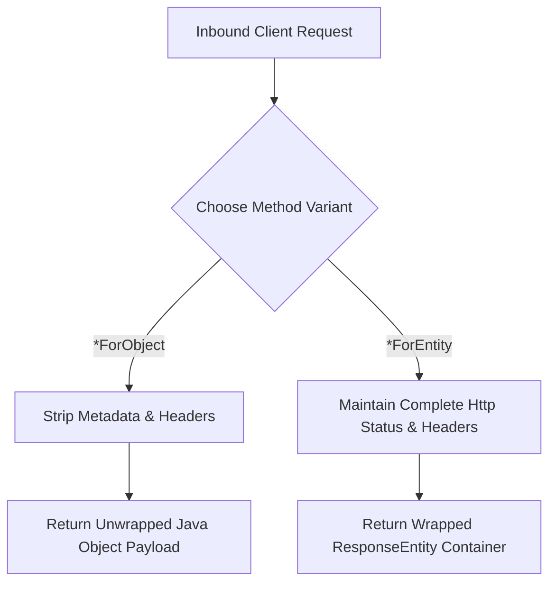
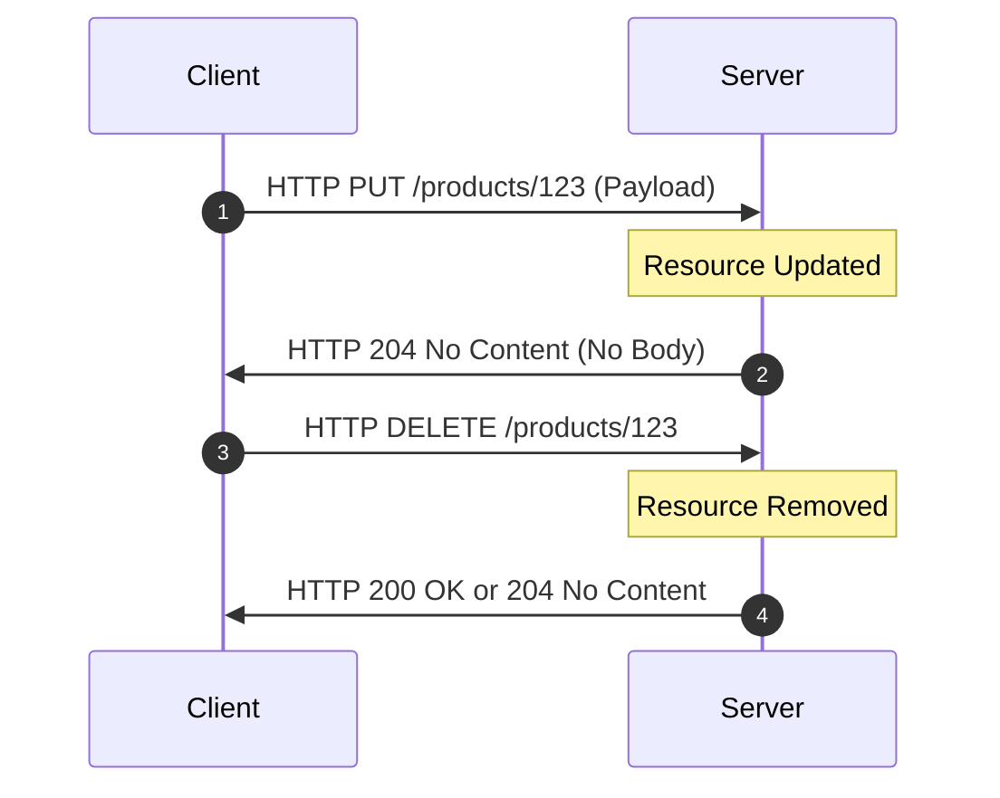
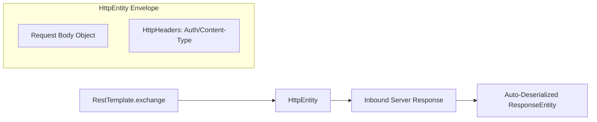
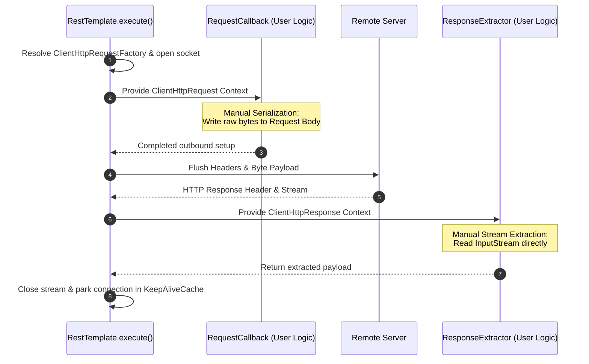

# 09_RestTemplate Communication Methods: API Capabilities and Customization

Spring's `RestTemplate` provides a rich spectrum of communication methods designed for varying degrees of control, ranging from simple, zero-configuration requests to absolute, low-level stream manipulation.

---

## 1. Categorization of RestTemplate Methods

To build resilient microservices, architects must choose the appropriate method based on the required control over metadata, payload serialization, and headers.

| Method Paradigm | Core Methods | Control Level | Serialization | Ideal Use Case |
| :--- | :--- | :--- | :--- | :--- |
| **Body-Only (Simple)** | `getForObject`, `postForObject` | Minimal | Automatic | Basic CRUD where headers/status codes are irrelevant. |
| **Full Entity (Standard)** | `getForEntity`, `postForEntity` | Moderate (Headers/Status read) | Automatic | Operations requiring validation of status codes (e.g., `201 Created`) or headers. |
| **Void (No-Response)** | `put`, `delete` | Low | Automatic | Outbound state updates where response payloads are omitted. |
| **Highly Flexible** | `exchange` | High (Headers/Method write) | Automatic | Adding custom headers (Authorization/Tokens), custom HTTP verbs, while retaining auto-conversion. |
| **Raw / Low-Level** | `execute` | Absolute | Manual | Performance-critical or highly custom streams requiring manual serialization and direct socket wrapper access. |

---

## 2. Standard GET and POST Communication

GET and POST requests form the backbone of synchronous REST communication. Spring bifurcates these into `*ForObject` and `*ForEntity` variants.

### GET Operations
*   **`getForObject`**: Fetches the resource and returns only the deserialized response body directly as the target Java object.
*   **`getForEntity`**: Returns a complete `ResponseEntity<T>` container, granting access to the HTTP status code, response headers, and the body.

```java
Product p = restTemplate.getForObject(uri, Product.class);
```
```java
ResponseEntity<Product> res = restTemplate.getForEntity(uri, Product.class);
HttpStatus status = (HttpStatus) res.getStatusCode();
```

### POST Operations
POST requests require a request body to write or create a resource. 
*   **`postForObject`**: Accepts the URI, request body object, and expected response type, returning only the parsed body.
*   **`postForEntity`**: Transmits the request body and returns a full `ResponseEntity` containing creation metadata.

```java
Product created = restTemplate.postForObject(uri, newProduct, Product.class);
```
```java
ResponseEntity<Product> res = restTemplate.postForEntity(uri, newProduct, Product.class);
```



---

## 3. Void State-Modifying Operations: PUT and DELETE

For updates and deletions, standard REST semantics often do not require a response body.

*   **`put`**: Modifies a resource on the server. It accepts the target URI and the updated object. It has a `void` return type and expects no payload in response.
*   **`delete`**: Removes a resource on the server. It accepts only the URI of the target resource, returning `void`.

```java
restTemplate.put(uri, updatedProduct);
```
```java
restTemplate.delete(uri);
```



---

## 4. Advanced Request Control with `exchange`

When a microservice needs to send custom HTTP headers (such as `Authorization` bearer tokens or custom transaction tracking IDs) or use less common HTTP verbs, the simple methods are insufficient. The `exchange` method provides full control over the request structure while delegating the complex task of serialization and deserialization to Spring's automatic `HttpMessageConverter` infrastructure.

*   **Headers Configuration**: Custom header properties (e.g., `Content-Type`, `Authorization`) are written to an `HttpHeaders` object.
*   **Envelope Wrapping**: The request body and the custom headers are wrapped together into a single `HttpEntity<T>` envelope.
*   **Invocation**: `exchange` accepts the target URI, the HTTP method (`HttpMethod`), the `HttpEntity` envelope, and the response class. It returns a fully hydrated `ResponseEntity`.

```java
HttpHeaders headers = new HttpHeaders();
headers.setBearerAuth("token123");
HttpEntity<Product> entity = new HttpEntity<>(body, headers);
ResponseEntity<Product> res = restTemplate.exchange(uri, HttpMethod.POST, entity, Product.class);
```



---

## 5. Absolute Low-Level Orchestration with `execute`

All RestTemplate operations (`getForObject`, `postForEntity`, `exchange`, etc.) are high-level convenience wrappers. Under the hood, they all delegate their execution to a single underlying orchestrator: the `execute` method.

If a developer requires total, fine-grained control over both the raw connection stream and manual serialization/deserialization, they can call `execute` directly.

### Functional Callbacks
The `execute` method utilizes two functional callback interfaces to manage the transaction lifecycle:
1.  **`RequestCallback`**: Grants direct access to the raw outbound `ClientHttpRequest` object. Inside this callback, developers can manually manipulate header values and write raw byte streams directly to the request body, bypassing standard Java-to-JSON serialization frameworks.
2.  **`ResponseExtractor<T>`**: Grants direct access to the raw inbound `ClientHttpResponse` object. This interface allows developers to inspect raw status codes and read raw byte streams from the network socket directly via the response body input stream.

```java
String result = restTemplate.execute(uri, HttpMethod.POST, 
    request -> StreamUtils.copy(bodyBytes, request.getBody()), 
    response -> StreamUtils.copyToString(response.getBody(), StandardCharsets.UTF_8));
```

### The Internal Execution Sequence
When `execute` is invoked:
1.  It triggers the `ClientHttpRequestFactory` to initiate the connection.
2.  It obtains the raw socket request stream and executes the user-defined `RequestCallback` logic to populate the outbound data.
3.  It flushes the headers and body, making the physical HTTP call to the server.
4.  Upon receiving the server response, it executes the user-defined `ResponseExtractor` to parse the incoming input stream.
5.  It gracefully handles socket management, keeping the physical connection open in the JVM `KeepAliveCache` while closing the stream.


