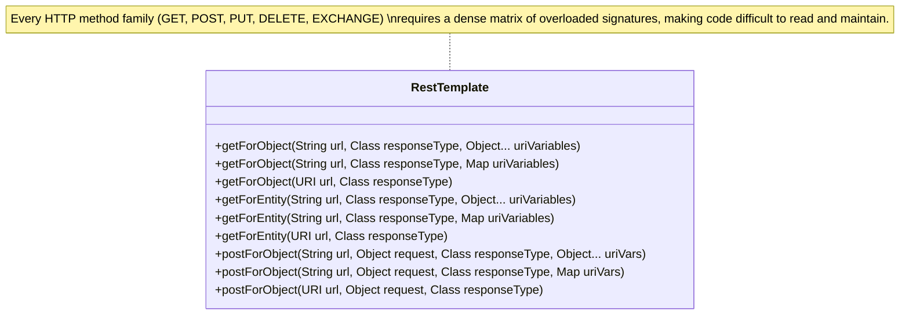
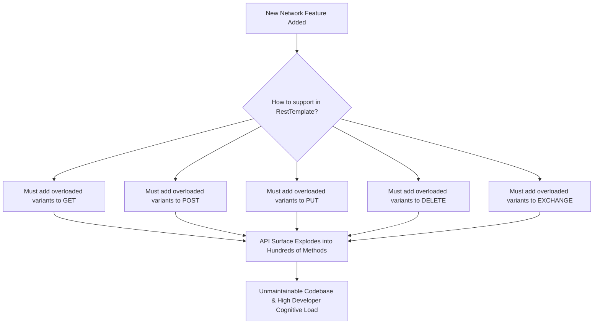
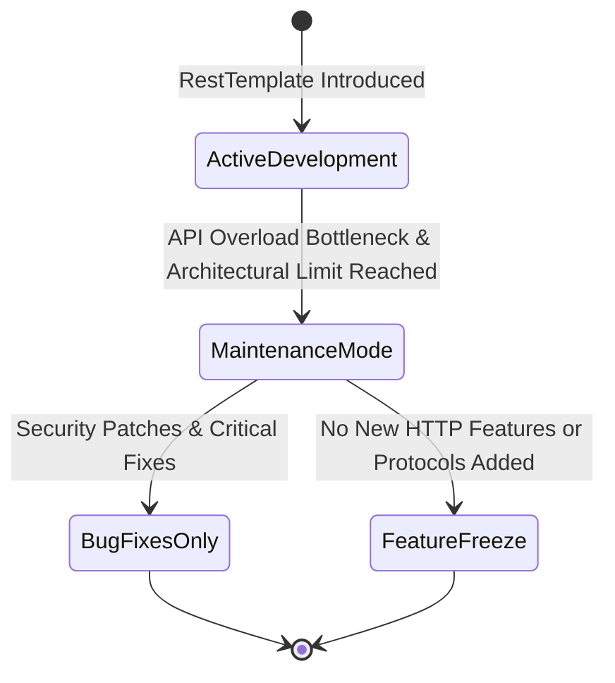
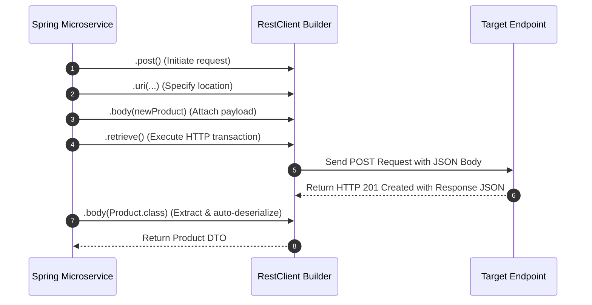
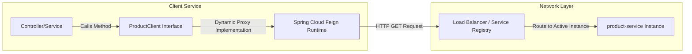

# 10_Limitations of RestTemplate and the Evolution to Modern Clients

In modern microservices architectures, communication patterns must remain maintainable, readable, and highly resilient. While Spring’s `RestTemplate` served as the industry standard for synchronous HTTP communication for over a decade, its design has reached its architectural limits. This technical guide explores the severe structural limitations of `RestTemplate`, why the Spring framework team placed it into maintenance mode, and how modern alternatives like `RestClient` and Spring Cloud `FeignClient` resolve these challenges using fluent interfaces and declarative paradigms.

---

## 1. The Overloaded Method Explosion

The primary architectural flaw of `RestTemplate` lies in its heavy reliance on method overloading. Because HTTP interactions require diverse inputs—such as varying URI variables, request bodies, and headers—`RestTemplate` attempted to accommodate every combination by providing multiple overloaded versions of its core communication methods.

### The Combinatorial Explosion of Signatures
Even for basic requests, developers must navigate a confusing array of signatures. For instance:
*   **`getForObject`**: Includes three distinct overloaded variants (accepting raw `String` URIs with varargs, `String` URIs with map parameters, or a `URI` object).
*   **`getForEntity`**: Similarly replicates these three signatures.
*   **`postForObject` and `postForEntity`**: Maintain their own distinct, heavily parameter-heavy overloads to accommodate optional request payloads.

This design results in an unmanageable API surface area. For developers, it is difficult to remember which parameter order is required, leading to poor code maintainability and confusion during integration.



---

## 2. The Maintenance Nightmare of Cross-Cutting Concerns

As distributed microservices matured, cross-cutting concerns such as network retries, timeouts, interceptors, and circuit breakers became mandatory production requirements. Retrofitting these features onto `RestTemplate` exposed the fundamental inflexibility of its overloaded method design.

### Structural Inflexibility
To support a new feature natively across the entire `RestTemplate` API, the framework maintainers would have to duplicate that feature across every single overloaded variant of every HTTP verb. For example, adding a dedicated circuit breaker configuration or a custom filter option would require appending hundreds of new overloaded signatures across `get`, `post`, `put`, `delete`, and `exchange`. 

While it is technically possible to manually register interceptors or build custom request factories, doing so is complex, requires substantial boilerplate code, and often forces developers to pass highly nested arrays of parameters.



---

## 3. The Shift to Maintenance Mode

Because of this structural design bottleneck, the Spring Framework team placed `RestTemplate` into **maintenance mode**. 

### What Maintenance Mode Implies
*   **Bug Fixes Only**: The framework receives security patches and critical bug resolutions, but no new features or optimizations are introduced.
*   **No Modern HTTP Protocols**: Emerging web and HTTP features (such as advanced stream multiplexing, complex interceptors, or native support for modern protocols) are not being backported to `RestTemplate`.
*   **Deprecation Pathway**: Although it remains supported for backwards compatibility, developers are strongly discouraged from utilizing it for greenfield microservice projects.



---

## 4. The Fluent API Revolution: Spring RestClient

To provide a modern, highly readable, and maintainable alternative to `RestTemplate` without forcing a migration to reactive programming (such as Spring WebFlux’s `WebClient`), Spring 6.1 introduced **`RestClient`**.

### The Fluent Builder Pattern
`RestClient` replaces the confusing matrix of overloaded methods with a single, unified **fluent builder style** (or fluent API). Instead of memorizing which overloaded method takes which parameter, developers chain intuitive, descriptive method calls.

This builder style offers several key advantages:
*   **No Overloaded Methods**: You do not have to choose between custom DTO or `ResponseEntity` variants at the method level. The structure of the call remains identical, and you simply specify how to retrieve the data at the end of the chain.
*   **Readability**: Outbound requests read like standard English sentences, flowing naturally from HTTP method to URI, headers, body, and finally the extraction strategy.
*   **Streamlined Integration**: Custom interceptors, error handling, and authorization filters are easily registered directly in the builder chain rather than requiring complex request factories.

### Fluent POST Request Pattern
```java
RestClient restClient = RestClient.create();
Product newProduct = new Product("Smartwatch", 199.99);
Product response = restClient.post()
    .uri("http://product-service/products")
    .body(newProduct)
    .retrieve()
    .body(Product.class);
```



---

## 5. Declarative Microservices Communication: Spring Cloud FeignClient

For large-scale, distributed microservices architectures, Spring Cloud provides an even higher layer of abstraction: **`FeignClient`**.

### Declarative vs. Programmatic Calls
While both `RestTemplate` and `RestClient` require writing programmatic code to execute calls, `FeignClient` is entirely declarative. Developers simply define a standard Java interface and annotate it. Under the hood, Spring Cloud dynamically generates the implementation, automatically handles target server routing, and integrates seamlessly with discovery services (like Eureka) and resilience frameworks (like Resilience4j circuit breakers).

### FeignClient Annotation Pattern
```java
@FeignClient(name = "product-service")
public interface ProductClient {
    @GetMapping("/products/{id}")
    Product getProductById(@PathVariable("id") Long id);
}
```



---

## 6. Comprehensive HTTP Client Comparison

The table below summarizes the key trade-offs, styles, and features across the evolutionary stages of Spring microservice communication clients:

| Client Name | API Design Style | Connection Management | Overload Complexity | Resilience Integration (Circuit Breaker / Retry) | Maintenance Lifecycle Status |
| :--- | :--- | :--- | :--- | :--- | :--- |
| **`RestTemplate`** | Programmatic / Traditional | Reuses underlying JVM `KeepAliveCache` | **High** (Hundreds of overloaded variants across verbs) | Complex (Requires wrapping or parameter-heavy overloads) | **Maintenance Mode** (Bug fixes only, no new features) |
| **`RestClient`** | Programmatic / Fluent Builder | Flexible (Supports connection pooling request factories) | **None** (Clean, chainable builder methods) | Built-in (Easily registered via builder interceptors) | **Active** (Standard synchronous client in Spring 3.x/6.x) |
| **`FeignClient`** | Declarative / Annotation-based | Delegated to underlying HTTP clients (Apache/OkHttp) | **None** (Defined as standard interface methods) | Out-of-the-box (Native Spring Cloud Resilience4j integration) | **Active** (Standard declarative microservices client) |
