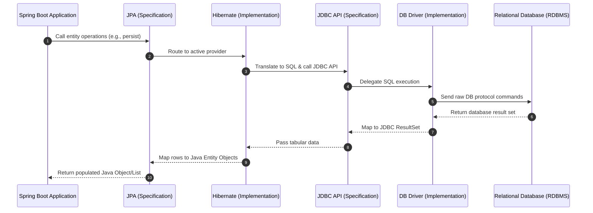
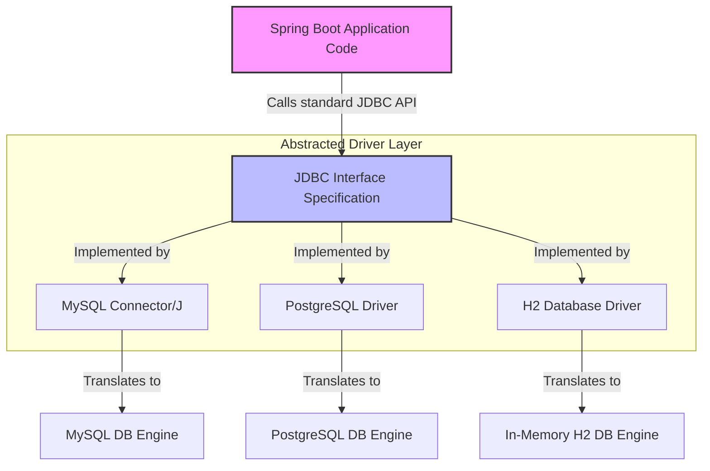

# 01_Introduction about JDBC: The Database Interaction Stack and JDBC Fundamentals

Modern Java applications interact with relational databases through a layered architecture that transitions from high-level, developer-friendly object abstractions down to low-level, database-specific communication protocols. This guide outlines the complete database interaction stack, compares Object-Relational Mapping (ORM) with raw SQL approaches, and dives deep into the fundamentals of Java Database Connectivity (JDBC) and database drivers.

---

## The Database Interaction Stack

When a Spring Boot application performs a database operation, the request travels through a well-defined sequence of components. This multi-layered stack ensures separation of concerns, decoupling the application logic from the underlying storage technology.

### Architectural Sequence

The data persistence stack consists of the following components from top to bottom:

1. **Spring Boot Application Logic**: The entry point where business logic is executed and Spring beans (repositories, services) are managed.
2. **Java Persistence API (JPA)**: A high-level, standard specification (interface) that defines how Java objects are mapped to relational database tables. JPA itself does not contain any execution logic; it merely provides the APIs.
3. **JPA Implementation (ORM Provider)**: The engine that implements the JPA specification. **Hibernate** is the most widely used provider, though alternatives like **EclipseLink** and **Apache OpenJPA** exist.
4. **Java Database Connectivity (JDBC) API**: A lower-level Java standard specification (interface) that provides methods for querying databases, managing connections, and processing tabular results.
5. **Database Driver**: The concrete implementation of the JDBC API. Each database vendor provides a driver specific to their engine (e.g., MySQL, PostgreSQL, H2). The driver translates JDBC method calls into database-specific network protocols.
6. **Relational Database Management System (RDBMS)**: The physical database engine (e.g., MySQL, PostgreSQL, H2) that executes the actual SQL commands and stores the data.

### The Role of Interfaces vs. Implementations

A key design pattern in the Java ecosystem is the separation of specification (interface) and implementation:
* **Specifications (JPA & JDBC)**: Define *what* can be done. They offer a uniform set of methods that Java developers write code against, ensuring application code remains independent of specific framework or database implementations.
* **Implementations (Hibernate & Database Drivers)**: Define *how* it is done. They contain the low-level, high-performance logic required to carry out the operations defined by the interfaces.



---

## Object-Relational Mapping (ORM) vs. Plain JDBC

Relational databases store data in tabular formats (rows and columns), whereas Java applications represent data as a network of interconnected objects (graphs). This structural mismatch is known as the **Object-Relational Impedance Mismatch**.

### The ORM Bridge

The **Object-Relational Mapping (ORM)** framework serves as a bridge between these two paradigms. 
* **With Plain JDBC**: Developers must manually write SQL queries, map Java variables to SQL parameters, execute statements, and manually parse tabular `ResultSet` objects back into Java objects. This is highly repetitive, error-prone, and binds application logic tightly to SQL syntax.
* **With ORM (JPA/Hibernate)**: The application interacts directly with Java objects. The ORM framework automatically generates the necessary SQL queries, binds parameters, and maps database rows to Java objects.

### Comparison Table: Plain JDBC vs. JPA/Hibernate ORM

| Feature | Plain JDBC (with Driver) | JPA / Hibernate (ORM) |
| :--- | :--- | :--- |
| **Primary Focus** | Executing raw SQL statements directly | Managing Java objects and their relationships |
| **Developer Overhead** | High (must write queries, handle connections, map results manually) | Low (queries and mapping are handled automatically by the framework) |
| **Data Representation** | Tabular results (`ResultSet`) | Strongly-typed Java Objects (Entities) |
| **Database Portability** | Medium (SQL dialects are often database-specific) | High (Hibernate translates object operations into the correct SQL dialect) |
| **Code Verbosity** | High boilerplate code | Low boilerplate code |

---

## JDBC and Database Drivers

Java Database Connectivity (JDBC) is the foundational technology for database interaction in Java. While modern frameworks abstract it away, understanding JDBC is crucial as it remains the underlying vehicle for all database communication.

### Core Responsibilities of JDBC

The JDBC specification provides standard interfaces for three main tasks:
1. **Establishing Connections**: Providing a uniform API to open a session with a target database.
2. **Querying Databases**: Exposing standard classes to send SQL queries and updates.
3. **Processing Results**: Providing mechanisms to iterate through returned tables and extract data.

### Database Drivers: The Implementations

JDBC cannot communicate with a database directly. It requires a vendor-specific database driver to implement its interfaces. The driver handles the socket connections, authentication handshakes, and binary network protocols unique to each database engine.

The following table displays standard database engines, their corresponding JDBC drivers, and the driver classes loaded in Java applications:

| Database Engine | Driver Name | Fully Qualified Driver Class Name | Typical Connection URL Pattern |
| :--- | :--- | :--- | :--- |
| **MySQL** | MySQL Connector/J | `com.mysql.cj.jdbc.Driver` | `jdbc:mysql://localhost:3306/db_name` |
| **PostgreSQL** | PostgreSQL JDBC Driver | `org.postgresql.Driver` | `jdbc:postgresql://localhost:5432/db_name` |
| **H2 (In-Memory)** | H2 Database Engine | `org.h2.Driver` | `jdbc:h2:mem:db_name` |

### Database Independence and Abstraction

Because Spring Boot applications program against the generic JDBC interfaces, they are highly decoupled from specific database implementations. For example, calling a connection method like `DriverManager.getConnection()` remains identical regardless of whether the backing database is MySQL or PostgreSQL. 

If an organization decides to migrate its storage layer:
1. The developer swaps the database driver dependency in the build configuration (e.g., `pom.xml`).
2. The developer updates the datasource configuration keys (e.g., URL and driver class name).
3. The Java code itself remains completely unchanged, as the driver abstracts away the structural differences of the target database.



---

## Configuration & Core Patterns in Spring Boot

In a standard Spring Boot environment, the application handles connection management automatically. Developers configure the data source in `application.properties` or `application.yml`, and Spring Boot's autoconfiguration initializes the datasource beans under the hood.

### Datasource Configuration Example

The following lines demonstrate how to configure database connection parameters for a MySQL database:

```properties
spring.datasource.url=jdbc:mysql://localhost:3306/dev_database
spring.datasource.username=db_user
spring.datasource.password=secure_password
spring.datasource.driver-class-name=com.mysql.cj.jdbc.Driver
```

### Raw JDBC Connection Pattern

While Spring Boot automates connection handling, the core JDBC pattern for establishing a manual connection and executing a query follows this sequence:

```java
try (Connection conn = DriverManager.getConnection(dbUrl, user, pass);
     PreparedStatement stmt = conn.prepareStatement("SELECT * FROM users WHERE id = ?")) {
    stmt.setInt(1, userId);
    ResultSet rs = stmt.executeQuery();
}
```
