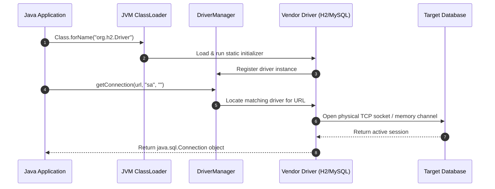
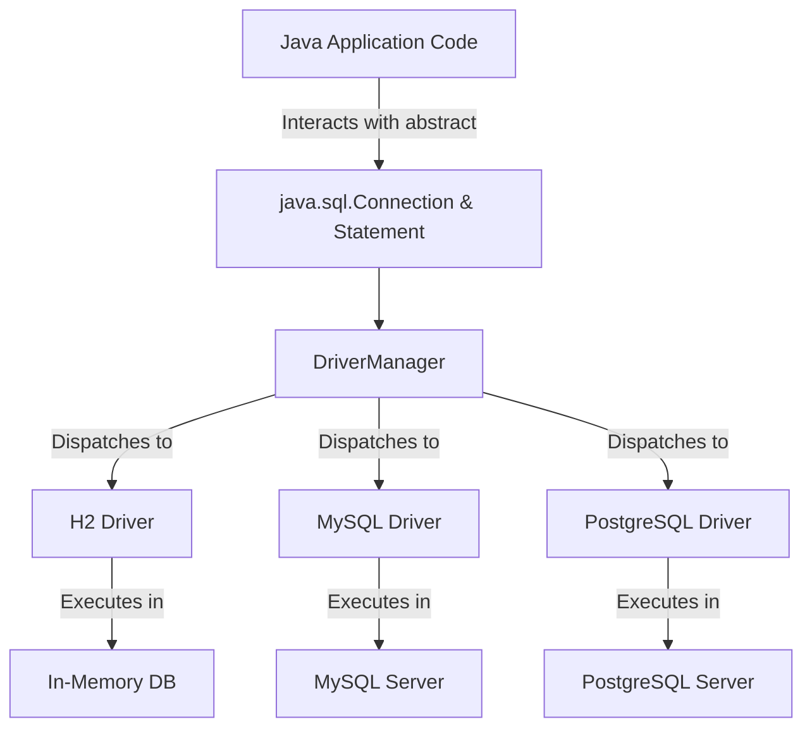
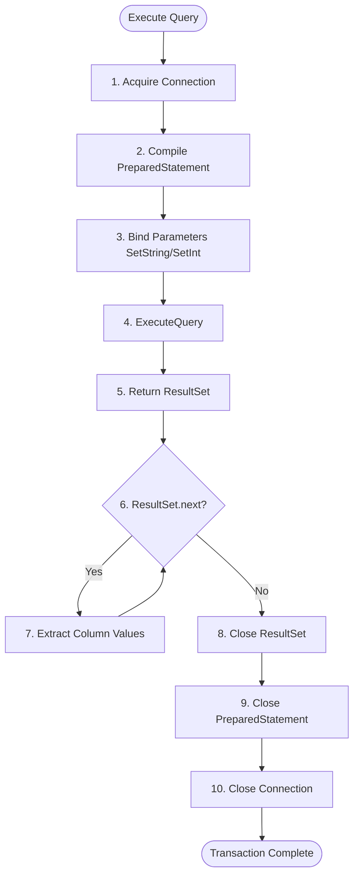

# 02_Plain JDBC Handling: Connections, Statement Execution, and Resource Management

This technical guide explores the fundamentals of plain, low-level Java Database Connectivity (JDBC) without any high-level abstractions like Spring Boot, Spring JDBC, or Java Persistence API (JPA). It breaks down the mechanical sequence of establishing database connections, executing structural and data operations, and managing resources manually.

---

## The Core JDBC Architecture & Connection Flow

In a traditional Java application lacking framework support, database communication relies on the core JDBC API. JDBC acts as a standardized interface, delegating the actual socket communication and database-specific protocols to vendor-specific database drivers.

### 1. Loading the Database Driver
The first step in JDBC interaction is registering the driver class with the Java Virtual Machine (JVM). Historically, this is achieved using reflection via `Class.forName()`, which dynamically loads the driver class and executes its static block to register itself with the `DriverManager`.

```java
// Dynamically loading the H2 database driver into the JVM
Class.forName("org.h2.Driver");
```

### 2. Establishing the Database Connection
Once the driver is loaded, the `DriverManager` class acts as the factory for obtaining database connections. Developers must supply a connection string (JDBC URL), a username, and a password to the `getConnection()` method.

```java
// Requesting a physical connection from the DriverManager
Connection conn = DriverManager.getConnection(dbUrl, username, password);
```

### The In-Memory (H2) Database Environment
For lightweight testing and execution without running an external database server like MySQL or PostgreSQL, Java developers frequently utilize **H2** (phonetically referenced as "S2" in some transcriptions). H2 is an embedded relational database engine supporting two primary modes:
*   **Transient Mode (In-Memory):** The database exists entirely in the JVM's memory. When the application starts, the database is instantiated; when the application shuts down, all tables and data are permanently lost.
*   **Persistent Mode (File-Based):** Data is written directly to the host filesystem, allowing the database state to persist across JVM restarts.

For H2, the default administrative username is `sa` (System Administrator, phonetically transcribed as "essay") and the default password is an empty string. If the targeted database in the JDBC URL does not exist, H2 automatically instantiates it.



---

## Database Independence via Driver Abstraction

A crucial design goal of the JDBC API is database independence. The application code interacts exclusively with abstract JDBC interfaces (such as `java.sql.Connection`, `java.sql.Statement`, and `java.sql.PreparedStatement`). The underlying physical database engine can be swapped seamlessly by modifying only the driver library and the configuration parameters (URL, username, and password). The operational Java code remains completely untouched.

| Database Engine | Driver Class | Example Connection URL |
| :--- | :--- | :--- |
| **H2 (In-Memory)** | `org.h2.Driver` | `jdbc:h2:mem:userDb` |
| **H2 (File-Persistent)** | `org.h2.Driver` | `jdbc:h2:~/userDb` |
| **MySQL** | `com.mysql.cj.jdbc.Driver` | `jdbc:mysql://localhost:3306/userDb` |
| **PostgreSQL** | `org.postgresql.Driver` | `jdbc:postgresql://localhost:5432/userDb` |



---

## Data Access Object (DAO) Implementation & Resource Handling

In low-level JDBC development, a **Data Access Object (DAO)** class encapsulates the SQL statements and connection logic required to perform database transactions. Each operation—whether structural DDL (Data Definition Language) or transactional DML (Data Manipulation Language)—must strictly manage connection lifetimes.

### 1. Creating Database Tables (DDL)
To execute structural statements such as `CREATE TABLE`, developers instantiate a basic `Statement` object off the connection. The SQL is compiled by the database at runtime and executed using `executeUpdate()`.

```java
// Creating a basic table structure via direct Statement
Statement stmt = connection.createStatement();
stmt.executeUpdate("CREATE TABLE users (user_id INT AUTO_INCREMENT PRIMARY KEY, username VARCHAR(255), age INT)");
```

### 2. Inserting Records Safely via PreparedStatements (DML)
For parameterized queries where parameters are dynamically supplied, plain `Statement` objects are susceptible to SQL Injection attacks and database parser overhead. **PreparedStatement** objects solve this by pre-compiling the SQL query template (using `?` placeholders) and binding typed inputs.

```java
// Parameterized SQL insertion using dynamic index binding
PreparedStatement pstmt = connection.prepareStatement("INSERT INTO users (username, age) VALUES (?, ?)");
pstmt.setString(1, username);
pstmt.setInt(2, age);
pstmt.executeUpdate();
```

### 3. Reading and Querying Records (ResultSet)
Retrieving data requires executing `executeQuery()`, which returns a `java.sql.ResultSet`. The `ResultSet` represents a tabular virtual table. A cursor is initially positioned before the first row, and calling `.next()` advances the cursor.

```java
// Querying rows and pulling typed columns sequentially
ResultSet rs = pstmt.executeQuery();
while (rs.next()) {
    String name = rs.getString("username");
    int age = rs.getInt("age");
}
```



---

## The Boilerplate Challenges of Plain JDBC

While plain JDBC is functional, it exposes several structural drawbacks that impede rapid application development. These challenges are the primary motivators behind the creation of Spring Boot's JDBC and JPA abstractions.

### 1. Verbose Resource Leak Risk
All JDBC resources—specifically `Connection`, `Statement`/`PreparedStatement`, and `ResultSet`—hold physical operating system file descriptors and TCP sockets. These must be closed explicitly in the reverse order of their opening inside a `finally` block to prevent resource exhaustion.
*   **The Trap:** If an error occurs during query execution, the execution path jumps out of the method. Without a guaranteed `finally` block, the connection stays open, rapidly depleting the connection pool.

### 2. Fragmented Try-Catch-Finally Logic
Every single JDBC database action throws a checked `java.sql.SQLException`. Dealing with this forces developers into complex nested blocks of error handling, dragging business logic down into infrastructure plumbing.

```java
// The plain JDBC boilerplate structure showing nested exception traps
Connection conn = null;
PreparedStatement pstmt = null;
try {
    conn = dbConn.getConnection();
    pstmt = conn.prepareStatement("INSERT INTO users (username, age) VALUES (?, ?)");
    pstmt.setString(1, username);
    pstmt.setInt(2, age);
    pstmt.executeUpdate();
} catch (SQLException e) {
    // Boilerplate error handling
    e.printStackTrace();
} finally {
    // Resource cleanup boilerplates
    if (pstmt != null) { try { pstmt.close(); } catch (SQLException e) {} }
    if (conn != null) { try { conn.close(); } catch (SQLException e) {} }
}
```

### 3. High Code Redundancy
Nearly 80% of a typical DAO class in plain JDBC is structural scaffolding (opening connections, setting up catching frames, and closing resources) rather than actual application-specific business SQL or mapping. This overhead scales linearly with every database method added to the application.
