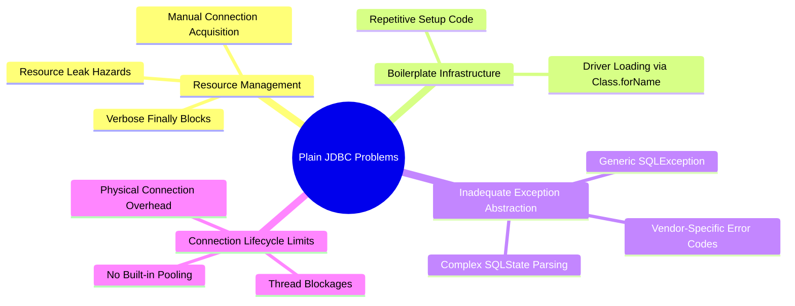
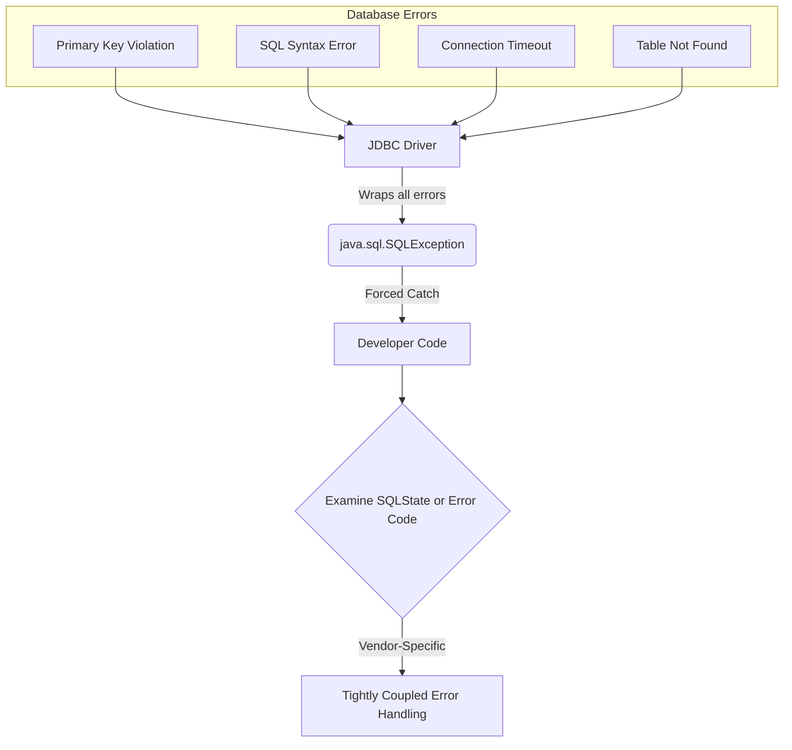
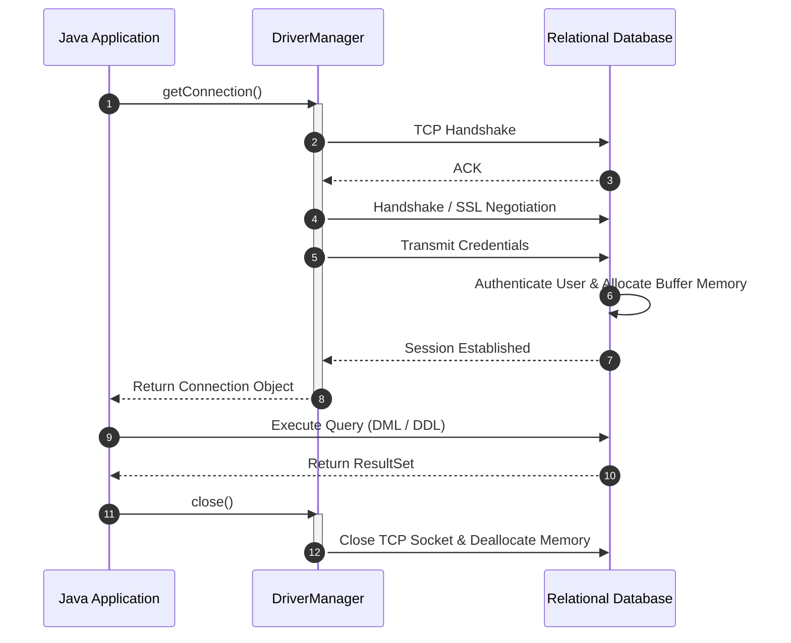
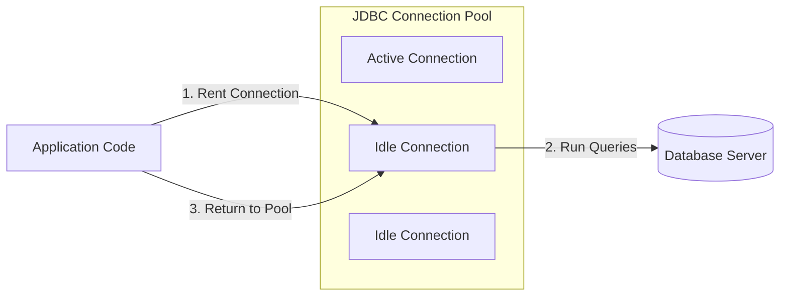

# 03_Problems with Plain JDBC: Boilerplate, Exception Abstraction, and Connection Pooling

Traditional, low-level Java Database Connectivity (JDBC) requires developers to interact directly with database driver APIs. While this provides maximum control, it introduces significant development friction, architectural complexity, and operational hazards. This guide examines the fundamental limitations of plain JDBC, highlighting why modern enterprise frameworks abstract these low-level patterns.

---

## The Four Pillars of Plain JDBC Pain

Using plain JDBC forces developers to manage structural, environmental, and infrastructural concerns within their business logic. These concerns are categorized into four core problem areas:



---

## 1. Boilerplate Infrastructure & Manual Connection Acquisition

Every database interaction using plain JDBC requires repetitive setup steps. Before any SQL query can run, the application must load the driver and establish a raw physical socket connection to the database.

### Driver Class Loading
Historically, developers had to register the database driver class manually with the JVM. Although JDBC 4.0 auto-loads drivers listed in `META-INF/services`, legacy applications or specific environments still rely on explicit registration.
```java
Class.forName("com.mysql.cj.jdbc.Driver");
```

### Manual Connection Acquisition
Developers must supply database credentials and JDBC URLs directly to the `DriverManager`. This tightly couples the database coordinates to the application initialization or data access layers.
```java
Connection conn = DriverManager.getConnection(url, user, pass);
```

### The Accumulative Overhead
This setup code must be repeated across every database-facing method (e.g., `createUser`, `readUser`, `updateUser`), leading to thousands of lines of duplicated infrastructure code across a standard enterprise project.

---

## 2. Inadequate Exception Abstraction (The SQLException Bottleneck)

When a database operation fails, JDBC throws a checked `SQLException`. While checked exceptions force developers to write try-catch blocks, `SQLException` acts as a monolithic catch-all that hides the root cause of the error.

### The Monolithic Exception Problem
Whether a query fails due to a syntax error, a connection timeout, a primary key constraint violation, a database lock-up, or a missing table, the driver throws the exact same high-level checked `SQLException`.



### Handling SQL Failures Safely
Because JDBC does not parse or categorize exceptions, the developer must write complex conditional logic to inspect database-specific state strings or numeric error codes to determine how to recover from the exception.
```java
catch (SQLException ex) {
    if ("23505".equals(ex.getSQLState())) {
        // Handle duplicate key violation (PostgreSQL code)
    }
}
```
This pattern presents several major disadvantages:
* **Loss of Portability**: Error codes are database-vendor-specific. Switching from MySQL to PostgreSQL breaks the exception-handling logic.
* **Checked Exception Pollution**: Checked exceptions force calling methods to either catch the exception or declare it in their signatures, polluting the entire application call stack.

---

## 3. Resource Leak Hazards and Verbose Cleanup

Database connections, SQL statements, and cursor result sets map directly to operating system resources (file descriptors, sockets, and memory buffers). Failing to release these resources immediately after execution leads to severe system degradation.

### The Hazard of Memory and Socket Leaks
In plain JDBC, a query involves three main objects: a `Connection`, a `Statement` (or `PreparedStatement`), and a `ResultSet`. If an exception occurs during the execution of a statement or when parsing a result set, execution halts, skipping subsequent lines of code. If resource cleanup is placed at the end of the method block, any error will trigger a connection leak. Over time, the application will exhaust the database’s connection pool and crash with socket-allocation or database connection timeout errors.

### The Verbose `finally` Block Pattern
To guarantee resource cleanup under all execution branches (success and failure), resources must be closed in a `finally` block. However, closing JDBC objects itself throws `SQLException`, forcing nested try-catch blocks and resulting in extremely verbose, unreadable boilerplate code.

```java
Connection conn = null;
PreparedStatement ps = null;
ResultSet rs = null;
try {
    conn = DriverManager.getConnection(url, user, pass);
    ps = conn.prepareStatement("SELECT * FROM users WHERE id = ?");
    ps.setLong(1, userId);
    rs = ps.executeQuery();
    // process result set...
} finally {
    if (rs != null) { try { rs.close(); } catch (SQLException e) { /* log */ } }
    if (ps != null) { try { ps.close(); } catch (SQLException e) { /* log */ } }
    if (conn != null) { try { conn.close(); } catch (SQLException e) { /* log */ } }
}
```

---

## 4. Connection Lifecycle Limits and Lack of Pooling

Creating a new physical database connection is an expensive operation that involves resolving DNS, opening TCP sockets, executing handshake protocols, verifying user credentials, and allocating memory buffers inside the database engine.



### The Cost of Ad-Hoc Connection Creation
In plain JDBC applications, executing a database action typically triggers a call to a connection helper method. This creates a brand-new connection on the fly, executes the query, and then immediately terminates the connection.

When an application experiences high traffic, this connection lifecycle model introduces severe bottlenecks:
* **Execution Latency**: Opening and closing connections adds tens or hundreds of milliseconds of network overhead to every request.
* **Database Exhaustion**: The database server spends more CPU cycles establishing and destroying connections than executing actual queries.
* **Thread Blockages**: If the database server limits concurrent connections, incoming web threads waiting to acquire a connection will block, eventually causing the application server to run out of threads and become unresponsive.

### The Connection Pooling Solution
An enterprise-grade system avoids this overhead by using a **JDBC Connection Pool** (such as HikariCP, Apache DBCP, or C3P0). 



Instead of closing connections physically, calling `connection.close()` on a pooled connection wraps the underlying socket and returns it to the pool for immediate reuse by another thread. Managing connection pools programmatically in plain JDBC requires significant configuration code and complex resource locking, which is why developers turn to frameworks that handle pooling transparently.

---

## Comparing Database Access Paradigms

| Feature | Plain JDBC | Managed Connection Pools (HikariCP) | Spring Boot JDBC / JPA |
| :--- | :--- | :--- | :--- |
| **Connection Setup** | Manual, per transaction via `DriverManager` | Reused from a pre-allocated pool of connections | Configured declaratively (`application.properties`) |
| **Exception Hierarchy** | Low-level, checked `SQLException` | Standard JDBC exception wrapper | Abstracted, runtime `DataAccessException` hierarchy |
| **Resource Cleanup** | Manual `finally` blocks or try-with-resources | Handled via pooled wrapper releases | Automatic framework-level lifecycle cleanup |
| **Performance Overhead** | High (TCP/SSL handshake per query) | Low (Instant connection rental) | Optimal (Fully managed pooling and batching) |
| **Database Portability** | Low (Coupled to vendor SQLStates/Error Codes) | Medium (Driver-specific pool configurations) | High (Dialect-based SQL translation) |
