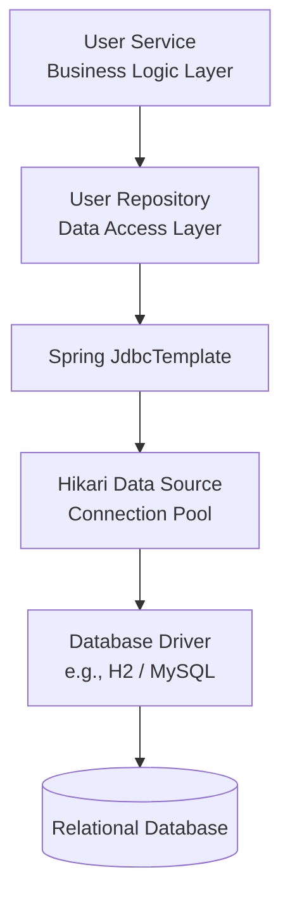
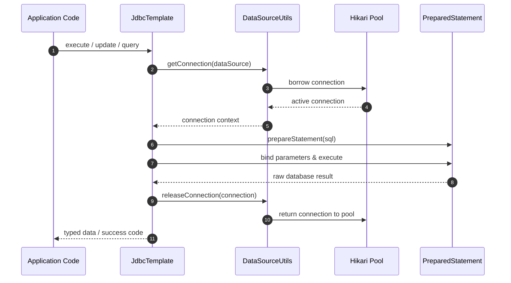
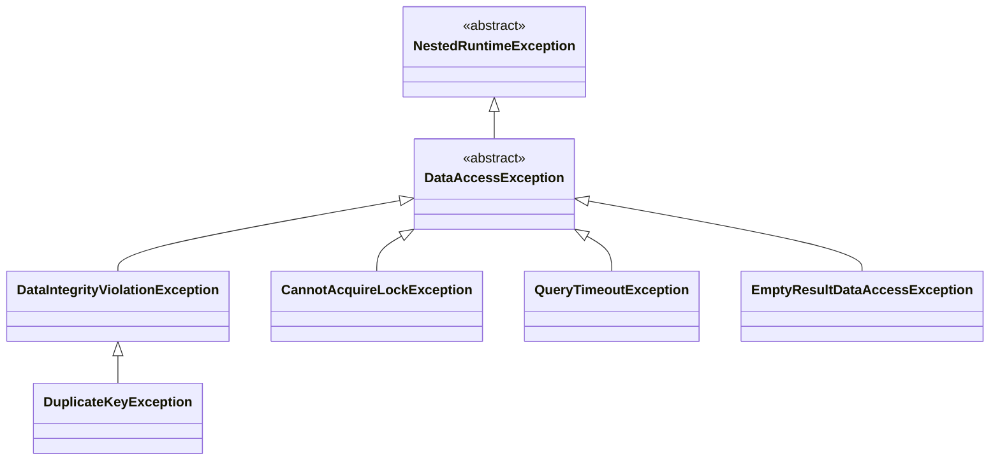

# 04_Spring Boot JDBC: Automated Configuration and Boilerplate Elimination

The emergence of Spring Boot and its standard library drastically altered the landscape of Java database interaction. By introducing automated configuration, unified exception translation, and robust template utilities, Spring Boot resolves the manual setup, resource leakages, and fragile error management characteristic of traditional, low-level JDBC implementations.

---

## 1. The Spring Boot JDBC Dependency Stack

To work with database interaction in a Spring Boot application, the build configuration requires two primary types of dependencies in the `pom.xml`: the Spring Boot Data Access starter and a database-specific runtime driver.

### 1.1 The Starter Wrapper
Instead of declaring separate, individual JAR files for core JDBC interfaces, driver managers, and connection pools, Spring Boot provides a unified starter dependency:

```xml
<dependency>
    <groupId>org.springframework.boot</groupId>
    <artifactId>spring-boot-starter-jdbc</artifactId>
</dependency>
```

This starter acts as a transitive wrapper that automatically pulls in core Spring JDBC support libraries (including `JdbcTemplate`), the default connection pool (HikariCP), and logging and transaction management capabilities.

### 1.2 The Database Driver Selection
The database driver serves as the runtime translator between standard JDBC calls and the vendor-specific database wire protocol. At runtime, Spring Boot detects the driver on the classpath and integrates it into the configuration.

```xml
<dependency>
    <groupId>com.h2database</groupId>
    <artifactId>h2</artifactId>
    <scope>runtime</scope>
</dependency>
```

This dependency is swap-in compatible. For production environments, the in-memory H2 engine dependency can be replaced with production-grade relational database drivers, such as MySQL Connector/J (`mysql-connector-j`) or the PostgreSQL JDBC Driver, without altering the application's Java logic.

---

## 2. Spring Boot Database Architecture

Database interaction in a Spring Boot environment follows a strict layered pattern. Each layer has an explicit responsibility, isolating business logic from infrastructure configurations.



### 2.1 The Repository Layer (`@Repository`)
Data persistence mechanisms are encapsulated within specialized Repository classes. These classes are decorated with the Spring Stereotype annotation `@Repository`:

```java
@Repository
public class UserRepository {
    @Autowired
    private JdbcTemplate jdbcTemplate;
}
```

The `@Repository` annotation functions as a specialized version of the `@Component` annotation, rendering the class eligible for automatic classpath scanning and dependency injection. Crucially, it also enables automatic **persistence exception translation**, ensuring database-specific errors are mapped to Spring's portable exception hierarchy.

### 2.2 The Service Layer (`@Service` / `@Component`)
The Service layer handles orchestration, transaction boundaries, and core business rules. It consumes the Repository layer through dependency injection, keeping database execution separate from business logic:

```java
@Service
public class UserService {
    @Autowired
    private UserRepository userRepository;
}
```

---

## 3. Core Database Operations via `JdbcTemplate`

The `org.springframework.jdbc.core.JdbcTemplate` is the central class in Spring's JDBC support. It handles the entire lifecycle of resource acquisition, statement creation, preparation, query execution, and resource cleanup.



### 3.1 DDL Execution with `execute()`
For structural database modifications (such as table creations or schema modifications) where no parameters need to be bound and no return rows are expected, `JdbcTemplate` exposes the `execute()` method:

```java
public void createTable() {
    jdbcTemplate.execute("CREATE TABLE users (id INT, name VARCHAR(50))");
}
```

### 3.2 Parameterized DML with `update()`
For Data Manipulation Language (DML) statements (such as `INSERT`, `UPDATE`, and `DELETE`), the `update()` method accepts parameterized SQL queries containing placeholders (`?`) to prevent SQL injection vulnerabilities:

```java
public int insertUser(int id, String name, int age) {
    return jdbcTemplate.update("INSERT INTO users VALUES (?, ?, ?)", id, name, age);
}
```

This method internally handles the creation of a `PreparedStatement`, binds the variable-length arguments sequentially to the query placeholders, and returns the number of rows affected.

### 3.3 Data Retrieval with `query()`
For querying data, `JdbcTemplate` wraps result set processing. It provides structured callback interfaces, such as `RowMapper`, to map raw database rows into Java Domain POJOs (Plain Old Java Objects) sequentially:

```java
public List<User> getUsers() {
    return jdbcTemplate.query("SELECT * FROM users", (rs, rowNum) -> 
        new User(rs.getInt("id"), rs.getString("name"), rs.getInt("age"))
    );
}
```

---

## 4. Internal Mechanics and Resource Automation

`JdbcTemplate` removes the notorious developer overhead of manual JDBC connection handling.

### 4.1 Connection Lifecycle Management
In low-level JDBC, developers must open a database connection, prepare a statement, bind parameters, handle checked exceptions, and run a `finally` block to close the connection safely. 

`JdbcTemplate` automates this entire cycle. It accesses a database connection only when an active operation runs. It achieves this by invoking `DataSourceUtils.getConnection(dataSource)` to safely acquire a thread-bound connection, preparing and executing the statement, and executing a robust `finally` cleanup block to return the connection back to the connection pool or close it.

### 4.2 Parameter and Resource Cleanup
`JdbcTemplate` handles cleanup tasks such as closing the `PreparedStatement` and cleaning up bound parameters inside its internal execution loop. This eliminates the possibility of physical socket leaks or statement cache exhaustion due to developer error.

---

## 5. Unified Data Access Exception Translation

One of Spring's major advancements is decoupling the application's exception handling from the underlying database driver. Instead of forcing developers to catch the checked `SQLException`, Spring translates database-specific errors into granular, unchecked exceptions residing in the `org.springframework.dao` package.



Spring's internal SQL-to-Exception translation mappings are highly granular:

| Spring Exception Class (in `org.springframework.dao`) | Underlying Database Trigger / Scenario |
| :--- | :--- |
| `DuplicateKeyException` | Insertion of an identifier that violates a primary key or unique index constraint. |
| `DataIntegrityViolationException` | Violation of foreign key constraints, nullable constraints, or column length limitations. |
| `CannotAcquireLockException` | Database deadlock or failure to lock requested rows within the allotted lock wait window. |
| `QueryTimeoutException` | Statement execution duration exceeding the configured transaction or template timeout. |
| `EmptyResultDataAccessException` | Expecting exactly one row return (such as `queryForObject`) but receiving zero results. |

By translating SQL errors into these runtime (unchecked) exceptions, Spring Boot removes the obligation to write nested `try-catch` blocks for every database query, allowing developers to handle exceptions globally.

---

## 6. Connection Management and Pooling with HikariCP

By default, Spring Boot manages database connection pooling through **HikariCP**, an extremely fast and lightweight JDBC connection pool.

### 6.1 Default Configurations via `application.properties`
When starting an application, Spring Boot parses connection properties from `application.properties` and constructs a singleton `DataSource` instance.

```properties
spring.datasource.url=jdbc:h2:mem:testdb;DB_CLOSE_DELAY=-1
spring.datasource.username=sa
spring.datasource.password=password
spring.datasource.driver-class-name=org.h2.Driver
```

If no connection pool properties are specified, HikariCP configures its pool with a default maximum and minimum pool size of 10 connections. This can be customized directly in the properties file:

```properties
spring.datasource.hikari.maximum-pool-size=15
spring.datasource.hikari.minimum-idle=5
```

### 6.2 Programmatic DataSource Customization
If an enterprise application requires custom datasource behaviors, multiple databases, or an alternative connection pool (such as Tomcat JDBC Pool or Apache Commons DBCP2), you can override default auto-configuration by defining a customized programmatic `@Bean` in a configuration class:

```java
@Bean
public DataSource dataSource() {
    HikariDataSource ds = new HikariDataSource();
    ds.setJdbcUrl("jdbc:h2:mem:testdb");
    return ds;
}
```

This configuration disables Spring Boot's automatic datasource construction, ensuring the application uses the explicitly defined connection pool bean instead.
