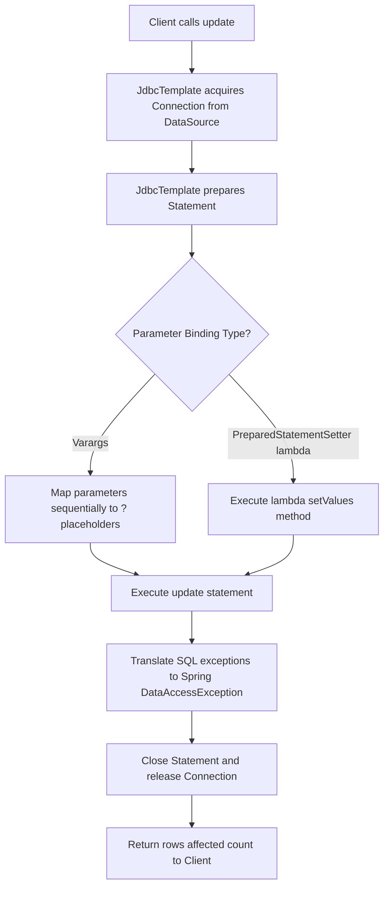
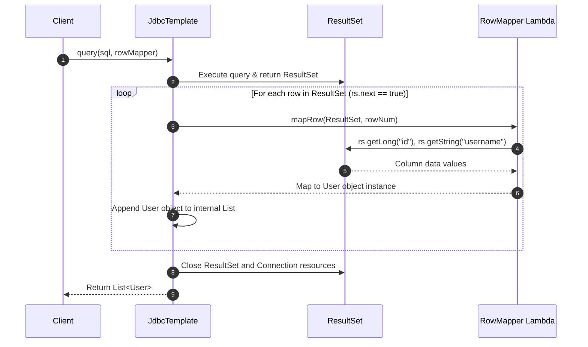
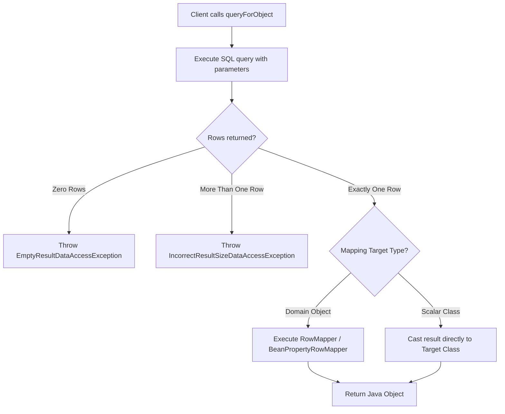

# 05_Spring Boot JDBC Helper Methods: Simplified Database Operations

Spring Boot’s `JdbcTemplate` provides a suite of highly optimized helper methods designed to eliminate the boilerplate code of traditional JDBC. These methods abstract away manual resource handling, statement creation, parameter binding, and result set iteration. This guide covers these helper methods, dividing them into data modification, multi-row fetching, single-record queries, and scalar operations, establishing the architectural bridge toward Object-Relational Mapping (ORM).

---

## Data Modification Operations (`update`)

For any SQL operation that modifies database state—specifically `INSERT`, `UPDATE`, and `DELETE` (DML)—`JdbcTemplate` provides the overloaded `update()` method. This method executes the statement and returns an `int` representing the number of rows affected.

### Variable Arguments (Varargs) Parameter Binding
The most common flavor of `update()` accepts a SQL string with placeholders (`?`) followed by a variable-length argument list (varargs) or an object array. This approach is clean and automatically handles type mapping for dynamic query inputs.

```java
String sql = "INSERT INTO user (username, age) VALUES (?, ?)";
int rowsAffected = jdbcTemplate.update(sql, "JohnDoe", 30);
```

### PreparedStatementSetter for Complex Binding
When binding parameters requires granular control, extreme precision, or dynamic collection handling, `JdbcTemplate` supports passing a `PreparedStatementSetter`. This is a functional interface containing a single method: `void setValues(PreparedStatement ps) throws SQLException`. Since it is a functional interface, developers can implement it elegantly using Java lambda expressions.

```java
String sql = "INSERT INTO user (username, age) VALUES (?, ?)";
jdbcTemplate.update(sql, ps -> {
    ps.setString(1, "JohnDoe");
    ps.setInt(2, 30);
});
```

Unlike plain JDBC where developers must manually wrap execution in `try-catch` blocks and close the connection, `JdbcTemplate` handles connection lifecycle management, statement preparation, exception translation, and resource cleanup behind the scenes.



---

## Fetching Multiple Rows (`query` and `queryForList`)

Reading multiple rows from a database requires converting SQL tabular results into Java collection structures. `JdbcTemplate` provides specialized query methods for both custom entity mapping and single-column extractions.

### RowMapper for Domain Object Mapping
The `query(String sql, RowMapper<T> rowMapper)` method retrieves multiple rows and maps each row to a domain object. `RowMapper<T>` is a functional interface defining a single method: `T mapRow(ResultSet rs, int rowNum) throws SQLException`.

When called, `JdbcTemplate` executes the SQL query, obtains a JDBC `ResultSet`, and automatically loops through each record. For every record, it invokes the `mapRow()` implementation, passing the current state of the `ResultSet` and the 1-based index of the row. Developers only need to define how columns map to properties.

```java
String sql = "SELECT id, username, age FROM users";
List<User> users = jdbcTemplate.query(sql, (rs, rowNum) -> {
    return new User(rs.getLong("id"), rs.getString("username"), rs.getInt("age"));
});
```

Under the hood, `JdbcTemplate` handles standard cursor management, advancing the pointer via `rs.next()`, assembling the populated domain objects into a `java.util.List`, and ensuring all resources are safely disposed of.



### queryForList for Single-Column Multiple-Row Extraction
When you need to fetch only a single column from multiple database rows (rather than full multi-column entities), you can use `queryForList(String sql, Class<T> elementType)`. This method avoids the need to define a custom `RowMapper`.

```java
String sql = "SELECT username FROM users";
List<String> usernames = jdbcTemplate.queryForList(sql, String.class);
```

---

## Fetching Single Records and Values (`queryForObject`)

When queries are guaranteed to return a single row or a single scalar value, `queryForObject` should be used instead of the multi-row `query` methods.

### Single Row Object Mapping
To fetch a single database row and map it to a custom Java object, use `queryForObject(String sql, Object[] args, RowMapper<T> rowMapper)`. 

*Note on Automatic Mapping:* To map a row automatically without writing a custom lambda, developers can use `BeanPropertyRowMapper.newInstance(Class<T>)`, which dynamically matches table column names to Java object properties using reflection and standard JavaBean getter/setter naming conventions.

```java
String sql = "SELECT id, username, age FROM user WHERE id = ?";
User user = jdbcTemplate.queryForObject(sql, new Object[]{1L}, (rs, rowNum) -> {
    return new User(rs.getLong("id"), rs.getString("username"), rs.getInt("age"));
});
```

### Single Scalar Value Retrieval
For queries that return exactly one column and one row—such as SQL aggregate functions (`COUNT(*)`, `SUM()`, `AVG()`) or unique lookup flags—you can pass the desired Java target type directly.

```java
String sql = "SELECT COUNT(*) FROM user";
Integer count = jdbcTemplate.queryForObject(sql, Integer.class);
```

*Architectural Safety Exception Note:* `queryForObject` expects exactly one row to be returned by the database. If no row is returned, Spring throws an `EmptyResultDataAccessException`. If more than one row is returned, it throws an `IncorrectResultSizeDataAccessException`.



---

## Comparison of JdbcTemplate Helper Methods

| Helper Method | Operations Allowed | Key Parameters | Return Type | Architectural Use Case |
| :--- | :--- | :--- | :--- | :--- |
| **`update` (Varargs)** | `INSERT`, `UPDATE`, `DELETE` | `String sql`, `Object... args` | `int` (Rows affected) | Standard DML modifications with simple parameters. |
| **`update` (PSS)** | `INSERT`, `UPDATE`, `DELETE` | `String sql`, `PreparedStatementSetter pss` | `int` (Rows affected) | Complex dynamic parameters, raw binary data, or precise index handling. |
| **`query`** | `SELECT` | `String sql`, `RowMapper<T> rowMapper` | `List<T>` | Fetching multiple rows with multi-column domain mappings. |
| **`queryForList`** | `SELECT` | `String sql`, `Class<T> elementType` | `List<T>` | Fetching a single specific column across multiple database rows. |
| **`queryForObject` (RowMapper)** | `SELECT` | `String sql`, `Object[] args`, `RowMapper<T> rm` | `T` (Single object) | Fetching a single database row and mapping to an object. |
| **`queryForObject` (Scalar Class)** | `SELECT` | `String sql`, `Class<T> requiredType` | `T` (Scalar value) | Database aggregate functions, counting, sums, or exist checks. |

---

## Transitioning to Object-Relational Mapping (ORM)

While `JdbcTemplate` eliminates over 90% of the manual boilerplate code required by plain JDBC, developers must still:
1. Write raw, database-specific SQL strings directly within Java source files.
2. Manually define tabular-to-object mappings (`RowMapper` classes or lambdas) for nested, complex relational graphs.
3. Keep track of table schema changes and update Java mappings manually.

These challenges highlight the need for **Object-Relational Mapping (ORM)** and the development of the **Java Persistence API (JPA)** and **Hibernate**. ORM frameworks establish an automated bridge between Java’s object-oriented paradigms and relational SQL databases, allowing developers to manage, query, and persist complex object graphs without writing manual SQL strings or custom mapping classes.
